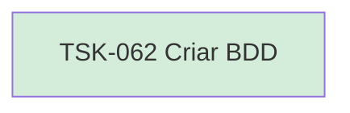

# TSK-062 — Criar BDD

| Campo | Valor |
|-------|--------|
| ID | TSK-062 |
| Status | Done |
| Pai | [TSK-024](../README.md) |
| Output | [US-04 — Atribuir responsavel](../../../../../../epics/EP-03-gantt/US-04-atribuir-responsavel/README.md) |

## Árvore de atividades

