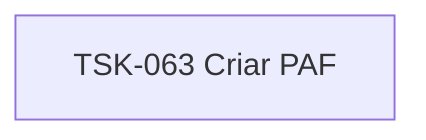

# TSK-063 — Criar PAF

| Campo | Valor |
|-------|--------|
| ID | TSK-063 |
| Status | Todo |
| Pai | [TSK-024](../README.md) |
| Output | [US-04 — Atribuir responsavel](../../../../../../epics/EP-03-gantt/US-04-atribuir-responsavel/README.md) |

## Árvore de atividades

