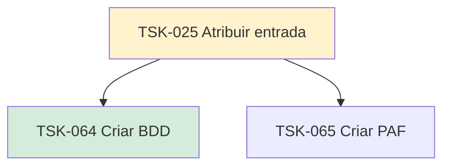

# TSK-025 — Atribuir entrada

| Campo | Valor |
|-------|--------|
| ID | TSK-025 |
| Status | Doing |
| Pai | [TSK-005](../README.md) |
| Output | [US-05 — Atribuir entrada](../../../../../epics/EP-03-gantt/US-05-atribuir-entrada/README.md) |

## Árvore de atividades

## Filhos

- [`TSK-064`](TSK-064-criar-bdd/README.md) → Criar BDD (Done)
- [`TSK-065`](TSK-065-criar-paf/README.md) → Criar PAF (Todo)
