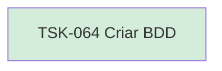

# TSK-064 — Criar BDD

| Campo | Valor |
|-------|--------|
| ID | TSK-064 |
| Status | Done |
| Pai | [TSK-025](../README.md) |
| Output | [US-05 — Atribuir entrada](../../../../../../epics/EP-03-gantt/US-05-atribuir-entrada/README.md) |

## Árvore de atividades

