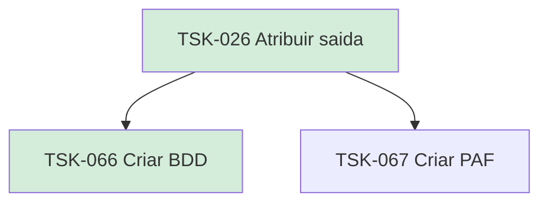

# TSK-026 — Atribuir saída

| Campo | Valor |
|-------|--------|
| ID | TSK-026 |
| Status | Done |
| Pai | [TSK-005](../README.md) |
| Output | [US-06 — Atribuir saída](../../../../../epics/EP-03-gantt/US-06-atribuir-saida/README.md) |

## Árvore de atividades

## Filhos

- [`TSK-066`](TSK-066-criar-bdd/README.md) → Criar BDD (Done)
- [`TSK-067`](TSK-067-criar-paf/README.md) → Criar PAF (Todo)
