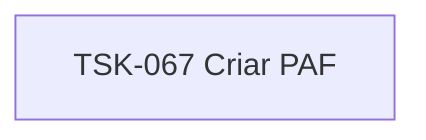

# TSK-067 — Criar PAF

| Campo | Valor |
|-------|--------|
| ID | TSK-067 |
| Status | Todo |
| Pai | [TSK-026](../README.md) |
| Output | [US-06 — Atribuir saida](../../../../../../epics/EP-03-gantt/US-06-atribuir-saida/README.md) |

## Árvore de atividades

