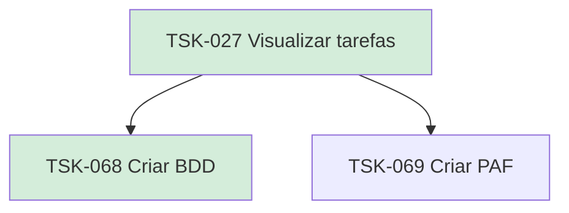

# TSK-027 — Visualizar tarefas

| Campo | Valor |
|-------|--------|
| ID | TSK-027 |
| Status | Done |
| Pai | [TSK-005](../README.md) |
| Output | [US-07 — Visualizar tarefas](../../../../../epics/EP-03-gantt/US-07-visualizar-tarefas/README.md) |

## Árvore de atividades

## Filhos

- [`TSK-068`](TSK-068-criar-bdd/README.md) → Criar BDD (Done)
- [`TSK-069`](TSK-069-criar-paf/README.md) → Criar PAF (Todo)
