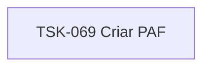

# TSK-069 — Criar PAF

| Campo | Valor |
|-------|--------|
| ID | TSK-069 |
| Status | Todo |
| Pai | [TSK-027](../README.md) |
| Output | [US-07 — Visualizar tarefas](../../../../../../epics/EP-03-gantt/US-07-visualizar-tarefas/README.md) |

## Árvore de atividades

