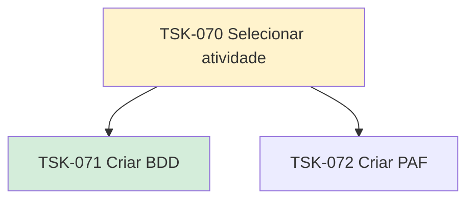

# TSK-070 — Selecionar atividade

| Campo | Valor |
|-------|--------|
| ID | TSK-070 |
| Status | Doing |
| Pai | [TSK-005](../README.md) |
| Output | [US-08 — Selecionar atividade](../../../../../epics/EP-03-gantt/US-08-selecionar-atividade/README.md) |

## Árvore de atividades

## Filhos

- [`TSK-071`](TSK-071-criar-bdd/README.md) → Criar BDD (Done)
- [`TSK-072`](TSK-072-criar-paf/README.md) → Criar PAF (Todo)
