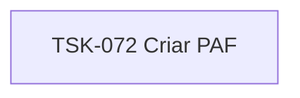

# TSK-072 — Criar PAF

| Campo | Valor |
|-------|--------|
| ID | TSK-072 |
| Status | Todo |
| Pai | [TSK-070](../README.md) |
| Output | [US-08 — Selecionar atividade](../../../../../../epics/EP-03-gantt/US-08-selecionar-atividade/README.md) |

## Árvore de atividades

