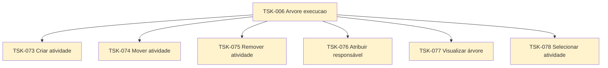

# TSK-006 — Árvore de execução

| Campo | Valor |
|-------|--------|
| ID | TSK-006 |
| Status | Doing |
| Pai | [TSK-002](../README.md) |
| Output | [EP-04 — Árvore de execução](../../../../epics/EP-04-arvore-de-execucao/README.md) |

## Árvore de atividades

## Filhos

- [`TSK-073`](TSK-073-criar-atividade/README.md) → Output [US-01-criar-atividade](../../../../epics/EP-04-arvore-de-execucao/US-01-criar-atividade/README.md)
  - [`TSK-079`](TSK-073-criar-atividade/TSK-079-criar-bdd/README.md) → Criar BDD
  - [`TSK-080`](TSK-073-criar-atividade/TSK-080-criar-paf/README.md) → Criar PAF
- [`TSK-074`](TSK-074-mover-atividade-dragdrop/README.md) → Output [US-02-mover-atividade-dragdrop](../../../../epics/EP-04-arvore-de-execucao/US-02-mover-atividade-dragdrop/README.md)
  - [`TSK-081`](TSK-074-mover-atividade-dragdrop/TSK-081-criar-bdd/README.md) → Criar BDD
  - [`TSK-082`](TSK-074-mover-atividade-dragdrop/TSK-082-criar-paf/README.md) → Criar PAF
- [`TSK-075`](TSK-075-remover-atividade/README.md) → Output [US-03-remover-atividade](../../../../epics/EP-04-arvore-de-execucao/US-03-remover-atividade/README.md)
  - [`TSK-083`](TSK-075-remover-atividade/TSK-083-criar-bdd/README.md) → Criar BDD
  - [`TSK-084`](TSK-075-remover-atividade/TSK-084-criar-paf/README.md) → Criar PAF
- [`TSK-076`](TSK-076-atribuir-responsavel/README.md) → Output [US-04-atribuir-responsavel](../../../../epics/EP-04-arvore-de-execucao/US-04-atribuir-responsavel/README.md)
  - [`TSK-085`](TSK-076-atribuir-responsavel/TSK-085-criar-bdd/README.md) → Criar BDD
  - [`TSK-086`](TSK-076-atribuir-responsavel/TSK-086-criar-paf/README.md) → Criar PAF
- [`TSK-077`](TSK-077-visualizar-arvore/README.md) → Output [US-05-visualizar-arvore](../../../../epics/EP-04-arvore-de-execucao/US-05-visualizar-arvore/README.md)
  - [`TSK-087`](TSK-077-visualizar-arvore/TSK-087-criar-bdd/README.md) → Criar BDD
  - [`TSK-088`](TSK-077-visualizar-arvore/TSK-088-criar-paf/README.md) → Criar PAF
- [`TSK-078`](TSK-078-selecionar-atividade/README.md) → Output [US-06-selecionar-atividade](../../../../epics/EP-04-arvore-de-execucao/US-06-selecionar-atividade/README.md)
  - [`TSK-089`](TSK-078-selecionar-atividade/TSK-089-criar-bdd/README.md) → Criar BDD
  - [`TSK-090`](TSK-078-selecionar-atividade/TSK-090-criar-paf/README.md) → Criar PAF
