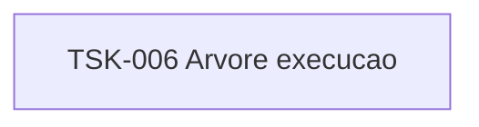

# TSK-006 — Árvore de execução

| Campo | Valor |
|-------|--------|
| ID | TSK-006 |
| Status | Todo |
| Pai | [TSK-002](../README.md) |
| Output | [EP-04 — Árvore de execução](../../../../epics/EP-04-arvore-de-execucao/README.md) |

## Árvore de atividades

