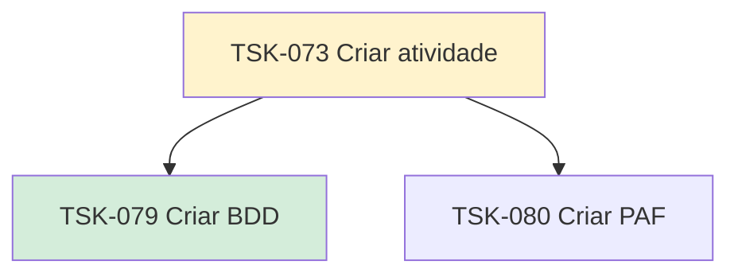

# TSK-073 — Criar atividade

| Campo | Valor |
|-------|--------|
| ID | TSK-073 |
| Status | Doing |
| Pai | [TSK-006](../README.md) |
| Output | [US-01 — Criar atividade](../../../../../epics/EP-04-arvore-de-execucao/US-01-criar-atividade/README.md) |

## Árvore de atividades

## Filhos

- [`TSK-079`](TSK-079-criar-bdd/README.md) → Criar BDD (Done)
- [`TSK-080`](TSK-080-criar-paf/README.md) → Criar PAF (Todo)
