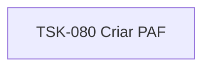

# TSK-080 — Criar PAF

| Campo | Valor |
|-------|--------|
| ID | TSK-080 |
| Status | Todo |
| Pai | [TSK-073](../README.md) |
| Output | [US-01 — Criar atividade](../../../../../../epics/EP-04-arvore-de-execucao/US-01-criar-atividade/README.md) |

## Árvore de atividades

