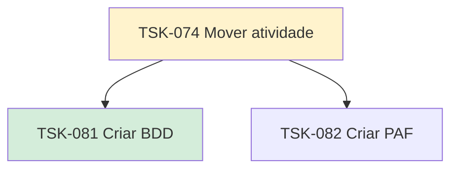

# TSK-074 — Mover atividade (drag and drop)

| Campo | Valor |
|-------|--------|
| ID | TSK-074 |
| Status | Doing |
| Pai | [TSK-006](../README.md) |
| Output | [US-02 — Mover atividade (drag and drop)](../../../../../epics/EP-04-arvore-de-execucao/US-02-mover-atividade-dragdrop/README.md) |

## Árvore de atividades

## Filhos

- [`TSK-081`](TSK-081-criar-bdd/README.md) → Criar BDD (Done)
- [`TSK-082`](TSK-082-criar-paf/README.md) → Criar PAF (Todo)
