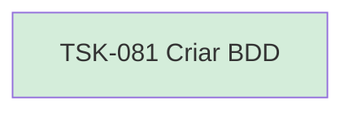

# TSK-081 — Criar BDD

| Campo | Valor |
|-------|--------|
| ID | TSK-081 |
| Status | Done |
| Pai | [TSK-074](../README.md) |
| Output | [US-02 — Mover atividade (drag and drop)](../../../../../../epics/EP-04-arvore-de-execucao/US-02-mover-atividade-dragdrop/README.md) |

## Árvore de atividades

