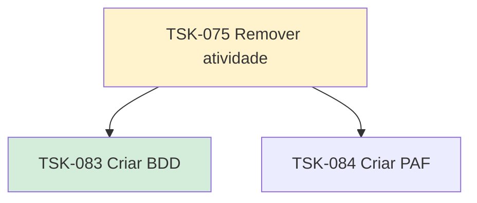

# TSK-075 — Remover atividade

| Campo | Valor |
|-------|--------|
| ID | TSK-075 |
| Status | Doing |
| Pai | [TSK-006](../README.md) |
| Output | [US-03 — Remover atividade](../../../../../epics/EP-04-arvore-de-execucao/US-03-remover-atividade/README.md) |

## Árvore de atividades

## Filhos

- [`TSK-083`](TSK-083-criar-bdd/README.md) → Criar BDD (Done)
- [`TSK-084`](TSK-084-criar-paf/README.md) → Criar PAF (Todo)
