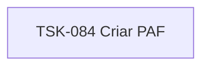

# TSK-084 — Criar PAF

| Campo | Valor |
|-------|--------|
| ID | TSK-084 |
| Status | Todo |
| Pai | [TSK-075](../README.md) |
| Output | [US-03 — Remover atividade](../../../../../../epics/EP-04-arvore-de-execucao/US-03-remover-atividade/README.md) |

## Árvore de atividades

