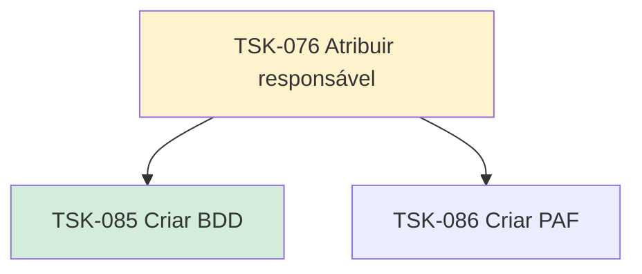

# TSK-076 — Atribuir responsável

| Campo | Valor |
|-------|--------|
| ID | TSK-076 |
| Status | Doing |
| Pai | [TSK-006](../README.md) |
| Output | [US-04 — Atribuir responsável](../../../../../epics/EP-04-arvore-de-execucao/US-04-atribuir-responsavel/README.md) |

## Árvore de atividades

## Filhos

- [`TSK-085`](TSK-085-criar-bdd/README.md) → Criar BDD (Done)
- [`TSK-086`](TSK-086-criar-paf/README.md) → Criar PAF (Todo)
