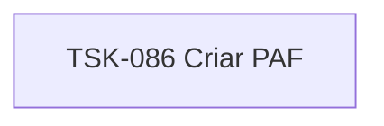

# TSK-086 — Criar PAF

| Campo | Valor |
|-------|--------|
| ID | TSK-086 |
| Status | Todo |
| Pai | [TSK-076](../README.md) |
| Output | [US-04 — Atribuir responsável](../../../../../../epics/EP-04-arvore-de-execucao/US-04-atribuir-responsavel/README.md) |

## Árvore de atividades

