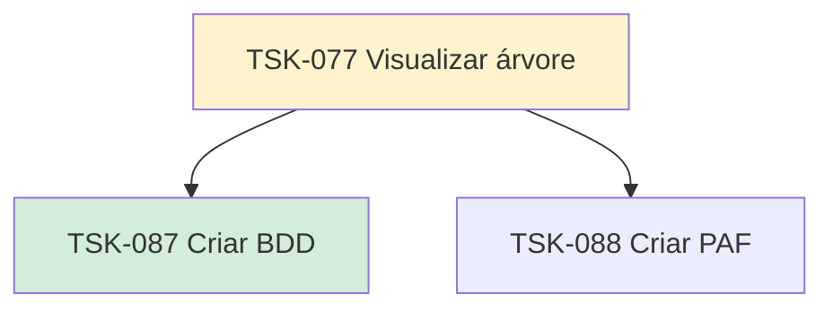

# TSK-077 — Visualizar árvore

| Campo | Valor |
|-------|--------|
| ID | TSK-077 |
| Status | Doing |
| Pai | [TSK-006](../README.md) |
| Output | [US-05 — Visualizar árvore](../../../../../epics/EP-04-arvore-de-execucao/US-05-visualizar-arvore/README.md) |

## Árvore de atividades

## Filhos

- [`TSK-087`](TSK-087-criar-bdd/README.md) → Criar BDD (Done)
- [`TSK-088`](TSK-088-criar-paf/README.md) → Criar PAF (Todo)
