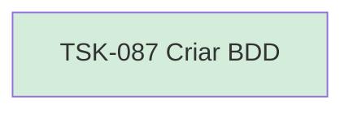

# TSK-087 — Criar BDD

| Campo | Valor |
|-------|--------|
| ID | TSK-087 |
| Status | Done |
| Pai | [TSK-077](../README.md) |
| Output | [US-05 — Visualizar árvore](../../../../../../epics/EP-04-arvore-de-execucao/US-05-visualizar-arvore/README.md) |

## Árvore de atividades

