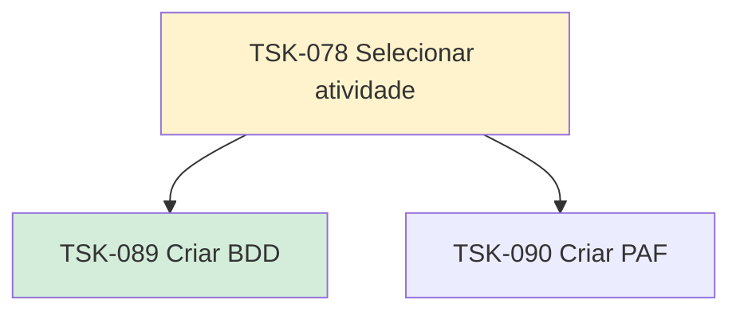

# TSK-078 — Selecionar atividade

| Campo | Valor |
|-------|--------|
| ID | TSK-078 |
| Status | Doing |
| Pai | [TSK-006](../README.md) |
| Output | [US-06 — Selecionar atividade](../../../../../epics/EP-04-arvore-de-execucao/US-06-selecionar-atividade/README.md) |

## Árvore de atividades

## Filhos

- [`TSK-089`](TSK-089-criar-bdd/README.md) → Criar BDD (Done)
- [`TSK-090`](TSK-090-criar-paf/README.md) → Criar PAF (Todo)
