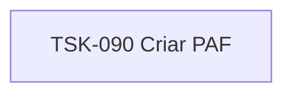

# TSK-090 — Criar PAF

| Campo | Valor |
|-------|--------|
| ID | TSK-090 |
| Status | Todo |
| Pai | [TSK-078](../README.md) |
| Output | [US-06 — Selecionar atividade](../../../../../../epics/EP-04-arvore-de-execucao/US-06-selecionar-atividade/README.md) |

## Árvore de atividades

