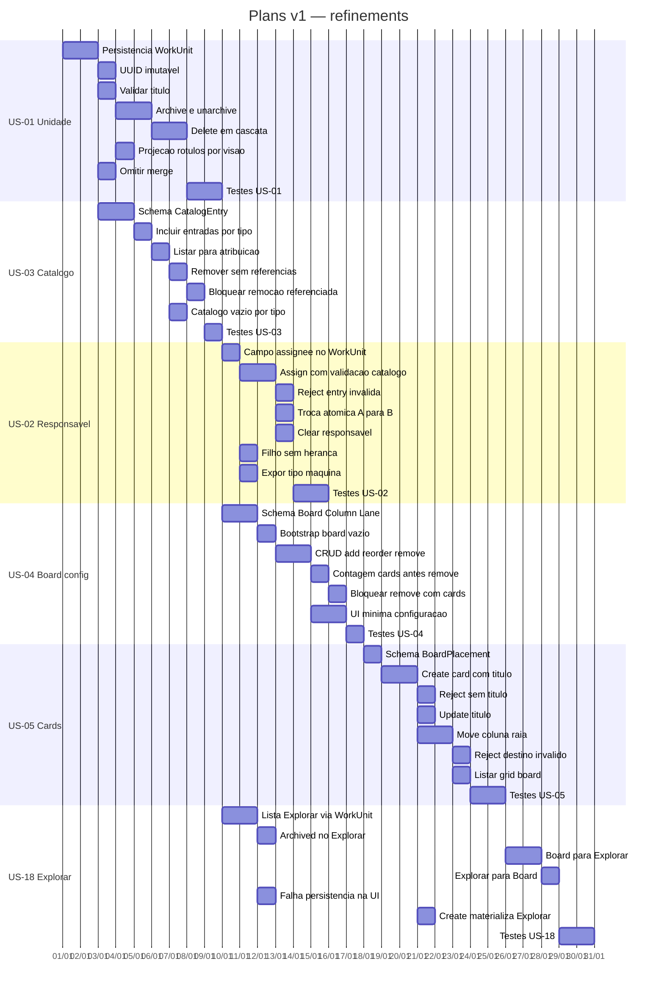
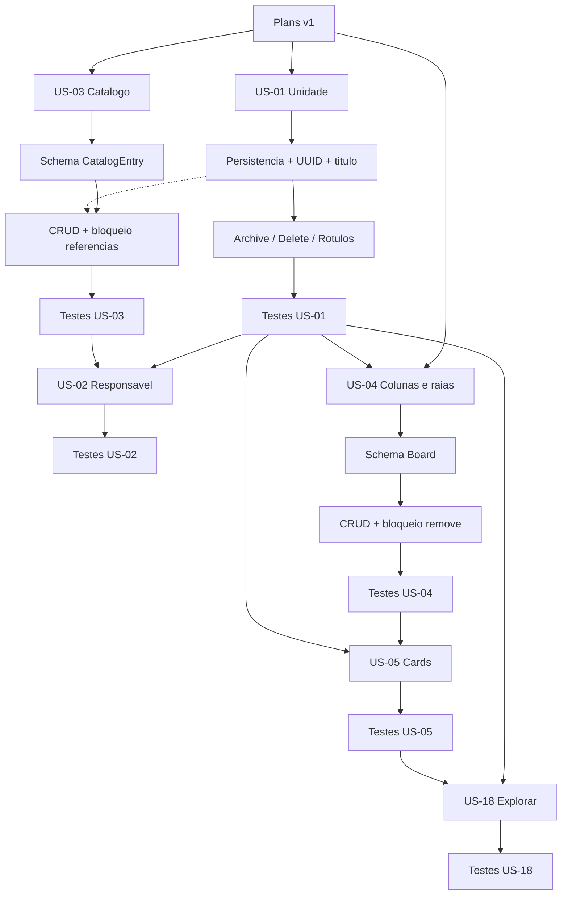

# Refinements — Plans (v1)

Breakdown técnico das histórias `ready` da **v1**. Rastreio em [`../../epics.md`](../../epics.md) · Histórias em [`../../stories/user-stories.md`](../../stories/user-stories.md) · Versões em [`../../versions.md`](../../versions.md).

Negócio (não redefinir aqui): [`../../../README.md`](../../../README.md).

## Índice

| Ordem | ID | História | Título |
|-------|-----|----------|--------|
| 1 | REF-EP00-US01 | US-01 | Unidade, vocabulário e ciclo de vida |
| 2 | REF-EP00-US03 | US-03 | Catálogo de responsáveis |
| 3 | REF-EP00-US02 | US-02 | Atribuir responsável tipado |
| 4 | REF-EP01-US04 | US-04 | Configurar colunas e raias |
| 5 | REF-EP01-US05 | US-05 | Cadastrar e mover cards |
| 6 | REF-EP04-US18 | US-18 | Persistir e abrir no Explorar |

## Cronograma (Gantt)

Mermaid Gantt das tarefas técnicas da v1 (durações relativas; ordem respeita dependências).



## Dependências (árvore)



---

## REF-EP00-US01 — Unidade, vocabulário e ciclo de vida

| Campo | Valor |
|-------|-------|
| História | [`US-01`](../../stories/user-stories.md) · rastreio [`epics.md`](../../epics.md) |
| Versão | v1 |
| Status | done |

### Escopo técnico

Implementar o **núcleo de domínio** da unidade de trabalho: id canônico (UUID), título, ciclo de vida (`active` / `archived` / deleted), vocabulário por visão (rótulo card/tarefa/nó/arquivo só na projeção) e exclusão em cascata da subárvore. Sem merge.

### Modelo de dados (sugerido)

```text
WorkUnit
  id: UUID (canônico, imutável)
  title: string (obrigatório)
  lifecycle: active | archived
  parentId: UUID | null          # hierarquia; v1 pode existir sem UI de aninhar
  deletedAt: datetime | null     # soft ou hard delete conforme ADR
  createdAt, updatedAt
```

Projeções/views **não** duplicam entidade: Board/Gantt/Árvore/Explorar leem o mesmo `WorkUnit`.

### API / comandos

- `CreateWorkUnit({ title }) → WorkUnit`
- `UpdateWorkUnitTitle({ id, title })`
- `ArchiveWorkUnit({ id })` / `UnarchiveWorkUnit({ id })`
- `DeleteWorkUnit({ id })` — remove unidade + descendentes em todas as visões
- `GetWorkUnit({ id })` / `ListWorkUnits({ lifecycle? })`

### Tarefas

- [x] Definir persistência de `WorkUnit` (schema + repositório)
- [x] Gerar UUID na criação; garantir imutabilidade do id
- [x] Validar título obrigatório
- [x] Implementar archive / unarchive (fluxo ativo vs Explorar)
- [x] Implementar delete com cascata de filhos
- [x] Camada de projeção: mapear visão → rótulo (card | tarefa | atividade/nó | arquivo)
- [x] Rejeitar/omitir operação de merge (fora de escopo v1)
- [x] Testes alinhados aos critérios de aceite da US-01

### Dependências

- Nenhuma história anterior; **base** das demais US v1
- ADR opcional: soft delete vs hard delete — v1 usa soft delete (`deletedAt`)

### Riscos

- Cascata de delete em árvores profundas (performance)
- Consistência se no futuro existirem projeções cacheadas por visão

### Fora de escopo

- Merge de unidades
- Aninhar/desaninhar na UI (US-06)
- Lista/busca no Explorar (US-19)

---

## REF-EP00-US03 — Catálogo de responsáveis

| Campo | Valor |
|-------|-------|
| História | [`US-03`](../../stories/user-stories.md) · rastreio [`epics.md`](../../epics.md) |
| Versão | v1 |
| Status | ready-for-dev |

### Escopo técnico

CRUD do **catálogo do projeto** por tipo: pessoa, IA, prestador, máquina. Remoção bloqueada se o item ainda for responsável de alguma unidade.

### Modelo de dados (sugerido)

```text
CatalogEntry
  id: UUID
  projectId: UUID
  type: person | ai | provider | machine
  displayName: string
  active: boolean
  metadata: json (opcional)
```

### API / comandos

- `AddCatalogEntry({ type, displayName, metadata? })`
- `RemoveCatalogEntry({ id })` — falha se referenciado como responsável
- `ListCatalogEntries({ type? })`

### Tarefas

- [ ] Schema + repositório de `CatalogEntry`
- [ ] Incluir entradas por tipo
- [ ] Listar para UI de atribuição
- [ ] Remover quando sem referências
- [ ] Bloquear remoção se `WorkUnit.assigneeId == entry.id`
- [ ] Catálogo vazio por tipo → lista vazia (atribuição impossível)
- [ ] Testes US-03

### Dependências

- US-01 (`WorkUnit` para checar referências) — pode implementar catálogo antes e validar referência quando assignee existir
- Consumido por US-02

### Riscos

- Ordem de bootstrap: seed mínimo de catálogo em ambiente de demo

### Fora de escopo

- Autenticação real / SSO de pessoas
- Runtime de IA ou máquina

---

## REF-EP00-US02 — Atribuir responsável tipado

| Campo | Valor |
|-------|-------|
| História | [`US-02`](../../stories/user-stories.md) · rastreio [`epics.md`](../../epics.md) |
| Versão | v1 |
| Status | ready-for-dev |

### Escopo técnico

Atribuir, trocar ou remover **um** responsável por unidade, somente a partir do catálogo. Filho nasce sem responsável (sem herança). Flag/comportamento “máquina como linguagem” só como marcador de tipo em v1 (execução real em versões futuras).

### Modelo de dados (sugerido)

```text
WorkUnit (extensão)
  assigneeId: UUID | null   # CatalogEntry.id
  assigneeType: person | ai | provider | machine | null  # desnormalizado opcional
```

### API / comandos

- `AssignResponsible({ workUnitId, catalogEntryId })` — valida catálogo; substitui anterior
- `ClearResponsible({ workUnitId })`
- Ao criar filho: `assigneeId = null` (garantir no create com parent)

### Tarefas

- [ ] Campo(s) de assignee em `WorkUnit`
- [ ] Assign com validação de existência no catálogo
- [ ] Reject se entry inexistente/inativa
- [ ] Replace (troca A→B) atômico
- [ ] Clear responsável
- [ ] Create child sem herdar assignee do pai
- [ ] Expor tipo máquina na leitura (para UI/feature flag futura)
- [ ] Testes US-02

### Dependências

- **US-03** (catálogo) — ordem sugerida: US-03 antes de US-02
- US-01 (WorkUnit)

### Riscos

- Inconsistência se entry for removida do catálogo sem limpar assignees (US-03 bloqueia remoção)

### Fora de escopo

- Múltiplos responsáveis
- Herança pai→filho
- Execução IA/máquina/prestador

---

## REF-EP01-US04 — Configurar colunas e raias

| Campo | Valor |
|-------|-------|
| História | [`US-04`](../../stories/user-stories.md) · rastreio [`epics.md`](../../epics.md) |
| Versão | v1 |
| Status | ready-for-dev |

### Escopo técnico

Configuração do board: colunas e raias em quantidade livre, reordenação, remoção só se vazias.

### Modelo de dados (sugerido)

```text
Board
  id: UUID
  projectId: UUID

BoardColumn
  id: UUID
  boardId: UUID
  name: string
  position: int
  # isExecution: false em v1 (US-07)

BoardLane
  id: UUID
  boardId: UUID
  name: string
  position: int
```

### API / comandos

- `EnsureDefaultBoard({ projectId })` — board utilizável vazio
- `AddColumn` / `AddLane` / `ReorderColumns` / `ReorderLanes`
- `RemoveColumn` / `RemoveLane` — erro se houver cards na célula

### Tarefas

- [ ] Schema Board + Column + Lane
- [ ] Bootstrap board vazio / primeira coluna e raia
- [ ] CRUD add/reorder/remove
- [ ] Contagem de cards por coluna/raia antes de remove
- [ ] Bloquear remove se count > 0
- [ ] UI mínima de configuração (ou API-first + UI stub)
- [ ] Testes US-04

### Dependências

- Projeto/contexto de board
- US-05 preenche cards (validação de “vazia” precisa do modelo de posição do card)

### Riscos

- Definir se “vazio” = zero cards na coluna **ou** na interseção coluna×raia (recomenda-se: bloquear se qualquer card referencia a coluna ou a raia)

### Fora de escopo

- Colunas de execução (US-07)
- WIP limits

---

## REF-EP01-US05 — Cadastrar e mover cards

| Campo | Valor |
|-------|-------|
| História | [`US-05`](../../stories/user-stories.md) · rastreio [`epics.md`](../../epics.md) |
| Versão | v1 |
| Status | ready-for-dev |

### Escopo técnico

Criar card (= `WorkUnit` + posição no board), validar título, atualizar título, mover entre coluna/raia válidas. Sem WIP.

### Modelo de dados (sugerido)

```text
BoardPlacement
  workUnitId: UUID (FK WorkUnit)
  boardId: UUID
  columnId: UUID
  laneId: UUID
  positionInCell: int (opcional)
```

Card **é** a unidade com projeção board + `BoardPlacement`.

### API / comandos

- `CreateCard({ title, columnId, laneId })` — cria WorkUnit + placement
- `UpdateCardTitle({ workUnitId, title })` — delega a UpdateWorkUnitTitle
- `MoveCard({ workUnitId, columnId, laneId })` — valida ids; senão no-op/erro e mantém origem

### Tarefas

- [ ] Schema `BoardPlacement`
- [ ] Create card com título obrigatório
- [ ] Reject create sem título
- [ ] Update título refletido em qualquer leitura de WorkUnit
- [ ] Move para coluna/raia existentes
- [ ] Reject/keep position se destino inválido
- [ ] Listar cards por board (grid coluna × raia)
- [ ] Testes US-05

### Dependências

- US-01 (WorkUnit)
- US-04 (colunas/raias)
- US-02 opcional na mesma tela (atribuir) — não bloqueia create/move

### Riscos

- Cards órfãos se coluna removida — mitigado por US-04 (bloqueio)

### Fora de escopo

- Aninhar cards (US-06)
- Coluna de execução / IA (US-07)
- Chamado (US-08)

---

## REF-EP04-US18 — Persistir e abrir no Explorar

| Campo | Valor |
|-------|-------|
| História | [`US-18`](../../stories/user-stories.md) · rastreio [`epics.md`](../../epics.md) |
| Versão | v1 |
| Status | ready-for-dev |

### Escopo técnico

Toda `WorkUnit` é um **arquivo** lógico no Explorar (mesmo UUID). Abrir unidade a partir do board (e depois outras visões) no Explorar e o caminho inverso. Unidades arquivadas permanecem listáveis no Explorar. Falha de persistência deve ser sinalizada sem sucesso falso.

### Modelo de dados (sugerido)

```text
# Sem entidade duplicada: Explorar lista WorkUnit
# Opcional:
FileViewIndex
  workUnitId: UUID
  pathHint: string   # futuro (US-19); v1 pode ser flat
```

### API / comandos

- `ListExploreFiles({ includeArchived: true })` — por padrão inclui archived; fluxo ativo exclui
- `OpenInExplore({ workUnitId })`
- `OpenInBoard({ workUnitId })` — navega para placement se existir
- Persistência: create/update retornam erro tipado se falhar I/O

### Tarefas

- [ ] Endpoint/lista Explorar baseada em WorkUnit (mesmo id)
- [ ] Incluir `archived` no Explorar; excluir do board ativo
- [ ] Navegação Board → Explorar (deep link / route por UUID)
- [ ] Navegação Explorar → Board
- [ ] Propagar falha de persistência à UI
- [ ] Garantir create card/unidade sempre materializa no Explorar
- [ ] Testes US-18

### Dependências

- **US-01** (WorkUnit + archive)
- US-05 (cards no board para deep link)

### Riscos

- Rotas de UI ainda sem Gantt/árvore — stubs `OpenInGantt`/`OpenInTree` podem retornar “não disponível na v1”

### Fora de escopo

- Ordenação/busca/breadcrumb (US-19)
- Formato físico de arquivo em disco (detalhe de storage)

---
