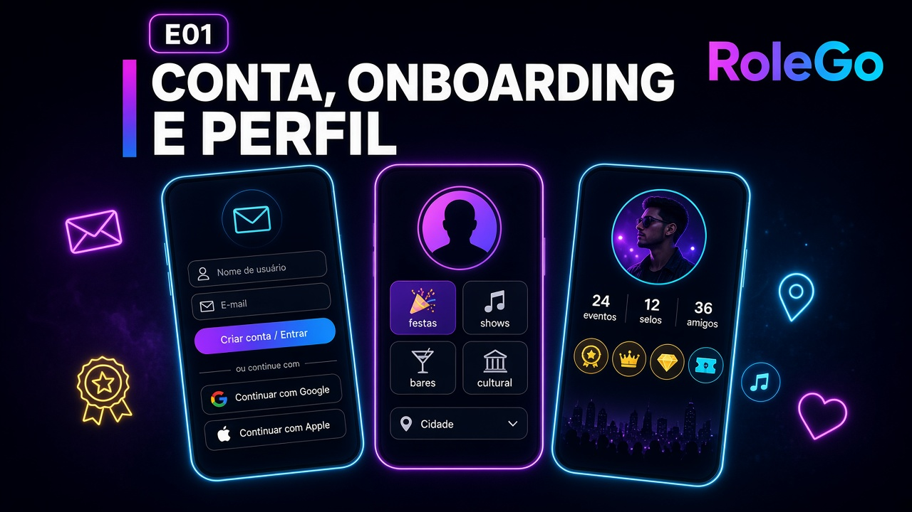
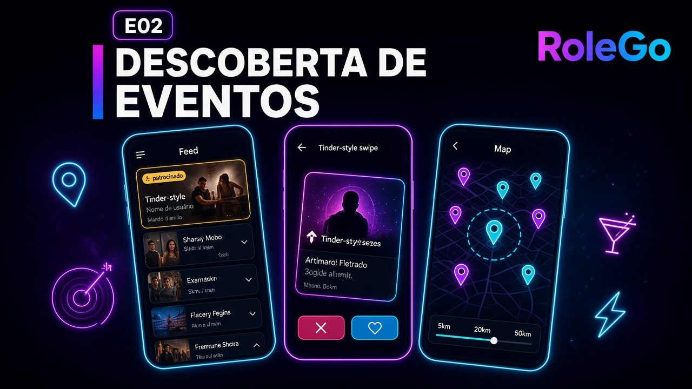
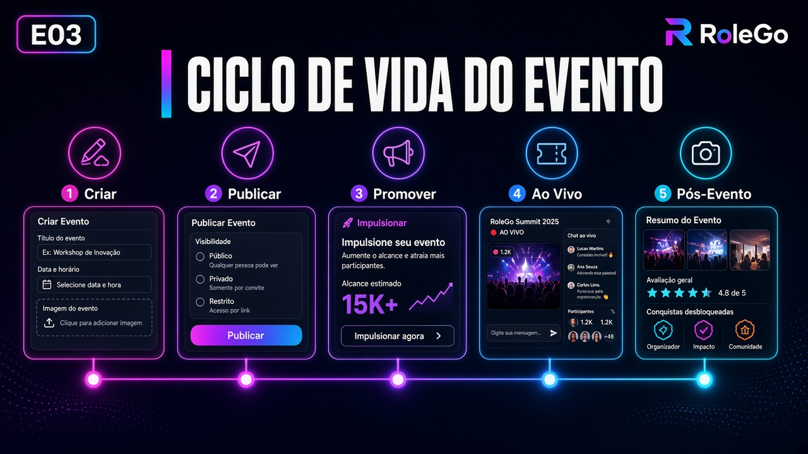
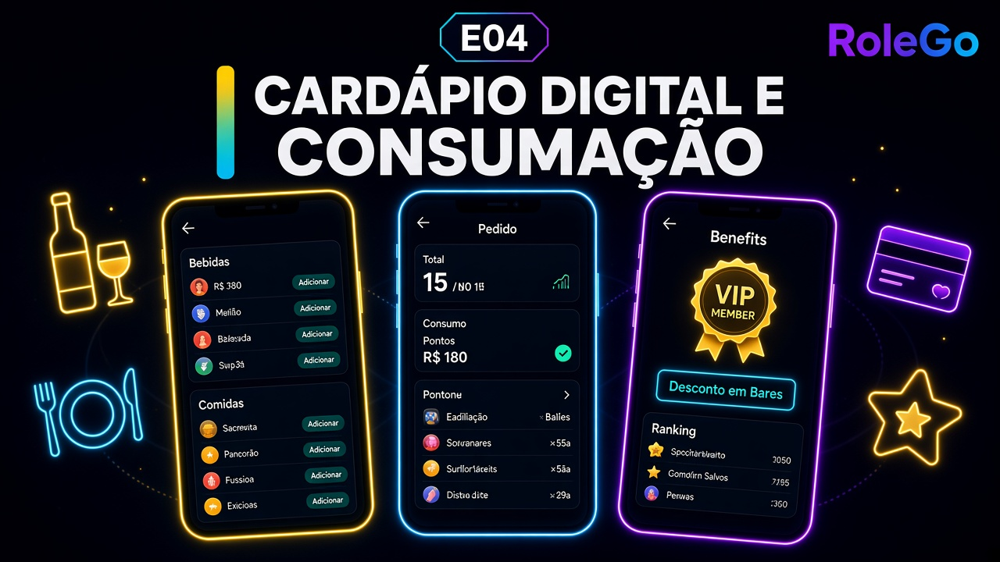
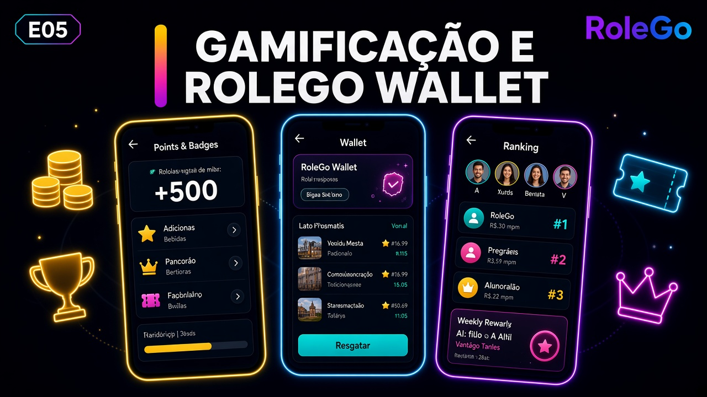
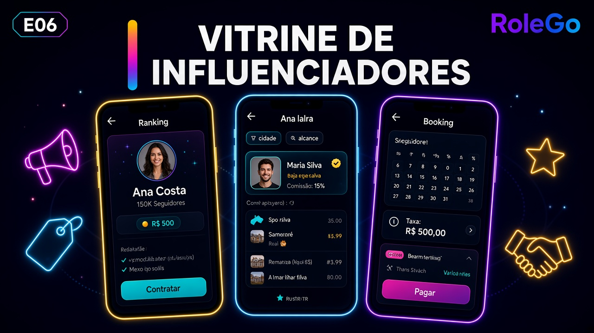
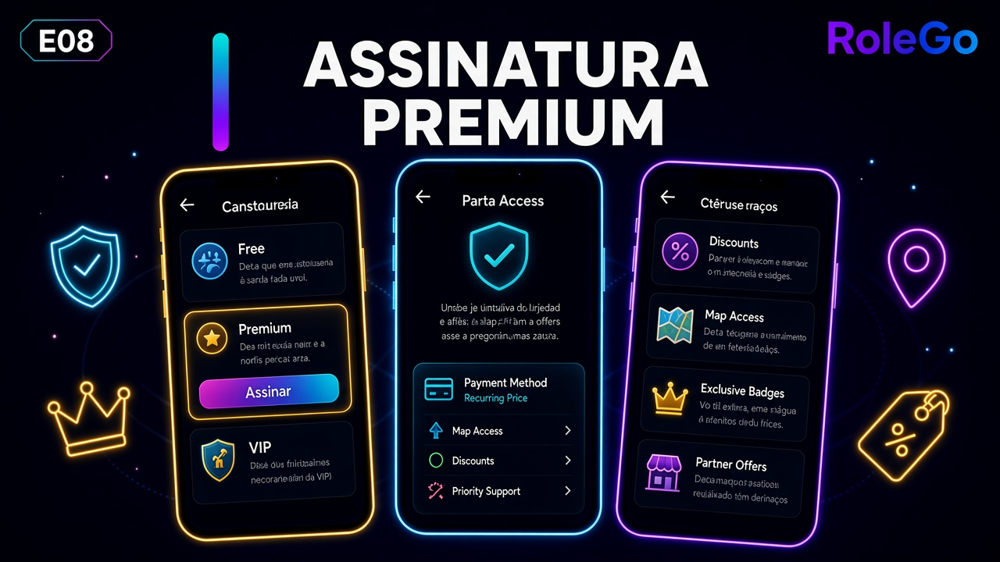
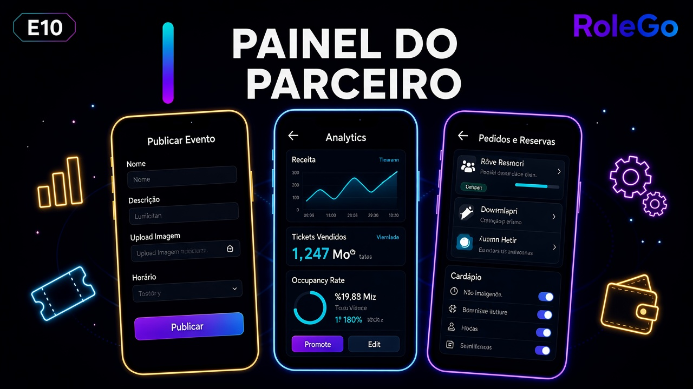
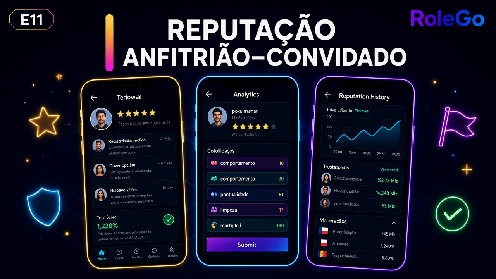

# RoleGo — Épicos

Fonte de verdade dos épicos do produto, derivada do [documento de visão](README.md) e dos materiais de MVP/slides em [`input/`](input/).

Cada épico agrupa um conjunto coerente de valor; histórias e BDD vêm depois.

---

## Índice

| ID | Épico |
|----|-------|
| E01 | Conta, onboarding e perfil |
| E02 | Descoberta de eventos |
| E03 | Ciclo de vida do evento |
| E04 | Ingressos e pagamento |
| E05 | Cardápio digital e consumação |
| E06 | Gamificação e RoleGo Wallet |
| E07 | Vitrine de influenciadores |
| E08 | Publicidade e visibilidade paga |
| E09 | Assinatura Premium |
| E10 | Notificações e alertas |
| E11 | Painel do parceiro (bares e casas) |
| E12 | Reputação anfitrião–convidado |

---

## E01 — Conta, onboarding e perfil

O usuário cria conta (email, Google ou Apple), configura preferências de tipo de evento, cidade, raio e localização, e mantém um perfil com foto, histórico de eventos, amigos, fotos por evento e selos. A entrada rápida e o perfil alimentam descoberta, social e gamificação.

## E02 — Descoberta de eventos

O usuário encontra o que está rolando perto dele por geolocalização e raio configurável (ex.: 5, 20 ou 50 km), com modos Feed, Tinder (swipe), Lista e Mapa (conforme premium/patrocínio), filtros por tipo e dia, destaque de eventos patrocinados e radar dinâmico com cards atualizados — unificando a descoberta hoje espalhada em Instagram, Google, sites e WhatsApp.

## E03 — Ciclo de vida do evento

Cada evento tem página completa (local, horários, valores de entrada/VIP/bebida, confirmados, interessados, influenciadores contratados e fotos de edições anteriores) e um ciclo do anúncio ao pós-evento (criar, publicar, promover, ao vivo, avaliação, comentário e selos) — informação suficiente para decidir, comprar e lembrar o rolê.

## E04 — Ingressos e pagamento

Compra de ingresso no app (pista, VIP etc.) com taxa de serviço, gateway de pagamento, QR Code, carteira de ingressos, compartilhamento com o grupo e reserva de mesa/consumação antecipada em parceiros — do descarte ao ingresso em poucos cliques.

## E05 — Cardápio digital e consumação

O usuário consome pelo app no bar parceiro via cardápio digital; a compra gera score de consumo e benefícios ligados a status/premium, com comissão para o estabelecimento (percentuais ainda em aberto na visão).

## E06 — Gamificação e RoleGo Wallet

Pontos, selos, rankings entre amigos, recompensas (descontos, ingressos com preço reduzido, furo de fila) e status (ex.: Rolê Gold, Platina) incentivam uso e compra pelo app. A RoleGo Wallet guarda histórico de experiências, fotos, avaliações e selos, reforçando retenção e adesão dos estabelecimentos.

## E07 — Vitrine de influenciadores

Influenciadores cadastram disponibilidade; casas e produtores contratam pela plataforma; o nome do influenciador confirmado aparece na página do evento como chamariz, com comissão sobre o cachê e tração em novas cidades.

## E08 — Publicidade e visibilidade paga

Eventos e casas pagam para aparecer além do alcance orgânico: impulsionamento fora do raio padrão, visibilidade no mapa, destaques no feed e parcerias de mídia paga — monetização B2B alinhada à visão.

## E09 — Assinatura Premium

O usuário paga por recursos extras: mapa completo de eventos, descontos em bares parceiros, visualização de fotos e participantes sem restrição e demais diferenciais do roadmap — gerando receita recorrente e engajamento diferenciado.

## E10 — Notificações e alertas

Push e central in-app avisam novo evento no raio, interações sociais (like, match, progresso do grupo), ingresso, segurança e pós-evento — reabrindo o app e acelerando a decisão no momento certo.

## E11 — Painel do parceiro (bares e casas)

Estabelecimentos e produtores operam vitrine, publicação e gestão de eventos, venda de ingresso, cardápio, campanhas pagas e métricas básicas de público e engajamento — o lado B2B da proposta de valor.

## E12 — Reputação anfitrião–convidado

Anfitrião e convidado se avaliam por estrelas após o evento; a reputação fica no perfil e influencia listas e decisões de convite, mitigando risco social em eventos privados.

---

## Notas de priorização (orientação)

Ordem sugerida para um MVP alinhado aos wireframes e à jornada principal da visão:

1. **E01** Conta e onboarding  
2. **E02** Descoberta de eventos  
3. **E03** Ciclo de vida do evento  
4. **E04** Ingressos  
5. **E10** Notificações  
6. **E06** Gamificação básica + pós-evento  

Demais épicos (premium, ads, influenciadores, cardápio, painel, reputação) como **além do MVP**, conforme validação e go-to-market.
