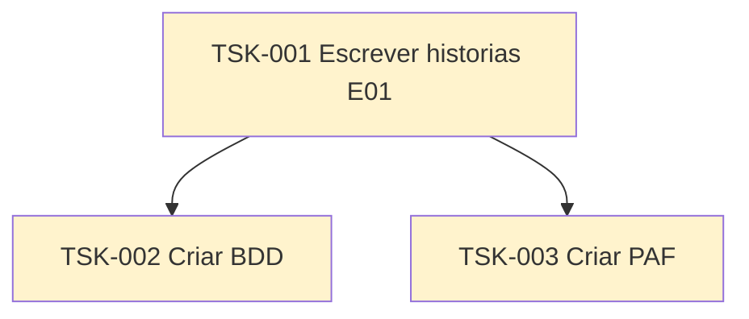

# RoleGo — Tasks

Cada atividade tem um **id**, uma **pasta** e um **output** previsto em [`docs/epics/`](../docs/epics/README.md).

Fonte do épico: [`epics.md`](../epics.md) (E01 — Conta, onboarding e perfil).

## Hierarquia

| ID | Task | Status | Output |
|----|------|--------|--------|
| TSK-001 | Escrever histórias E01 | Todo | [`docs/epics/EP-01-conta-onboarding-perfil/`](../docs/epics/EP-01-conta-onboarding-perfil/README.md) |
| TSK-002 | Criar BDD | Todo | BDD das US de EP-01 |
| TSK-003 | Criar PAF | Todo | PAF (protótipo de alta fidelidade) das US de EP-01 |
