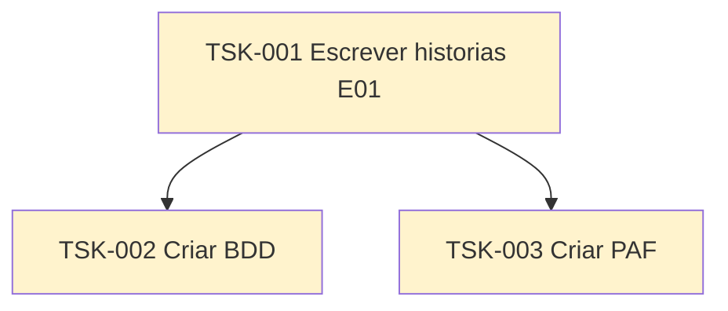

# TSK-001 — Escrever histórias E01

| Campo | Valor |
|-------|--------|
| ID | TSK-001 |
| Status | Todo |
| Pai | — |
| Épico | [E01 — Conta, onboarding e perfil](../../epics.md#e01--conta-onboarding-e-perfil) |
| Output | [`docs/epics/EP-01-conta-onboarding-perfil/`](../../docs/epics/EP-01-conta-onboarding-perfil/README.md) |

## Árvore de atividades

## Objetivo

Escrever as **histórias de usuário (US)** do épico **E01 — Conta, onboarding e perfil**, cobrindo cadastro/login (email, Google, Apple), onboarding (preferências, cidade, raio, localização) e perfil (foto, histórico, amigos, selos).

Referências:

- Visão / épico: [`epics.md`](../../epics.md)
- Documento de visão: [`README.md`](../../README.md)
- Identidade visual (para PAF): [`identidade-visual.md`](../../identidade-visual.md)
- Capa: [`assets/epic-e01-cover.png`](../../assets/epic-e01-cover.png)

## Filhos

- [`TSK-002`](TSK-002-criar-bdd/README.md) — Criar BDD
- [`TSK-003`](TSK-003-criar-paf/README.md) — Criar PAF
