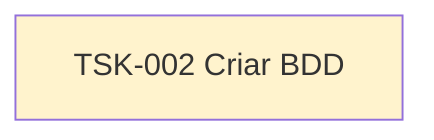

# TSK-002 — Criar BDD

| Campo | Valor |
|-------|--------|
| ID | TSK-002 |
| Status | Todo |
| Pai | [TSK-001](../README.md) |
| Épico | [E01 — Conta, onboarding e perfil](../../../epics.md#e01--conta-onboarding-e-perfil) |
| Output | BDD (cenários Given/When/Then) das US em [`docs/epics/EP-01-conta-onboarding-perfil/`](../../../docs/epics/EP-01-conta-onboarding-perfil/README.md) |

## Árvore de atividades

## Objetivo

Escrever os **cenários BDD** (Given / When / Then) para cada história de usuário do E01, cobrindo fluxos felizes e principais exceções de conta, onboarding e perfil.

Depende da conclusão (ou rascunho estável) das histórias em [TSK-001](../README.md).
