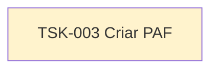

# TSK-003 — Criar PAF

| Campo | Valor |
|-------|--------|
| ID | TSK-003 |
| Status | Todo |
| Pai | [TSK-001](../README.md) |
| Épico | [E01 — Conta, onboarding e perfil](../../../epics.md#e01--conta-onboarding-e-perfil) |
| Output | PAF (protótipo de alta fidelidade) das telas de EP-01 em [`docs/epics/EP-01-conta-onboarding-perfil/`](../../../docs/epics/EP-01-conta-onboarding-perfil/README.md) |

## Árvore de atividades

## Objetivo

Criar o **PAF (protótipo de alta fidelidade)** das telas do E01 (splash/login/cadastro, onboarding, perfil), alinhado à [`identidade-visual.md`](../../../identidade-visual.md) e aos wireframes de referência em [`input/`](../../../input/).

Depende das histórias em [TSK-001](../README.md); preferencialmente após ou em paralelo com o BDD em [TSK-002](../TSK-002-criar-bdd/README.md).
