# Tasks — screen-robot

**Por quê:** Gantt das tasks (minutos IA).  
**IDs:** **TSK-** + origem **EP-** / **US-** / **SC-** em cada barra.  
**Regra:** pai com **uma** filha → só o pai no Gantt/tabela.  
**Roadmap:** [`3.roadmap.md`](3.roadmap.md).  
**Fonte:** [`1.stories.md`](1.stories.md) · [`4.scenarios.md`](4.scenarios.md) · [`5.bdds.md`](5.bdds.md).  
**Épicos:** [`2.epics.md`](2.epics.md).  
**Visão:** [`README.md`](README.md).  
**Kanban / inventário (umbrella):** [`core/tasks`](../core/tasks/README.md#p1--screen-robot).  
**Atividades documentadas (refinamento):** [`tasks/`](tasks/README.md).

Estimativas: minutos IA · **1 dia = 8h = 480 min**.  
Cores: **EP** azul (`done`) · **US** cinza · **SC** teal (`active`).

```mermaid
---
config:
  theme: base
  themeVariables:
    darkMode: true
    background: '#000000'
    primaryTextColor: '#ffffff'
    secondaryTextColor: '#ffffff'
    tertiaryTextColor: '#ffffff'
    textColor: '#ffffff'
    lineColor: '#333333'
    mainBkg: '#000000'
    secondaryColor: '#000000'
    tertiaryColor: '#000000'
    sectionBkgColor: '#000000'
    sectionBkgColor2: '#000000'
    altSectionBkgColor: '#000000'
    gridColor: '#222222'
    excludeBkgColor: '#000000'
    todayLineColor: '#444444'
    doneTaskBkgColor: '#2563eb'
    doneTaskBorderColor: '#1d4ed8'
    taskBkgColor: '#94a3b8'
    taskBorderColor: '#64748b'
    taskTextColor: '#ffffff'
    taskTextDarkColor: '#ffffff'
    taskTextLightColor: '#ffffff'
    taskTextOutsideColor: '#ffffff'
    critBkgColor: '#2563eb'
    critBorderColor: '#1d4ed8'
    activeTaskBkgColor: '#2dd4bf'
    activeTaskBorderColor: '#14b8a6'
---
gantt
  title screen-robot TSK
  dateFormat X
  axisFormat %s

  section TSK-001 EP-01 Provisionar
  TSK-001 EP-01 Provisionar agente      :tsk01, 0, 90m
  TSK-002 SC-01 Container nomeado       :active, tsk02, 0, 30m
  TSK-003 SC-02 Serial ADB online       :active, tsk03, after tsk02, 20m
  TSK-004 SC-03 Boot completo           :active, tsk04, after tsk03, 20m
  TSK-032 US-20 Resgatar agente         :tsk32, after tsk04, 20m
  TSK-033 SC-25 Localizar por nome      :active, tsk33, after tsk04, 10m
  TSK-034 SC-26 Reconectar e boot       :active, tsk34, after tsk33, 10m
  TSK-036 US-22 Mascarar identidade     :tsk36, after tsk04, 20m

  section TSK-005 EP-02 Eventos de UI
  TSK-005 EP-02 Eventos de UI           :done, tsk05, after tsk01, 24m
  TSK-006 US-02 Evento de boot          :tsk06, after tsk01, 12m
  TSK-007 US-03 Evento de app aberta    :tsk07, after tsk06, 12m
  TSK-008 US-04 Evento de tela estavel  :tsk08, after tsk06, 12m
  TSK-009 US-05 Evento de mudanca frame :tsk09, after tsk06, 12m

  section TSK-010 EP-03 Instalar APKs
  TSK-010 EP-03 Instalar APKs           :done, tsk10, after tsk09, 45m
  TSK-011 SC-08 Ler versao              :active, tsk11, after tsk09, 5m
  TSK-012 SC-09 Baixar APK              :active, tsk12, after tsk11, 25m
  TSK-013 SC-10 Instalar pacote         :active, tsk13, after tsk12, 15m

  section TSK-014 EP-04 Operar tela
  TSK-014 EP-04 Operar tela             :done, tsk14, after tsk09, 15m
  TSK-015 US-07 Abrir aplicativo        :tsk15, after tsk09, 15m
  TSK-016 US-08 tap                     :tsk16, after tsk09, 15m
  TSK-017 US-09 type                    :tsk17, after tsk09, 15m
  TSK-018 US-10 scroll                  :tsk18, after tsk09, 15m
  TSK-019 US-11 Capturar frame          :tsk19, after tsk09, 15m
  TSK-020 US-12 Resgatar coordenadas    :tsk20, after tsk09, 15m
  TSK-035 US-21 Abrir scrcpy            :tsk35, after tsk09, 20m

  section TSK-021 EP-05 Extrair elementos
  TSK-021 EP-05 Extrair elementos       :done, tsk21, after tsk09, 100m
  TSK-022 US-13 Extrair elementos OCR   :tsk22, after tsk09, 40m
  TSK-023 SC-17 Extrair textos fase 1   :active, tsk23, after tsk09, 20m
  TSK-024 SC-18 Extrair restante DOM    :active, tsk24, after tsk23, 20m
  TSK-025 US-14 Extrair icones          :tsk25, after tsk09, 20m
  TSK-026 US-15 Extrair listas          :tsk26, after tsk09, 20m
  TSK-027 US-16 Extrair imagens         :tsk27, after tsk09, 20m
  TSK-037 US-23 Buscar por texto        :tsk37, after tsk22, 30m

  section TSK-028 EP-06 Sessao
  TSK-028 EP-06 Sessao                  :done, tsk28, after tsk21, 45m
  TSK-029 US-17 Salvar sessao           :tsk29, after tsk21, 15m
  TSK-030 US-18 Remover sessao          :tsk30, after tsk29, 15m
  TSK-031 US-19 Recuperar sessao        :tsk31, after tsk30, 15m
```

| ID | Atividade | Descrição | Output | Status | Início | Fim | Estimativa |
|----|-----------|-----------|--------|--------|--------|-----|------------|
| TSK-001 | Provisionar agente | Orquestra criar agent nomeado (container novo) ou resgatar por nome até ADB pronto | Agent pronto (nome, serial online, boot ok) | Todo | | | 90 min |
| TSK-002 | Container nomeado | Aloca serial/porta e cria **container novo** ligado ao nome | Agent nomeado alcançável | Todo | | | 30 min |
| TSK-003 | Serial ADB online | Garante o serial alocado online via `adb connect` / listagem | Serial ADB online | Todo | | | 20 min |
| TSK-004 | Boot completo | Aguarda `sys.boot_completed` (ou equivalente) no device | Device com boot completo | Todo | | | 20 min |
| TSK-005 | Eventos de UI | Agrupa os sinais de UI que o código espera antes de operar/extrair | Sinais de boot, app aberta, tela estável e mudança de frame | Todo | | | 24 min |
| TSK-006 | Evento de boot | Emite/confirma o sinal de boot do device | Boot sinalizado | Todo | | | 12 min |
| TSK-007 | Evento de app aberta | Confirma que o package alvo está em foreground | App em foreground | Todo | | | 12 min |
| TSK-008 | Evento de tela estável | Confirma UI estável via hash/diff de **frame/imagem** | Tela estável | Todo | | | 12 min |
| TSK-009 | Evento de mudança de frame | Detecta mudança no **frame** (hash/diff visual; sem dump uiautomator) | Frame atualizado disponível | Todo | | | 12 min |
| TSK-010 | Instalar APKs | Lê versão, baixa e instala pacotes definidos na config | Apps instalados nas versões definidas | Todo | | | 45 min |
| TSK-011 | Ler versão | Parseia package/versão em `device.config.json` | Versão e package alvo | Todo | | | 5 min |
| TSK-012 | Baixar APK | Baixa o artefato APK/XAPK da versão pedida | Artefato APK no disco | Todo | | | 25 min |
| TSK-013 | Instalar pacote | Instala o APK no agent via `adb install` (ou equivalente) | Pacote instalado no agent | Todo | | | 15 min |
| TSK-014 | Operar tela | Agrupa gestos, captura e localização visual | Capacidade de operar e inspecionar a tela | Done | | | 15 min |
| TSK-015 | Abrir aplicativo | Faz launch de package/activity no agent | App em foreground | Done | | | 15 min |
| TSK-016 | tap | Toque em coords vindas de visão/OCR sobre o frame | UI refletindo o toque | Done | | | 15 min |
| TSK-017 | type | Digita / injeta texto no campo ou coords (visão/OCR) | Texto na UI | Done | | | 15 min |
| TSK-018 | scroll | Executa swipe/scroll na tela ou lista | Conteúdo rolado; novos itens visíveis | Done | | | 15 min |
| TSK-019 | Capturar frame | Captura frame (screencap ADB, stream ou câmera) e grava arquivo | Arquivo de imagem | Done | | | 15 min |
| TSK-020 | Resgatar coordenadas x,y | Localiza alvo por template/visão no frame e devolve x,y + confiança | Coordenadas x,y (e confiança) | Done | | | 15 min |
| TSK-035 | Abrir scrcpy | `handle.openScrcpy()` sobe scrcpy no serial do agent | Janela/processo scrcpy ativo | Done | | | 20 min |
| TSK-021 | Extrair elementos | Pipeline frame → OCR/visão → lista plana (sem dump uiautomator) | Lista de elementos por tipo / completa | Done | | | 100 min |
| TSK-022 | Extrair elementos (OCR) | Frame → OCR textos + visão restante até lista completa | Lista completa de elementos | Done | | | 40 min |
| TSK-023 | Extrair textos (fase 1) | OCR no frame: textos + bounds → lista | Lista com elementos `text` | Done | | | 20 min |
| TSK-024 | Enriquecer lista (fase 2) | Visão + OCR: ícones/listas/imagens na lista plana | Lista completa de elementos | Done | | | 20 min |
| TSK-025 | Extrair ícones | Visão reconhece ícones no frame | Lista com elementos `icon` | Done | | | 20 min |
| TSK-026 | Extrair listas | Visão + OCR extrai listas/itens no frame | Lista com elementos `list` | Done | | | 20 min |
| TSK-027 | Extrair imagens | Visão detecta regiões de imagem/foto no frame | Lista com elementos `image` | Done | | | 20 min |
| TSK-037 | Buscar por texto (similaridade) | `findByText(serial, query)` encapsula extractElements + score (US-23 · SC-29) | `{ elements, score }` ≥ limiar | Done | | | 30 min |
| TSK-028 | Sessão | Agrupa persistir, remover e recuperar estado do robô | Sessão gerenciável em disco/runtime | Done | | | 45 min |
| TSK-029 | Salvar sessão | Serializa o estado em memória e grava no path da sessão | Arquivo de sessão | Done | | | 15 min |
| TSK-030 | Remover sessão | Apaga o arquivo de sessão e limpa o contexto | Arquivo inexistente; contexto limpo | Done | | | 15 min |
| TSK-031 | Recuperar sessão | Lê o arquivo e reaplica o estado no runtime | Estado restaurado no runtime | Done | | | 15 min |
| TSK-032 | Resgatar agente existente | Pelo nome, localiza runtime e devolve handle sem criar container | Handle anexado (boot ok) | Todo | | | 20 min |
| TSK-033 | Localizar por nome | Resolve container/serial associados ao nome | Referência ao runtime (ou erro tipado) | Todo | | | 10 min |
| TSK-034 | Reconectar e boot | ADB connect + poll boot no agent já existente | Serial online e boot ok | Todo | | | 10 min |
| TSK-036 | Mascarar identidade | Perfil de aparelho de mercado em qualquer vendor (US-22 · SC-28) | Props sem fingerprint do runtime de automação | Todo | | | 20 min |

## Próximos passos

→ Roadmap: [`3.roadmap.md`](3.roadmap.md)  
→ Implementação em [`src`](src/README.md)  
→ Aceite: [`5.bdds.md`](5.bdds.md)
