# Arquitetura — screen-robot

**Por quê:** mapa completo do sistema até as camadas mais baixas (todos os métodos de `src/lib`).  
**API:** [`src/README.md`](src/README.md) · **Visão:** [`README.md`](README.md) · **EPs:** [`implementation-plan/`](implementation-plan/README.md) · **Runtime:** [`pocs/`](pocs/README.md).

Legenda nos diagramas: `+` público exportado · `-` interno (não exportado) · seta = chamada / uso.

---

## 1. Princípios

| Princípio | Detalhe |
|-----------|---------|
| Funções puras | Sem handle; `{ serial, … }` → dados |
| Percepção | frame → OCR → textos; gestos por coords |
| Runtime | AVD canônico; redroid legado |
| Create/attach | mesmo `name` anexa — não cria segundo |
| Deps | injetáveis para testes |

---

## 2. Camadas (topo → fundo)

```text
scripts/ · cli.js
    ↓
API pública (provision · reset · on · installApk · operate · extract · session)
    ↓
orquestradores internos (start-runtime · event-* · apk-* · frame · ocr)
    ↓
folha Node (adb.js · fs · crypto · child_process · net · tesseract.js)
    ↓
processos externos (adb · bash pocs/*/scripts · docker · scrcpy · apkeep · unzip)
    ↓
device (AVD / redroid / aparelho)
```

---

## 3. Catálogo de métodos (todos os exports)

### Folha ADB — `adb.js`

| Método | O quê | Camada baixa |
|--------|-------|--------------|
| `adb(serial, args, opts?)` | `spawnSync("adb", ["-s", serial, …])`; throw se exit ≠ 0 | adb CLI |
| `adbOk(serial, args)` | mesmo sem throw; retorna `status===0` | adb CLI |
| `connectIfTcp(serial)` | se host:port → `adb connect` | adb CLI |
| `sleep(ms)` | `setTimeout` Promise | timer |

### Provision / runtime

| Arquivo | Método | O quê |
|---------|--------|-------|
| `provision.js` | `provisionEmulator(cfg, deps?)` | resolve → start → ADB → boot |
| `provision.js` | `-resolveConfig(cfg)` | name/serial/kind/timeout/startScript |
| `reset-instance.js` | `resetInstance(cfg, deps?)` | reset.sh → reachable → ADB → boot |
| `reset-instance.js` | `defaultResetScript(kind)` | path `pocs/…/reset.sh` |
| `reset-instance.js` | `-defaultRunResetScript(path)` | `bash` spawnSync |
| `start-runtime.js` | `startRuntime(resolved, deps?)` | attach ou start.sh + poll |
| `start-runtime.js` | `defaultStartScript(kind)` | path `pocs/…/start.sh` |
| `start-runtime.js` | `isRuntimeReachable(serial, …)` | TCP+get-state **ou** `adb devices` |
| `start-runtime.js` | `findSerialForAvd(name, …)` | devices + `emu avd name` |
| `start-runtime.js` | `-defaultRunStartScript(path, env)` | `bash` spawnSync |
| `ensure-adb-online.js` | `ensureAdbOnline(serial, timeoutMs, …)` | connect + `wait-for-device` loop |
| `ensure-adb-online.js` | `-defaultWaitForDevice(serial)` | `adb wait-for-device` |
| `wait-boot-completed.js` | `waitBootCompleted(serial, timeoutMs, …)` | poll `sys.boot_completed` |
| `wait-boot-completed.js` | `-defaultGetBootCompleted(serial)` | getprop via adb |
| `redroid-instance.js` | `slugifyRedroidName(name)` | slug |
| `redroid-instance.js` | `portForRedroidName(name)` | 5555+(hash%100) |
| `redroid-instance.js` | `serialForRedroidName(name)` | `127.0.0.1:port` |
| `redroid-instance.js` | `containerNameForRedroid(name)` | `redroid-<slug>` |
| `redroid-instance.js` | `findSerialForRedroid(name, …)` | `docker inspect` HostPort |
| `redroid-instance.js` | `-dockerEnv()` | DOCKER_HOST / Colima sock |

### Eventos — `events.js` + `event-*.js`

| Arquivo | Método | O quê |
|---------|--------|-------|
| `events.js` | `on(cfg, deps?)` | switch event → waiter |
| `event-boot.js` | `waitBoot(serial, opts?, deps?)` | poll getprop boot |
| `event-boot.js` | `-defaultGetBoot` / `-timedOut` | adb / `EVENT_BOOT_TIMEOUT` |
| `event-app-open.js` | `waitAppOpen(serial, opts?, deps?)` | poll `pidof pkg` |
| `event-app-open.js` | `-defaultIsForeground` / `-timedOut` | adbOk / `EVENT_APP_TIMEOUT` |
| `event-ui-stable.js` | `waitUiStable(serial, opts?, deps?)` | dump SHA1 estável `stableMs` |
| `event-ui-stable.js` | `-hashDump(xml)` | crypto sha1 |
| `event-dump-change.js` | `waitDumpChange(serial, opts?, deps?)` | dump SHA1 ≠ previous |
| `event-dump-change.js` | `-hashDump` / `-timedOut` | crypto / `EVENT_DUMP_TIMEOUT` |

### APKs

| Arquivo | Método | O quê |
|---------|--------|-------|
| `apks.js` | `installApk(cfg, deps?)` | spec → version → artifact → install |
| `apk-read-spec.js` | `readAppSpec(app)` | valida package |
| `apk-get-installed-version.js` | `getInstalledVersion(serial, pkg)` | dumpsys `versionName` |
| `apk-download.js` | `findArtifact(dir, pkg, hint?)` | busca em `apks/` |
| `apk-download.js` | `ensureApkArtifact(spec)` | local ou `apkeep` download |
| `apk-install-package.js` | `installPackage(serial, path)` | apk ou xapk+ABI |
| `apk-install-package.js` | `-deviceAbis` / `-abiFromSplitName` / `-filterSplitsForDevice` | getprop + filtro |

### Operate — `operate.js`

| Método | O quê | Camada baixa |
|--------|-------|--------------|
| `launch(cfg)` | resolve-activity → `am start` / monkey | adb shell |
| `tap(cfg)` | `cmd input tap` → fallback `input tap` (+ reconnect) | adb |
| `tapElement(cfg)` | center/bounds → `tap` | → tap |
| `type(cfg)` | frame → OCR região → `buildKeyCenters` → taps | frame+ocr+tap |
| `buildKeyCenters(words)` | Map char→center (1 glifo) | puro |
| `scroll(cfg)` | `input swipe` | adb |
| `screenshot(cfg)` | screencap + pull + rm | adb + fs |
| `matchImage(cfg)` | stub ou `deps.matchTemplate` | — |
| `openScrcpy(cfg)` | `which scrcpy` + spawn detached | scrcpy |
| `key(cfg)` | `input keyevent` | adb |
| `-requireSerial` / `-resolveDeps` / `-fail` | helpers | — |

### Extract / OCR / frame / vision

| Arquivo | Método | O quê |
|---------|--------|-------|
| `extract.js` | `extract(cfg)` | frame → OCR → `TextElement[]` |
| `extract.js` | `extractElements(serial)` | OCR rico `{elements, framePath}` |
| `extract.js` | `findByText(serial, query)` | extractElements → matchByText |
| `extract.js` | `matchByText(els, query)` | janelas + similarity |
| `extract.js` | `findLoginTarget(elements)` | heurística login |
| `extract.js` | `findEditableFields(elements)` | heurística EditText |
| `extract.js` | `dumpUiXml(serial)` | **legado** uiautomator dump+cat |
| `extract.js` | `-withCenter`, `-elText`, `-elBounds`, `-flattenElements`, `-normalizeText`, `-isBetter`, `-similarity`, `-sequenceBonus`, `-levenshteinRatio`, `-sameLineNeighbors`, `-unionBounds` | match |
| `frame.js` | `captureFrame(serial)` | screencap → pull → PNG temp |
| `ocr.js` | `ocrWords(imagePath)` | tesseract.js → `OcrWord[]` |
| `ocr.js` | `regionToRectangle(region)` | normaliza ROI |
| `vision.js` | `detectIcons` / `detectLists` / `detectImages` | **legado**, não ligado a `extract` |
| `vision.js` | `-overlap` / `-nearCornerOrTop` | helpers |

### Sessão — `session.js`

| Método | O quê |
|--------|-------|
| `saveSession(cfg)` | mkdir + write JSON (`serial`, `kind`, `savedAt`, state) |
| `restoreSession(cfg)` | read + parse JSON |
| `removeSession(cfg)` | unlink se existe → bool |
| `loadSession(path)` | **deprecated** → objeto ou null |

---

## 4. Diagrama de classes — sistema completo


```mermaid
---
config:
  theme: base
  themeVariables:
    darkMode: true
    background: '#000000'
    primaryColor: '#000000'
    primaryTextColor: '#ffffff'
    primaryBorderColor: '#64748b'
    lineColor: '#64748b'
    textColor: '#ffffff'
    mainBkg: '#000000'
    classText: '#ffffff'
    clusterBkg: '#000000'
    clusterBorder: '#333333'
---
classDiagram
  direction TB

  class adb_js {
    <<leaf>>
    +adb(serial, args, opts)
    +adbOk(serial, args)
    +connectIfTcp(serial)
    +sleep(ms)
  }

  class provision_js {
    <<EP-01 público>>
    +provisionEmulator(cfg, deps)
    -resolveConfig(cfg)
  }
  class reset_instance_js {
    +resetInstance(cfg, deps)
    +defaultResetScript(kind)
    -defaultRunResetScript(path)
  }
  class start_runtime_js {
    +startRuntime(resolved, deps)
    +defaultStartScript(kind)
    +isRuntimeReachable(serial, timeoutMs, deps)
    +findSerialForAvd(name, deps)
    -defaultRunStartScript(path, env)
  }
  class redroid_instance_js {
    +slugifyRedroidName(name)
    +portForRedroidName(name)
    +serialForRedroidName(name)
    +containerNameForRedroid(name)
    +findSerialForRedroid(name, deps)
    -dockerEnv()
  }
  class ensure_adb_online_js {
    +ensureAdbOnline(serial, timeoutMs, started, deps)
    -defaultWaitForDevice(serial)
  }
  class wait_boot_completed_js {
    +waitBootCompleted(serial, timeoutMs, started, deps)
    -defaultGetBootCompleted(serial)
  }

  class events_js {
    <<EP-02 público>>
    +on(cfg, deps)
  }
  class event_boot_js {
    +waitBoot(serial, opts, deps)
    -defaultGetBoot(serial)
    -timedOut(msg)
  }
  class event_app_open_js {
    +waitAppOpen(serial, opts, deps)
    -defaultIsForeground(serial, pkg)
    -timedOut(msg)
  }
  class event_ui_stable_js {
    +waitUiStable(serial, opts, deps)
    -hashDump(xml)
    -timedOut(msg)
  }
  class event_dump_change_js {
    +waitDumpChange(serial, opts, deps)
    -hashDump(xml)
    -timedOut(msg)
  }

  class apks_js {
    <<EP-03 público>>
    +installApk(cfg, deps)
    -fail(code, msg)
  }
  class apk_read_spec_js {
    +readAppSpec(app)
  }
  class apk_get_installed_version_js {
    +getInstalledVersion(serial, pkg, deps)
  }
  class apk_download_js {
    +findArtifact(apksDir, pkg, hint, deps)
    +ensureApkArtifact(spec, deps)
  }
  class apk_install_package_js {
    +installPackage(serial, path, deps)
    -deviceAbis(serial, runAdb)
    -abiFromSplitName(name)
    -filterSplitsForDevice(splits, abis)
  }

  class operate_js {
    <<EP-04 público>>
    +launch(cfg, deps)
    +tap(cfg, deps)
    +tapElement(cfg, deps)
    +type(cfg, deps)
    +buildKeyCenters(words)
    +scroll(cfg, deps)
    +screenshot(cfg, deps)
    +matchImage(cfg, deps)
    +openScrcpy(cfg, deps)
    +key(cfg, deps)
    -requireSerial(cfg)
    -resolveDeps(deps)
    -fail(code, msg)
  }

  class extract_js {
    <<EP-05 público>>
    +extract(cfg, deps)
    +extractElements(serial, deps)
    +findByText(serial, query, opts)
    +matchByText(els, query, opts)
    +findLoginTarget(elements)
    +findEditableFields(elements)
    +dumpUiXml(serial, deps)
    -withCenter(el)
    -elText(el)
    -elBounds(el)
    -flattenElements(input)
    -normalizeText(s)
    -isBetter(cur, next)
    -similarity(q, c)
    -sequenceBonus(qt, ct)
    -levenshteinRatio(a, b)
    -sameLineNeighbors(els)
    -unionBounds(boxes)
  }
  class frame_js {
    +captureFrame(serial, deps)
  }
  class ocr_js {
    +ocrWords(imagePath, deps)
    +regionToRectangle(region)
  }
  class vision_js {
    <<legado>>
    +detectIcons(words, frameSize)
    +detectLists(words)
    +detectImages(words, frameSize)
    -overlap(a, b)
    -nearCornerOrTop(b, frameSize)
  }

  class session_js {
    <<EP-06 público>>
    +saveSession(cfg, deps)
    +restoreSession(cfg, deps)
    +removeSession(cfg, deps)
    +loadSession(path)
  }

  provision_js --> start_runtime_js
  provision_js --> ensure_adb_online_js
  provision_js --> wait_boot_completed_js
  reset_instance_js --> start_runtime_js : isReachable / defaultStartScript
  reset_instance_js --> ensure_adb_online_js
  reset_instance_js --> wait_boot_completed_js
  reset_instance_js --> adb_js : sleep
  start_runtime_js --> redroid_instance_js
  start_runtime_js --> adb_js : sleep
  ensure_adb_online_js --> adb_js
  wait_boot_completed_js --> adb_js

  events_js --> event_boot_js
  events_js --> event_app_open_js
  events_js --> event_ui_stable_js
  events_js --> event_dump_change_js
  event_boot_js --> adb_js
  event_app_open_js --> adb_js
  event_ui_stable_js --> extract_js : dumpUiXml
  event_dump_change_js --> extract_js : dumpUiXml

  apks_js --> apk_read_spec_js
  apks_js --> apk_get_installed_version_js
  apks_js --> apk_download_js
  apks_js --> apk_install_package_js
  apks_js --> adb_js : sleep
  apk_get_installed_version_js --> adb_js
  apk_install_package_js --> adb_js

  operate_js --> adb_js
  operate_js --> frame_js
  operate_js --> ocr_js
  extract_js --> frame_js
  extract_js --> ocr_js
  extract_js --> adb_js : dumpUiXml
  frame_js --> adb_js
```

---

## 5. Sequências até a camada mais baixa

### 5.1 `provisionEmulator` (AVD create/attach)

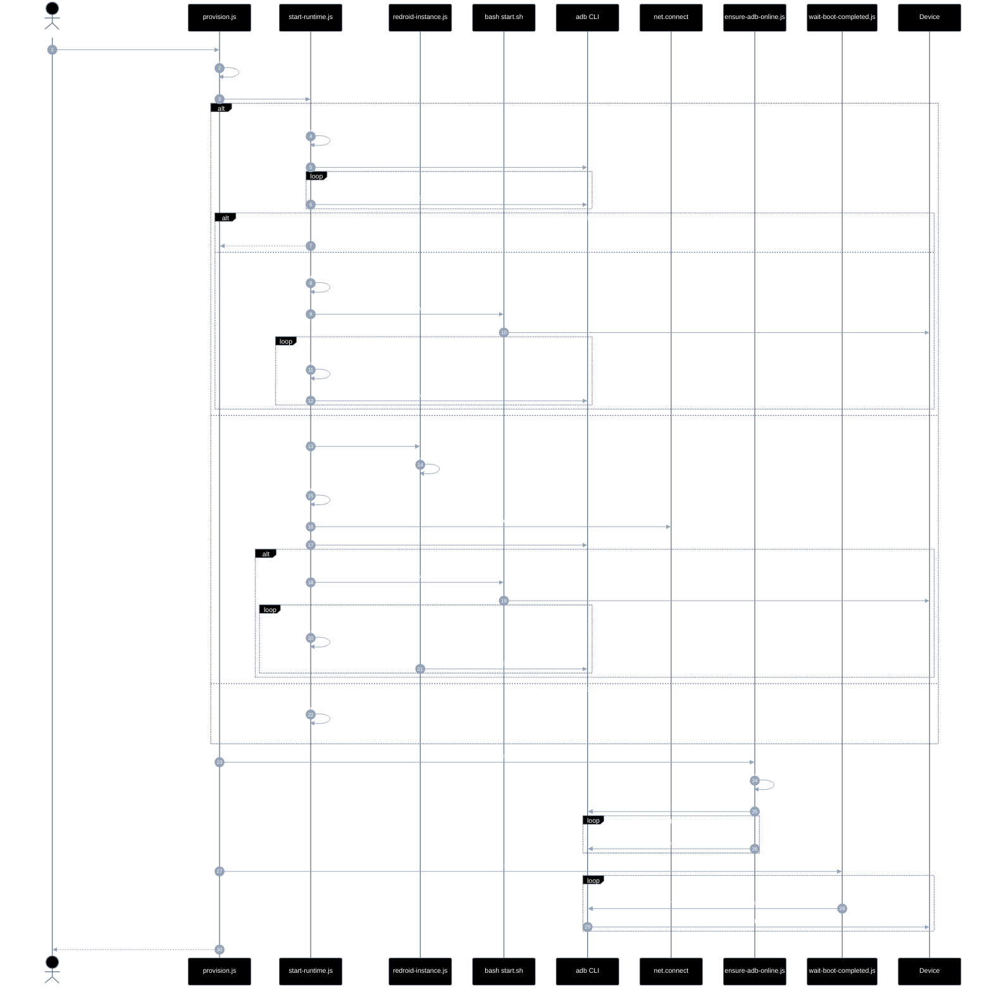
```mermaid
---
config:
  theme: base
  themeVariables:
    darkMode: true
    background: '#000000'
    primaryColor: '#000000'
    primaryTextColor: '#ffffff'
    primaryBorderColor: '#64748b'
    lineColor: '#64748b'
    textColor: '#ffffff'
    mainBkg: '#000000'
    actorBkg: '#000000'
    actorBorder: '#64748b'
    actorTextColor: '#ffffff'
    signalColor: '#94a3b8'
    signalTextColor: '#ffffff'
    noteBorderColor: '#64748b'
    noteBkgColor: '#111111'
    noteTextColor: '#ffffff'
    activationBorderColor: '#64748b'
    activationBkgColor: '#1a1a1a'
    sequenceNumberColor: '#ffffff'
    loopTextColor: '#ffffff'
---
sequenceDiagram
  autonumber
  actor Caller
  participant P as provision.js
  participant SR as start-runtime.js
  participant Red as redroid-instance.js
  participant Bash as bash start.sh
  participant ADBCLI as adb CLI
  participant Net as net.connect
  participant Ens as ensure-adb-online.js
  participant Boot as wait-boot-completed.js
  participant Dev as Device

  Caller->>P: provisionEmulator(cfg)
  P->>P: resolveConfig
  P->>SR: startRuntime(resolved)

  alt kind=avd + name
    SR->>SR: findSerialForAvd(name)
    SR->>ADBCLI: devices
    loop cada emulator-*
      SR->>ADBCLI: -s SERIAL emu avd name
    end
    alt já online
      SR-->>P: { serial }
    else sobe
      SR->>SR: defaultStartScript(avd)
      SR->>Bash: bash start.sh env AVD_NAME
      Bash->>Dev: emulator -avd …
      loop poll timeout
        SR->>SR: findSerialForAvd
        SR->>ADBCLI: devices + emu avd name
      end
    end
  else kind=redroid + name
    SR->>Red: serialForRedroidName(name)
    Red->>Red: portForRedroidName / slugify
    SR->>SR: isRuntimeReachable(serial)
    SR->>Net: TCP host:port
    SR->>ADBCLI: connect + get-state
    alt offline
      SR->>Bash: start.sh REDROID_NAME ADB_PORT
      Bash->>Dev: docker run redroid-…
      loop poll
        SR->>SR: isReachable / findSerialForRedroid
        Red->>ADBCLI: docker inspect HostPort
      end
    end
  else serial explícito
    SR->>SR: isRuntimeReachable(serial)
  end

  P->>Ens: ensureAdbOnline(serial, timeout)
  Ens->>Ens: connectIfTcp
  Ens->>ADBCLI: connect (se TCP)
  loop até device
    Ens->>ADBCLI: -s serial wait-for-device
  end

  P->>Boot: waitBootCompleted(serial, timeout)
  loop até =1
    Boot->>ADBCLI: shell getprop sys.boot_completed
    ADBCLI->>Dev: getprop
  end
  P-->>Caller: { serial, kind, provisionedAt, bootCompleted:true }
```

### 5.2 `resetInstance`

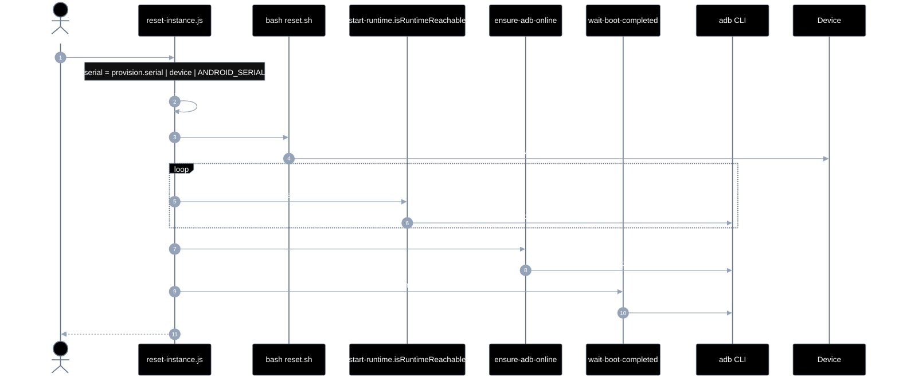
```mermaid
---
config:
  theme: base
  themeVariables:
    darkMode: true
    background: '#000000'
    primaryColor: '#000000'
    primaryTextColor: '#ffffff'
    primaryBorderColor: '#64748b'
    lineColor: '#64748b'
    textColor: '#ffffff'
    mainBkg: '#000000'
    actorBkg: '#000000'
    actorBorder: '#64748b'
    actorTextColor: '#ffffff'
    signalColor: '#94a3b8'
    signalTextColor: '#ffffff'
    noteBorderColor: '#64748b'
    noteBkgColor: '#111111'
    noteTextColor: '#ffffff'
    sequenceNumberColor: '#ffffff'
    loopTextColor: '#ffffff'
---
sequenceDiagram
  autonumber
  actor Caller
  participant R as reset-instance.js
  participant Bash as bash reset.sh
  participant SR as start-runtime.isRuntimeReachable
  participant Ens as ensure-adb-online
  participant Boot as wait-boot-completed
  participant ADB as adb CLI
  participant Dev as Device

  Caller->>R: resetInstance(cfg)
  Note over R: serial = provision.serial | device | ANDROID_SERIAL
  R->>R: defaultResetScript(kind) ou override
  R->>Bash: bash reset.sh
  Bash->>Dev: wipe + start de novo
  loop até reachable
    R->>SR: isRuntimeReachable(serial)
    SR->>ADB: connect/get-state ou devices
  end
  R->>Ens: ensureAdbOnline
  Ens->>ADB: wait-for-device
  R->>Boot: waitBootCompleted
  Boot->>ADB: getprop boot_completed
  R-->>Caller: { serial, kind, resetAt }
```

### 5.3 `on` — todos os eventos

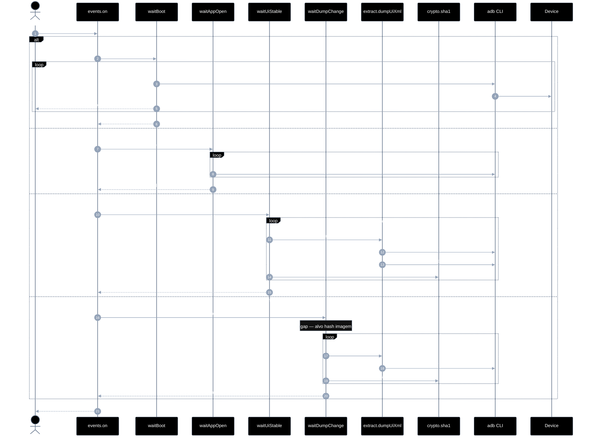
```mermaid
---
config:
  theme: base
  themeVariables:
    darkMode: true
    background: '#000000'
    primaryColor: '#000000'
    primaryTextColor: '#ffffff'
    primaryBorderColor: '#64748b'
    lineColor: '#64748b'
    textColor: '#ffffff'
    mainBkg: '#000000'
    actorBkg: '#000000'
    actorBorder: '#64748b'
    actorTextColor: '#ffffff'
    signalColor: '#94a3b8'
    signalTextColor: '#ffffff'
    noteBorderColor: '#64748b'
    noteBkgColor: '#111111'
    noteTextColor: '#ffffff'
    sequenceNumberColor: '#ffffff'
    loopTextColor: '#ffffff'
---
sequenceDiagram
  autonumber
  actor Caller
  participant E as events.on
  participant WB as waitBoot
  participant WA as waitAppOpen
  participant WS as waitUiStable
  participant WD as waitDumpChange
  participant Dump as extract.dumpUiXml
  participant Hash as crypto.sha1
  participant ADB as adb CLI
  participant Dev as Device

  Caller->>E: on({ serial, event, … })

  alt boot
    E->>WB: waitBoot(serial, opts)
    loop poll
      WB->>ADB: shell getprop sys.boot_completed
      ADB->>Dev: getprop
      WB-->>Caller: onEvent boot_poll (opc)
    end
    WB-->>E: { boot:true }
  else app_open
    E->>WA: waitAppOpen(serial, { pkg, … })
    loop poll
      WA->>ADB: shell pidof pkg (adbOk)
    end
    WA-->>E: { foreground, package }
  else ui_stable
    E->>WS: waitUiStable
    loop até hash estável stableMs
      WS->>Dump: dumpUiXml(serial)
      Dump->>ADB: shell uiautomator dump /sdcard/…
      Dump->>ADB: shell cat …
      WS->>Hash: sha1(xml)
    end
    WS-->>E: { stable:true }
  else frame_change / dump_change
    E->>WD: waitDumpChange
    Note over WD: gap — alvo hash imagem
    loop até hash ≠ previous
      WD->>Dump: dumpUiXml
      Dump->>ADB: uiautomator dump + cat
      WD->>Hash: sha1
    end
    WD-->>E: { xml, changed:true }
  end
  E-->>Caller: resultado
```

### 5.4 `installApk` (apk e xapk)

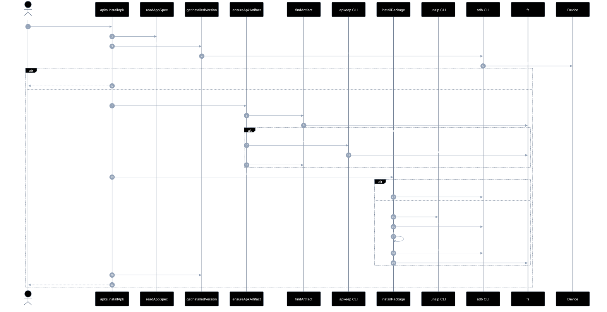
```mermaid
---
config:
  theme: base
  themeVariables:
    darkMode: true
    background: '#000000'
    primaryColor: '#000000'
    primaryTextColor: '#ffffff'
    primaryBorderColor: '#64748b'
    lineColor: '#64748b'
    textColor: '#ffffff'
    mainBkg: '#000000'
    actorBkg: '#000000'
    actorBorder: '#64748b'
    actorTextColor: '#ffffff'
    signalColor: '#94a3b8'
    signalTextColor: '#ffffff'
    noteBorderColor: '#64748b'
    noteBkgColor: '#111111'
    noteTextColor: '#ffffff'
    sequenceNumberColor: '#ffffff'
---
sequenceDiagram
  autonumber
  actor Caller
  participant A as apks.installApk
  participant Spec as readAppSpec
  participant Ver as getInstalledVersion
  participant Dl as ensureApkArtifact
  participant Find as findArtifact
  participant Keep as apkeep CLI
  participant Inst as installPackage
  participant Unzip as unzip CLI
  participant ADB as adb CLI
  participant FS as fs
  participant Dev as Device

  Caller->>A: installApk({ serial, … })
  A->>Spec: readAppSpec
  A->>Ver: getInstalledVersion(serial, pkg)
  Ver->>ADB: shell dumpsys package PKG
  ADB->>Dev: dumpsys
  alt version pin == instalada
    A-->>Caller: { skipped:true, package, version }
  else instalar
    A->>Dl: ensureApkArtifact(spec)
    Dl->>Find: findArtifact(apks/, pkg, hint)
    Find->>FS: exists / readdir
    alt não achou + source
      Dl->>Keep: apkeep -a pkg -d source apks/
      Keep->>FS: grava artefato
      Dl->>Find: findArtifact de novo
    end
    A->>Inst: installPackage(serial, path)
    alt .apk
      Inst->>ADB: install -r path
    else .xapk
      Inst->>Unzip: unzip *.apk → tmp
      Inst->>ADB: shell getprop ro.product.cpu.abilist
      Inst->>Inst: filterSplitsForDevice
      Inst->>ADB: install-multiple -r splits…
      Inst->>FS: rmSync tmp
    end
    A->>Ver: getInstalledVersion (confirma)
    A-->>Caller: { skipped:false, package, version, artifactPath }
  end
```

### 5.5 Operate — cada método até o fundo

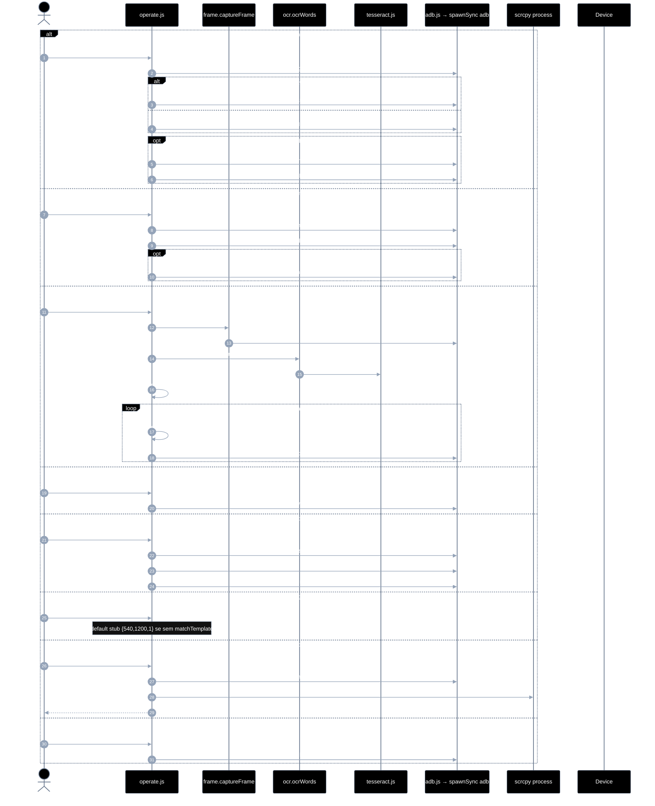
```mermaid
---
config:
  theme: base
  themeVariables:
    darkMode: true
    background: '#000000'
    primaryColor: '#000000'
    primaryTextColor: '#ffffff'
    primaryBorderColor: '#64748b'
    lineColor: '#64748b'
    textColor: '#ffffff'
    mainBkg: '#000000'
    actorBkg: '#000000'
    actorBorder: '#64748b'
    actorTextColor: '#ffffff'
    signalColor: '#94a3b8'
    signalTextColor: '#ffffff'
    noteBorderColor: '#64748b'
    noteBkgColor: '#111111'
    noteTextColor: '#ffffff'
    sequenceNumberColor: '#ffffff'
---
sequenceDiagram
  autonumber
  actor Caller
  participant O as operate.js
  participant F as frame.captureFrame
  participant OCR as ocr.ocrWords
  participant Tess as tesseract.js
  participant ADB as adb.js → spawnSync adb
  participant Scrcpy as scrcpy process
  participant Dev as Device

  alt launch
    Caller->>O: launch({ serial, package, activity? })
    O->>ADB: shell cmd package resolve-activity …
    alt component
      O->>ADB: shell am start -n component
    else
      O->>ADB: shell am start -a MAIN -c LAUNCHER -p pkg
    end
    opt falha → monkey
      O->>ADB: shell monkey -p pkg … (adbOk)
      O->>ADB: shell pidof pkg
    end
  else tap / tapElement
    Caller->>O: tap | tapElement
    O->>ADB: connectIfTcp
    O->>ADB: shell cmd input tap x y
    opt falha
      O->>ADB: shell input tap x y
    end
  else type
    Caller->>O: type({ serial, text, region? })
    O->>F: captureFrame
    F->>ADB: screencap / pull / rm
    O->>OCR: ocrWords(+ rectangle)
    OCR->>Tess: createWorker / recognize
    O->>O: buildKeyCenters(words)
    loop cada char
      O->>O: tap(center)
      O->>ADB: input tap
    end
  else scroll
    Caller->>O: scroll
    O->>ADB: shell input swipe x y x2 y2 300
  else screenshot
    Caller->>O: screenshot({ path })
    O->>ADB: screencap -p /sdcard/sr-shot.png
    O->>ADB: pull → path local
    O->>ADB: rm remote
  else matchImage
    Caller->>O: matchImage({ templatePath })
    Note over O: default stub {540,1200,1} se sem matchTemplate
  else openScrcpy
    Caller->>O: openScrcpy
    O->>ADB: connectIfTcp
    O->>Scrcpy: spawn -s serial --no-audio …
    O-->>Caller: { pid, serial }
  else key
    Caller->>O: key({ code })
    O->>ADB: shell input keyevent code
  end
```

### 5.6 `extract` / `findByText` / `matchByText`

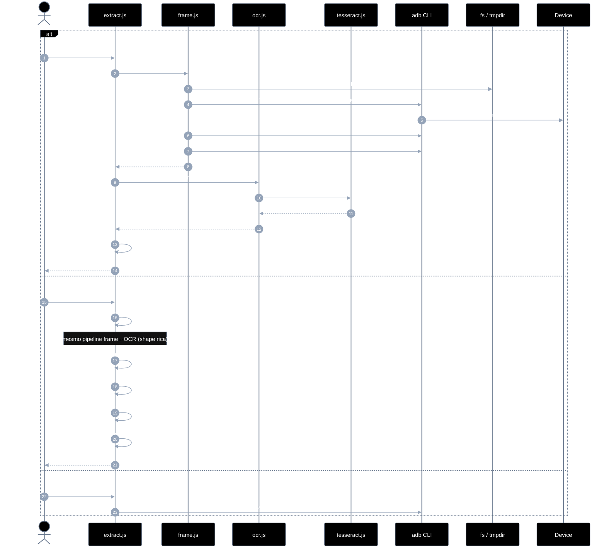
```mermaid
---
config:
  theme: base
  themeVariables:
    darkMode: true
    background: '#000000'
    primaryColor: '#000000'
    primaryTextColor: '#ffffff'
    primaryBorderColor: '#64748b'
    lineColor: '#64748b'
    textColor: '#ffffff'
    mainBkg: '#000000'
    actorBkg: '#000000'
    actorBorder: '#64748b'
    actorTextColor: '#ffffff'
    signalColor: '#94a3b8'
    signalTextColor: '#ffffff'
    noteBorderColor: '#64748b'
    noteBkgColor: '#111111'
    noteTextColor: '#ffffff'
    sequenceNumberColor: '#ffffff'
---
sequenceDiagram
  autonumber
  actor Caller
  participant X as extract.js
  participant F as frame.js
  participant OCR as ocr.js
  participant Tess as tesseract.js
  participant ADB as adb CLI
  participant FS as fs / tmpdir
  participant Dev as Device

  alt extract({ serial })
    Caller->>X: extract
    X->>F: captureFrame(serial)
    F->>FS: mkdir tmp PNG
    F->>ADB: shell screencap -p /sdcard/sr-frame.png
    ADB->>Dev: screencap
    F->>ADB: pull → outPath
    F->>ADB: shell rm remote
    F-->>X: framePath
    X->>OCR: ocrWords(framePath)
    OCR->>Tess: Tesseract.recognize(por+eng)
    Tess-->>OCR: words[]
    OCR-->>X: OcrWord[] (conf≥40)
    X->>X: withCenter → type text
    X-->>Caller: TextElement[]
  else findByText(serial, query)
    Caller->>X: findByText
    X->>X: extractElements(serial)
    Note over X: mesmo pipeline frame→OCR (shape rica)
    X->>X: matchByText(elements, query)
    X->>X: flattenElements / normalizeText
    X->>X: similarity / sequenceBonus / levenshteinRatio
    X->>X: sameLineNeighbors + unionBounds
    X-->>Caller: hit | null
  else dumpUiXml (legado eventos)
    Caller->>X: dumpUiXml(serial)
    X->>ADB: uiautomator dump + cat
  end
```

### 5.7 Sessão

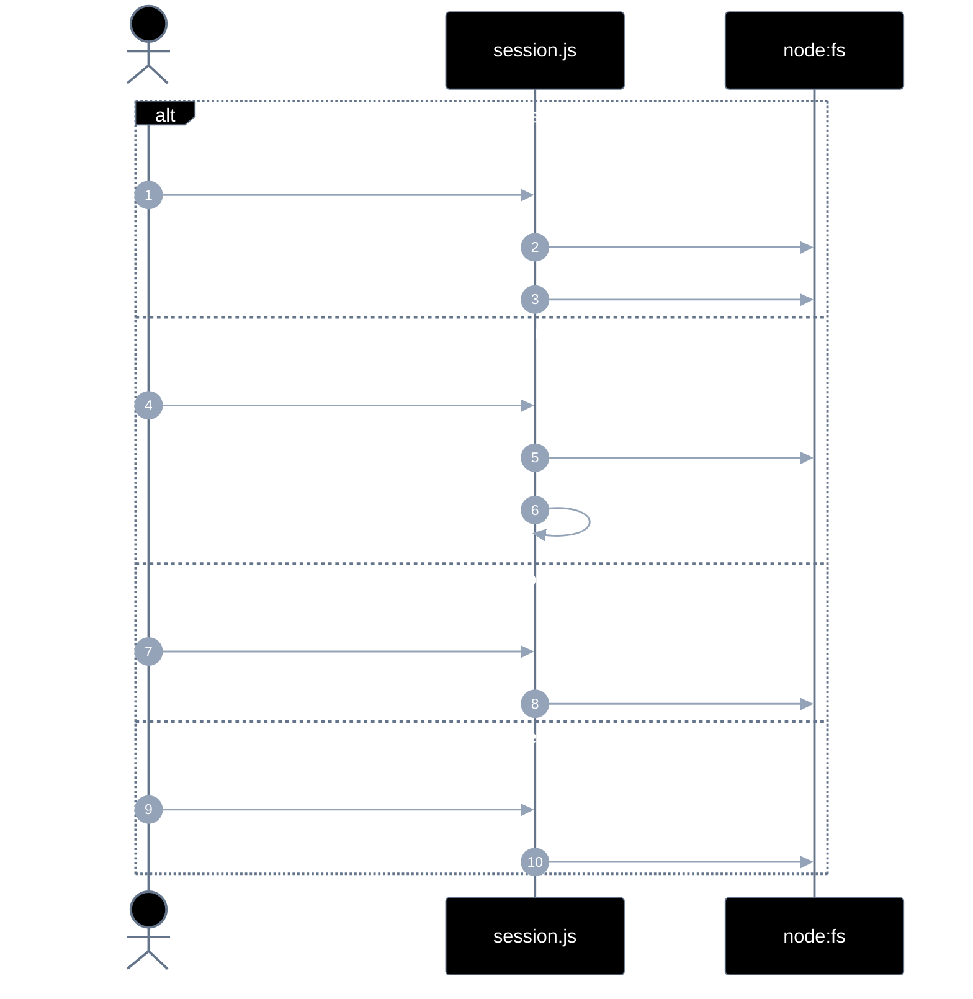
```mermaid
---
config:
  theme: base
  themeVariables:
    darkMode: true
    background: '#000000'
    primaryColor: '#000000'
    primaryTextColor: '#ffffff'
    primaryBorderColor: '#64748b'
    lineColor: '#64748b'
    textColor: '#ffffff'
    mainBkg: '#000000'
    actorBkg: '#000000'
    actorBorder: '#64748b'
    actorTextColor: '#ffffff'
    signalColor: '#94a3b8'
    signalTextColor: '#ffffff'
    noteBorderColor: '#64748b'
    noteBkgColor: '#111111'
    noteTextColor: '#ffffff'
    sequenceNumberColor: '#ffffff'
---
sequenceDiagram
  autonumber
  actor Caller
  participant S as session.js
  participant FS as node:fs

  alt saveSession
    Caller->>S: saveSession({ serial, kind, path, state })
    S->>FS: mkdirSync dirname
    S->>FS: writeFileSync JSON
  else restoreSession
    Caller->>S: restoreSession({ path })
    S->>FS: existsSync / readFileSync
    S->>S: JSON.parse
  else removeSession
    Caller->>S: removeSession({ path })
    S->>FS: unlinkSync se existe
  else loadSession (deprecated)
    Caller->>S: loadSession(path)
    S->>FS: readFileSync | null
  end
```

### 5.8 Folha `adb.js` (todas as entradas)

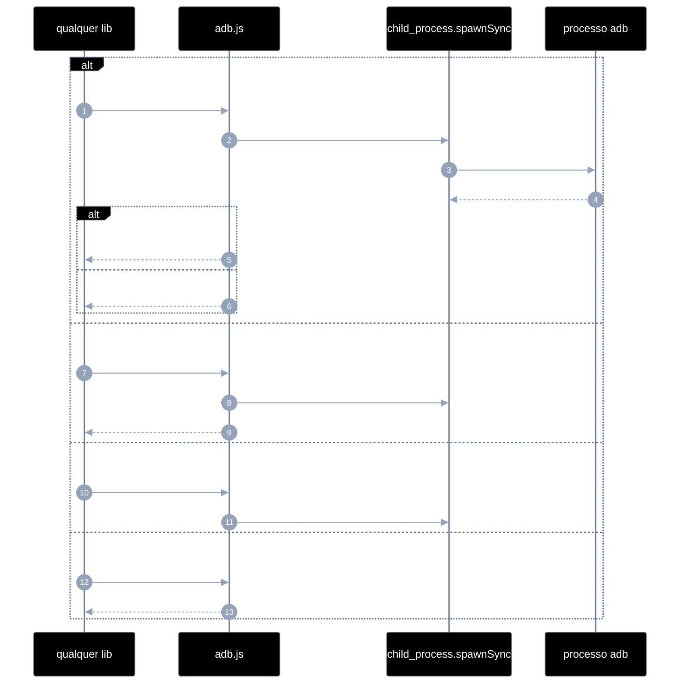
```mermaid
---
config:
  theme: base
  themeVariables:
    darkMode: true
    background: '#000000'
    primaryColor: '#000000'
    primaryTextColor: '#ffffff'
    primaryBorderColor: '#64748b'
    lineColor: '#64748b'
    textColor: '#ffffff'
    mainBkg: '#000000'
    actorBkg: '#000000'
    actorBorder: '#64748b'
    actorTextColor: '#ffffff'
    signalColor: '#94a3b8'
    signalTextColor: '#ffffff'
    noteBorderColor: '#64748b'
    noteBkgColor: '#111111'
    noteTextColor: '#ffffff'
    sequenceNumberColor: '#ffffff'
---
sequenceDiagram
  autonumber
  participant Any as qualquer lib
  participant A as adb.js
  participant CP as child_process.spawnSync
  participant CLI as processo adb

  alt adb(serial, args)
    Any->>A: adb(serial, args, opts?)
    A->>CP: spawnSync("adb", ["-s", serial, …args])
    CP->>CLI: adb
    CLI-->>CP: stdout/stderr/status
    alt status ≠ 0
      A-->>Any: throw Error
    else
      A-->>Any: result
    end
  else adbOk
    Any->>A: adbOk(serial, args)
    A->>CP: spawnSync adb
    A-->>Any: boolean
  else connectIfTcp
    Any->>A: connectIfTcp(serial)
    A->>CP: spawnSync("adb", ["connect", serial])
  else sleep
    Any->>A: sleep(ms)
    A-->>Any: Promise (setTimeout)
  end
```

### 5.9 Piloto (orquestração dos públicos)

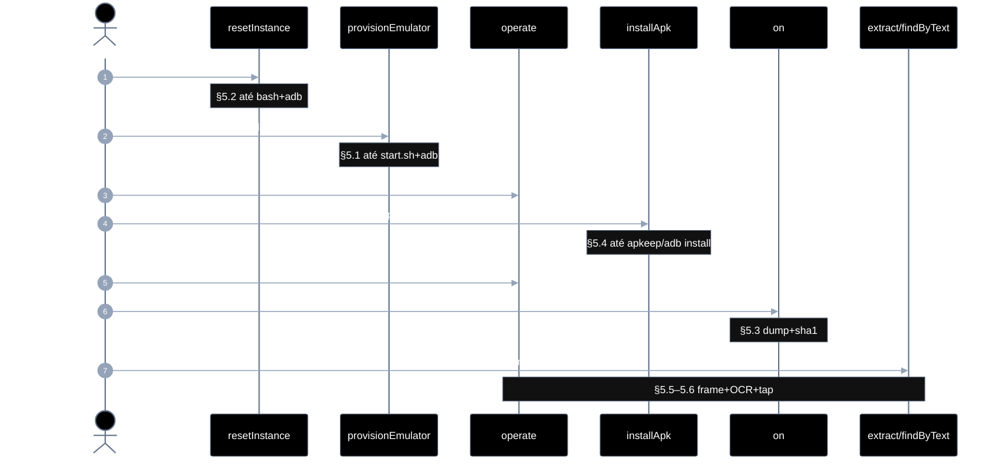
```mermaid
---
config:
  theme: base
  themeVariables:
    darkMode: true
    background: '#000000'
    primaryColor: '#000000'
    primaryTextColor: '#ffffff'
    primaryBorderColor: '#64748b'
    lineColor: '#64748b'
    textColor: '#ffffff'
    mainBkg: '#000000'
    actorBkg: '#000000'
    actorBorder: '#64748b'
    actorTextColor: '#ffffff'
    signalColor: '#94a3b8'
    signalTextColor: '#ffffff'
    noteBorderColor: '#64748b'
    noteBkgColor: '#111111'
    noteTextColor: '#ffffff'
    sequenceNumberColor: '#ffffff'
---
sequenceDiagram
  autonumber
  actor Script as scripts/linkedin-login|app-home
  participant Reset as resetInstance
  participant Prov as provisionEmulator
  participant Op as operate
  participant Apk as installApk
  participant Ev as on
  participant X as extract/findByText

  Script->>Reset: resetInstance(cfg)
  Note over Reset: §5.2 até bash+adb
  Script->>Prov: provisionEmulator(cfg)
  Note over Prov: §5.1 até start.sh+adb
  Script->>Op: openScrcpy
  Script->>Apk: installApk
  Note over Apk: §5.4 até apkeep/adb install
  Script->>Op: launch
  Script->>Ev: on(ui_stable)
  Note over Ev: §5.3 dump+sha1
  Script->>X: findByText → tapElement → extract
  Note over X,Op: §5.5–5.6 frame+OCR+tap
```

### 5.10 Scripts shell — AVD (`pocs/android-studio/scripts`)

Quem chama: `start-runtime` → `defaultStartScript("avd")` → `start.sh` · `resetInstance` → `defaultResetScript("avd")` → `reset.sh`. Env: `AVD_NAME` (default `ConnectMax_Cam`), `EMU_MEMORY`, `EMU_CORES`, `EMU_NO_WINDOW`.

#### `start.sh`

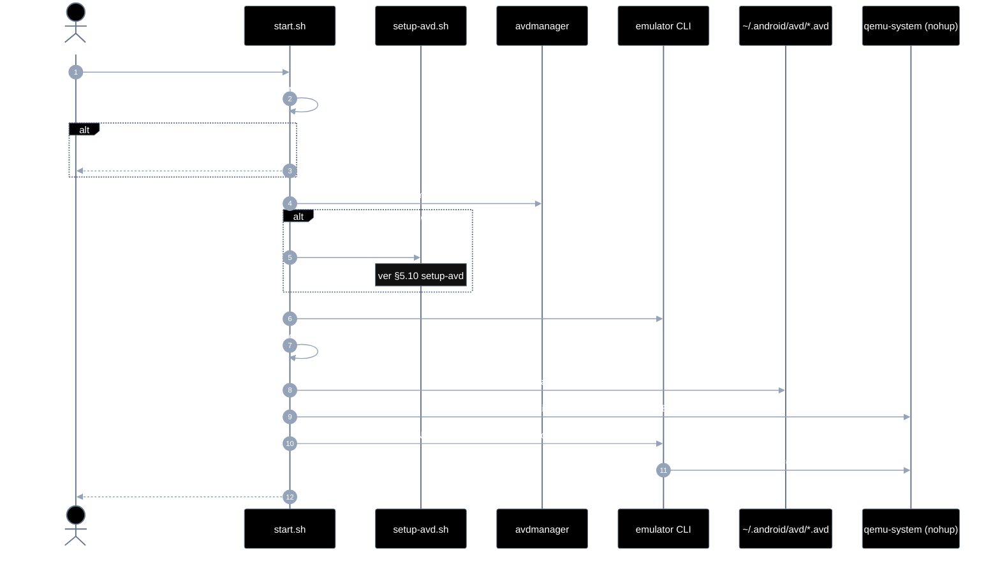
```mermaid
---
config:
  theme: base
  themeVariables:
    darkMode: true
    background: '#000000'
    primaryColor: '#000000'
    primaryTextColor: '#ffffff'
    primaryBorderColor: '#64748b'
    lineColor: '#64748b'
    textColor: '#ffffff'
    mainBkg: '#000000'
    actorBkg: '#000000'
    actorBorder: '#64748b'
    actorTextColor: '#ffffff'
    signalColor: '#94a3b8'
    signalTextColor: '#ffffff'
    noteBorderColor: '#64748b'
    noteBkgColor: '#111111'
    noteTextColor: '#ffffff'
    sequenceNumberColor: '#ffffff'
---
sequenceDiagram
  autonumber
  actor Lib as start-runtime / bash
  participant Start as start.sh
  participant Setup as setup-avd.sh
  participant AvdMgr as avdmanager
  participant Emu as emulator CLI
  participant FS as ~/.android/avd/*.avd
  participant Qemu as qemu-system (nohup)

  Lib->>Start: bash start.sh (AVD_NAME=…)
  Start->>Start: export JAVA_HOME ANDROID_HOME PATH
  alt emulator não no PATH
    Start-->>Lib: exit 1
  end
  Start->>AvdMgr: list avd | grep Name: AVD_NAME
  alt AVD não existe
    Start->>Setup: setup-avd.sh
    Note over Setup: ver §5.10 setup-avd
  end
  Start->>Emu: -webcam-list
  Start->>Start: escolhe webcam OBS ou webcam0
  Start->>FS: reescreve hw.camera.back/front no config.ini
  Start->>Qemu: pkill qemu-system.*AVD_NAME
  Start->>Emu: nohup emulator -avd AVD_NAME -camera-* -memory -cores -gpu … [-no-window]
  Emu->>Qemu: processo em background → emulator.log
  Start-->>Lib: exit 0 (boot ainda assíncrono — lib faz poll)
```

#### `setup-avd.sh`

```mermaid
---
config:
  theme: base
  themeVariables:
    darkMode: true
    background: '#000000'
    primaryColor: '#000000'
    primaryTextColor: '#ffffff'
    primaryBorderColor: '#64748b'
    lineColor: '#64748b'
    textColor: '#ffffff'
    mainBkg: '#000000'
    actorBkg: '#000000'
    actorBorder: '#64748b'
    actorTextColor: '#ffffff'
    signalColor: '#94a3b8'
    signalTextColor: '#ffffff'
    noteBorderColor: '#64748b'
    noteBkgColor: '#111111'
    noteTextColor: '#ffffff'
    sequenceNumberColor: '#ffffff'
---
sequenceDiagram
  autonumber
  actor Caller as start.sh / manual
  participant Setup as setup-avd.sh
  participant Sdk as sdkmanager
  participant Avd as avdmanager
  participant Py as python3
  participant FS as config.ini

  Caller->>Setup: setup-avd.sh
  Setup->>Setup: checa ANDROID_HOME/emulator
  Setup->>Sdk: yes | --licenses
  Setup->>Sdk: --install emulator platform-tools system-images;android-30;google_apis_playstore;arm64-v8a
  alt AVD já existe
    Setup->>Setup: só atualiza config
  else
    Setup->>Avd: create avd -n AVD_NAME -k PACKAGE -d pixel_4 --force
  end
  opt config ainda google_apis (sem Play)
    Setup->>Avd: delete avd + create playstore
  end
  Setup->>Py: reescreve RAM/CPU/disk/câmera/PlayStore.enabled
  Py->>FS: config.ini
  Setup-->>Caller: pronto
```

#### `reset.sh` (+ `stop.sh` + `wait-boot.sh`)

```mermaid
---
config:
  theme: base
  themeVariables:
    darkMode: true
    background: '#000000'
    primaryColor: '#000000'
    primaryTextColor: '#ffffff'
    primaryBorderColor: '#64748b'
    lineColor: '#64748b'
    textColor: '#ffffff'
    mainBkg: '#000000'
    actorBkg: '#000000'
    actorBorder: '#64748b'
    actorTextColor: '#ffffff'
    signalColor: '#94a3b8'
    signalTextColor: '#ffffff'
    noteBorderColor: '#64748b'
    noteBkgColor: '#111111'
    noteTextColor: '#ffffff'
    sequenceNumberColor: '#ffffff'
    loopTextColor: '#ffffff'
---
sequenceDiagram
  autonumber
  actor Lib as resetInstance
  participant Reset as reset.sh
  participant Stop as stop.sh
  participant Setup as setup-avd.sh
  participant Emu as emulator
  participant Wait as wait-boot.sh
  participant ADB as adb -e
  participant Qemu as qemu-system

  Lib->>Reset: bash reset.sh (AVD_NAME)
  Reset->>Reset: free_gb /Users — aborta se livre menor que 4 GB
  Reset->>Stop: stop.sh
  Stop->>Qemu: pkill qemu-system.*AVD_NAME
  Stop->>Qemu: pkill emulator -avd AVD_NAME
  alt AVD sumiu
    Reset->>Setup: setup-avd.sh
  end
  Reset->>Emu: -webcam-list → WEBCAM
  Reset->>Emu: nohup emulator -avd … -wipe-data …
  Emu->>Qemu: sobe com wipe
  Reset->>Reset: sleep 3; kill -0 pid (senão FATAL no log)
  Reset->>Wait: wait-boot.sh
  loop até 60× (sleep 2)
    Wait->>Qemu: pgrep qemu-system
    Wait->>ADB: shell getprop sys.boot_completed
  end
  Wait->>ADB: devices -l
  Wait-->>Reset: boot OK
  Reset-->>Lib: exit 0
```

#### `stop.sh` / `wait-boot.sh` (isolados)

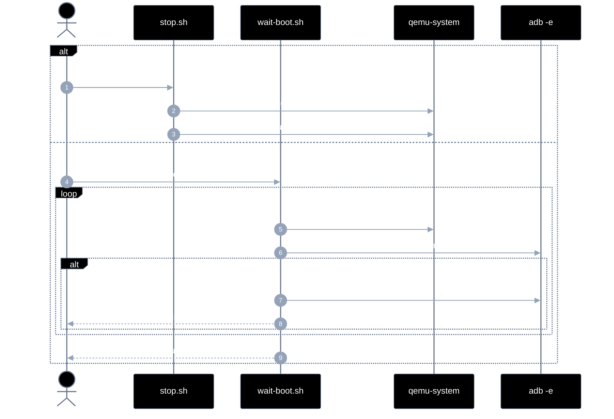
```mermaid
---
config:
  theme: base
  themeVariables:
    darkMode: true
    background: '#000000'
    primaryColor: '#000000'
    primaryTextColor: '#ffffff'
    primaryBorderColor: '#64748b'
    lineColor: '#64748b'
    textColor: '#ffffff'
    mainBkg: '#000000'
    actorBkg: '#000000'
    actorBorder: '#64748b'
    actorTextColor: '#ffffff'
    signalColor: '#94a3b8'
    signalTextColor: '#ffffff'
    noteBorderColor: '#64748b'
    noteBkgColor: '#111111'
    noteTextColor: '#ffffff'
    sequenceNumberColor: '#ffffff'
    loopTextColor: '#ffffff'
---
sequenceDiagram
  autonumber
  actor User as operador / reset.sh
  participant Stop as stop.sh
  participant Wait as wait-boot.sh
  participant Qemu as qemu-system
  participant ADB as adb -e

  alt stop
    User->>Stop: stop.sh
    Stop->>Qemu: pkill -f qemu-system.*AVD_NAME
    Stop->>Qemu: pkill -f emulator -avd AVD_NAME
  else wait-boot
    User->>Wait: wait-boot.sh
    loop 1..60
      Wait->>Qemu: pgrep qemu-system (senão exit 1)
      Wait->>ADB: getprop sys.boot_completed
      alt =1
        Wait->>ADB: devices -l
        Wait-->>User: exit 0
      end
    end
    Wait-->>User: timeout exit 1
  end
```

### 5.11 Scripts shell — redroid (`pocs/redroid/scripts`)

Quem chama: `start-runtime` → `start.sh` (env `REDROID_NAME`, `ADB_PORT`) · `resetInstance` → `reset.sh`. Todo script `source _docker.sh` (garante Docker/Colima).

#### `_docker.sh` — `_redroid_ensure_docker`

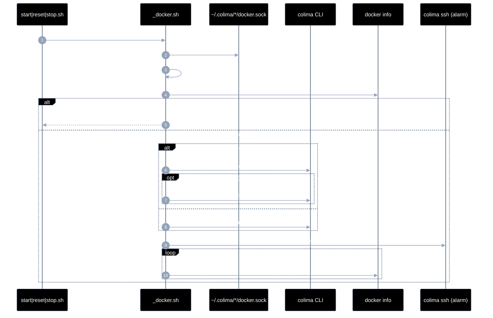
```mermaid
---
config:
  theme: base
  themeVariables:
    darkMode: true
    background: '#000000'
    primaryColor: '#000000'
    primaryTextColor: '#ffffff'
    primaryBorderColor: '#64748b'
    lineColor: '#64748b'
    textColor: '#ffffff'
    mainBkg: '#000000'
    actorBkg: '#000000'
    actorBorder: '#64748b'
    actorTextColor: '#ffffff'
    signalColor: '#94a3b8'
    signalTextColor: '#ffffff'
    noteBorderColor: '#64748b'
    noteBkgColor: '#111111'
    noteTextColor: '#ffffff'
    sequenceNumberColor: '#ffffff'
    loopTextColor: '#ffffff'
---
sequenceDiagram
  autonumber
  participant Any as start|reset|stop.sh
  participant D as _docker.sh
  participant Sock as ~/.colima/*/docker.sock
  participant Colima as colima CLI
  participant Dock as docker info
  participant SSH as colima ssh (alarm)

  Any->>D: source _docker.sh → _redroid_ensure_docker
  D->>Sock: localiza socket Colima
  D->>D: export DOCKER_HOST=unix://…
  D->>Dock: docker info
  alt OK
    D-->>Any: return 0
  else Darwin + colima
    alt colima “running” mas docker morto
      D->>Colima: restart (alarm 90s)
      opt falhou
        D->>Colima: stop -f + pkill limactl + start
      end
    else
      D->>Colima: start
    end
    D->>SSH: mount binderfs (best-effort)
    loop até 45s
      D->>Dock: docker info
    end
  end
```

#### `start.sh`

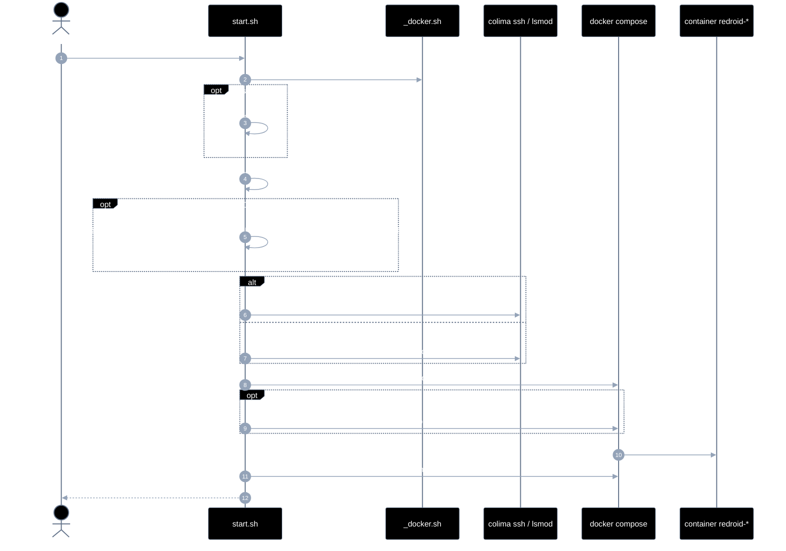
```mermaid
---
config:
  theme: base
  themeVariables:
    darkMode: true
    background: '#000000'
    primaryColor: '#000000'
    primaryTextColor: '#ffffff'
    primaryBorderColor: '#64748b'
    lineColor: '#64748b'
    textColor: '#ffffff'
    mainBkg: '#000000'
    actorBkg: '#000000'
    actorBorder: '#64748b'
    actorTextColor: '#ffffff'
    signalColor: '#94a3b8'
    signalTextColor: '#ffffff'
    noteBorderColor: '#64748b'
    noteBkgColor: '#111111'
    noteTextColor: '#ffffff'
    sequenceNumberColor: '#ffffff'
---
sequenceDiagram
  autonumber
  actor Lib as start-runtime
  participant Start as start.sh
  participant DockInit as _docker.sh
  participant Host as colima ssh / lsmod
  participant Compose as docker compose
  participant Ctr as container redroid-*

  Lib->>Start: bash start.sh (REDROID_NAME ADB_PORT)
  Start->>DockInit: source → ensure docker
  opt sem .env
    Start->>Start: cp .env.example .env
  end
  Start->>Start: mkdir -p data
  opt REDROID_NAME set
    Start->>Start: SLUG → COMPOSE_PROJECT_NAME / REDROID_CONTAINER_NAME / ADB_PORT
  end
  alt Linux
    Start->>Host: lsmod binder_linux (aviso se falta)
  else Darwin
    Start->>Host: colima ssh → modprobe binder + mount binderfs
  end
  Start->>Compose: up -d --force-recreate
  opt falhou
    Start->>Compose: docker rm -f órfãos + up de novo
  end
  Compose->>Ctr: sobe redroid/redroid
  Start->>Compose: ps (+ aviso se mais de 1 redroid up)
  Start-->>Lib: exit 0
```

#### `reset.sh` / `stop.sh`

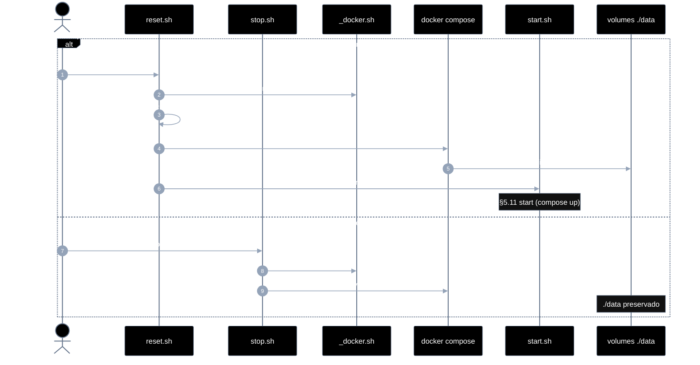
```mermaid
---
config:
  theme: base
  themeVariables:
    darkMode: true
    background: '#000000'
    primaryColor: '#000000'
    primaryTextColor: '#ffffff'
    primaryBorderColor: '#64748b'
    lineColor: '#64748b'
    textColor: '#ffffff'
    mainBkg: '#000000'
    actorBkg: '#000000'
    actorBorder: '#64748b'
    actorTextColor: '#ffffff'
    signalColor: '#94a3b8'
    signalTextColor: '#ffffff'
    noteBorderColor: '#64748b'
    noteBkgColor: '#111111'
    noteTextColor: '#ffffff'
    sequenceNumberColor: '#ffffff'
---
sequenceDiagram
  autonumber
  actor Lib as resetInstance / operador
  participant Reset as reset.sh
  participant Stop as stop.sh
  participant DockInit as _docker.sh
  participant Compose as docker compose
  participant Start as start.sh
  participant Vol as volumes ./data

  alt reset (wipe)
    Lib->>Reset: bash reset.sh
    Reset->>DockInit: source ensure docker
    Reset->>Reset: aplica REDROID_NAME → project/container/port
    Reset->>Compose: down -v
    Compose->>Vol: remove volumes (instância do zero)
    Reset->>Start: exec start.sh
    Note over Start: §5.11 start (compose up)
  else stop (preserva data)
    Lib->>Stop: stop.sh
    Stop->>DockInit: source ensure docker
    Stop->>Compose: down
    Note over Vol: ./data preservado
  end
```

### 5.12 Quem chama qual script

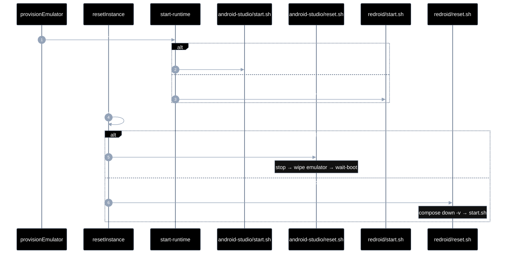
```mermaid
---
config:
  theme: base
  themeVariables:
    darkMode: true
    background: '#000000'
    primaryColor: '#000000'
    primaryTextColor: '#ffffff'
    primaryBorderColor: '#64748b'
    lineColor: '#64748b'
    textColor: '#ffffff'
    mainBkg: '#000000'
    actorBkg: '#000000'
    actorBorder: '#64748b'
    actorTextColor: '#ffffff'
    signalColor: '#94a3b8'
    signalTextColor: '#ffffff'
    noteBorderColor: '#64748b'
    noteBkgColor: '#111111'
    noteTextColor: '#ffffff'
    sequenceNumberColor: '#ffffff'
---
sequenceDiagram
  autonumber
  participant Prov as provisionEmulator
  participant Reset as resetInstance
  participant SR as start-runtime
  participant AvdStart as android-studio/start.sh
  participant AvdReset as android-studio/reset.sh
  participant RedStart as redroid/start.sh
  participant RedReset as redroid/reset.sh

  Prov->>SR: startRuntime
  alt kind=avd
    SR->>AvdStart: bash + AVD_NAME
  else kind=redroid
    SR->>RedStart: bash + REDROID_NAME + ADB_PORT
  end

  Reset->>Reset: defaultResetScript(kind)
  alt kind=avd
    Reset->>AvdReset: bash reset.sh
    Note over AvdReset: stop → wipe emulator → wait-boot
  else kind=redroid|adb
    Reset->>RedReset: bash reset.sh
    Note over RedReset: compose down -v → start.sh
  end
```

---

## 6. Gaps (código vs alvo)

| Gap | Hoje | Alvo |
|-----|------|------|
| `ui_stable` / `frame_change` | SHA1 dump XML | hash/diff imagem |
| `matchImage` | stub sem `matchTemplate` | template real |
| `vision.js` | órfão | não alimenta `extract` |
| Plano EP-01 `attach-runtime` / `agent-registry` | lógica em `start-runtime.js` | — |
| `sample.js` | demos redroid | AVD canônico |

---

## 7. Caminho inverso

| Precisa | Ir |
|---------|-----|
| Contratos / uso | [`src/README.md`](src/README.md) |
| Detalhe por EP | [`implementation-plan/`](implementation-plan/README.md) |
| Por que AVD | [`postmortem.md`](postmortem.md) |
| Shell start/reset (seq. §5.10–5.12) | [`pocs/android-studio/`](pocs/android-studio/README.md) · [`pocs/redroid/`](pocs/redroid/README.md) |
| Aceite | [`5.bdds.md`](5.bdds.md) |
