# Arquitetura — screen-robot

**Por quê:** visão estrutural única do runtime Node + ADB (módulos, contratos, sequências).  
**API canônica:** [`src/README.md`](src/README.md) · **Visão:** [`README.md`](README.md) · **Planos por épico:** [`implementation-plan/`](implementation-plan/README.md) · **Runtime:** [`pocs/`](pocs/README.md).

---

## 1. Princípios

| Princípio | Detalhe |
|-----------|---------|
| Funções puras | Sem handle; cada op recebe `{ serial, … }` e devolve dados |
| Percepção por imagem | `extract` = frame → OCR → textos; gestos por coordenadas |
| Runtime canônico | AVD (`kind: "avd"`); redroid = legado |
| Create / attach | Mesmo `name` → anexa; não cria segundo AVD/container |
| Deps injetáveis | `deps` opcional em libs (testes unitários) |

**Fora de escopo:** regras LinkedIn/vendas (consumidores externos).

---

## 2. Camadas

```text
scripts/ · cli.js          ← entry (pilotos / legado)
        ↓
lib/* públicos             ← provision · on · installApk · operate · extract · session · reset
        ↓
lib/* internos             ← start-runtime · events waiters · apk-* · frame · ocr · adb
        ↓
pocs/*/scripts/*.sh        ← start / reset AVD|redroid
        ↓
adb · emulator · docker · scrcpy · tesseract.js
```

| Camada | Papel |
|--------|--------|
| Scripts | Orquestram o fluxo piloto (`linkedin-login`, `app-home`, …) |
| API pública | Contratos EP-01..06 |
| Internos | Resolução de serial, waits, pipeline APK/OCR |
| Shell / vendor | Sobe ou wipe o runtime |
| Externos | ADB, emulador, OCR, scrcpy |

---

## 3. Diagrama de classes — sistema

```mermaid
---
config:
  theme: base
  themeVariables:
    darkMode: true
    background: '#000000'
    primaryColor: '#000000'
    primaryTextColor: '#ffffff'
    primaryBorderColor: '#64748b'
    secondaryColor: '#000000'
    secondaryTextColor: '#ffffff'
    secondaryBorderColor: '#64748b'
    tertiaryColor: '#000000'
    tertiaryTextColor: '#ffffff'
    tertiaryBorderColor: '#64748b'
    lineColor: '#64748b'
    textColor: '#ffffff'
    mainBkg: '#000000'
    nodeBorder: '#64748b'
    clusterBkg: '#000000'
    clusterBorder: '#333333'
    titleColor: '#ffffff'
    classText: '#ffffff'
---
classDiagram
  direction TB

  class provision_js {
    <<EP-01>>
    +provisionEmulator(cfg, deps) Promise~ProvisionResult~
  }
  class reset_instance_js {
    <<ops>>
    +resetInstance(cfg, deps) Promise~ResetResult~
    +defaultResetScript(kind)
  }
  class events_js {
    <<EP-02>>
    +on(cfg, deps) Promise~UiEventResult~
  }
  class apks_js {
    <<EP-03>>
    +installApk(cfg, deps) Promise~InstallResult~
  }
  class operate_js {
    <<EP-04>>
    +launch(cfg)
    +tap(cfg)
    +tapElement(cfg)
    +type(cfg)
    +scroll(cfg)
    +screenshot(cfg)
    +matchImage(cfg)
    +openScrcpy(cfg)
    +key(cfg)
    +buildKeyCenters(words)
  }
  class extract_js {
    <<EP-05>>
    +extract(cfg) Promise~TextElement[]~
    +extractElements(serial)
    +findByText(serial, query)
    +matchByText(elements, query)
  }
  class session_js {
    <<EP-06>>
    +saveSession(cfg)
    +restoreSession(cfg)
    +removeSession(cfg)
  }

  class start_runtime_js {
    +startRuntime(resolved)
    +findSerialForAvd(name)
    +isRuntimeReachable(serial)
    +defaultStartScript(kind)
  }
  class redroid_instance_js {
    +serialForRedroidName(name)
    +findSerialForRedroid(name)
    +portForRedroidName(name)
  }
  class ensure_adb_online_js {
    +ensureAdbOnline(serial, timeoutMs)
  }
  class wait_boot_completed_js {
    +waitBootCompleted(serial, timeoutMs)
  }
  class event_boot_js {
    +waitBoot(serial, opts)
  }
  class event_app_open_js {
    +waitAppOpen(serial, opts)
  }
  class event_ui_stable_js {
    +waitUiStable(serial, opts)
  }
  class event_dump_change_js {
    +waitDumpChange(serial, opts)
  }
  class apk_read_spec_js {
    +readAppSpec(app) AppSpec
  }
  class apk_get_installed_version_js {
    +getInstalledVersion(serial, pkg)
  }
  class apk_download_js {
    +ensureApkArtifact(spec)
  }
  class apk_install_package_js {
    +installPackage(serial, path)
  }
  class frame_js {
    +captureFrame(serial) path
  }
  class ocr_js {
    +ocrWords(imagePath) OcrWord[]
  }
  class adb_js {
    <<leaf>>
    +adb(serial, args)
    +adbOk(serial, args)
    +connectIfTcp(serial)
    +sleep(ms)
  }

  provision_js --> start_runtime_js
  provision_js --> ensure_adb_online_js
  provision_js --> wait_boot_completed_js
  reset_instance_js --> start_runtime_js
  reset_instance_js --> ensure_adb_online_js
  reset_instance_js --> wait_boot_completed_js
  start_runtime_js --> redroid_instance_js
  start_runtime_js --> adb_js
  ensure_adb_online_js --> adb_js
  wait_boot_completed_js --> adb_js

  events_js --> event_boot_js
  events_js --> event_app_open_js
  events_js --> event_ui_stable_js
  events_js --> event_dump_change_js
  event_boot_js --> adb_js
  event_app_open_js --> adb_js
  event_ui_stable_js --> extract_js : dumpUiXml
  event_dump_change_js --> extract_js : dumpUiXml

  apks_js --> apk_read_spec_js
  apks_js --> apk_get_installed_version_js
  apks_js --> apk_download_js
  apks_js --> apk_install_package_js
  apk_get_installed_version_js --> adb_js
  apk_install_package_js --> adb_js

  operate_js --> adb_js
  operate_js --> frame_js
  operate_js --> ocr_js
  extract_js --> frame_js
  extract_js --> ocr_js
  frame_js --> adb_js
```

Modelos de dados (tipos lógicos):

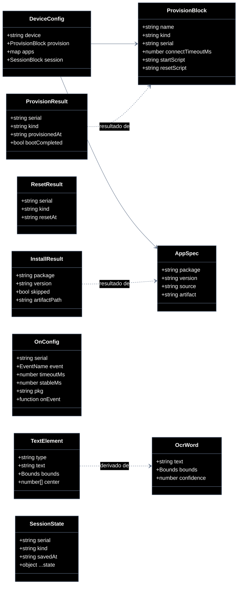

---

## 4. Sequências

### 4.1 Piloto completo (LinkedIn / app-home)

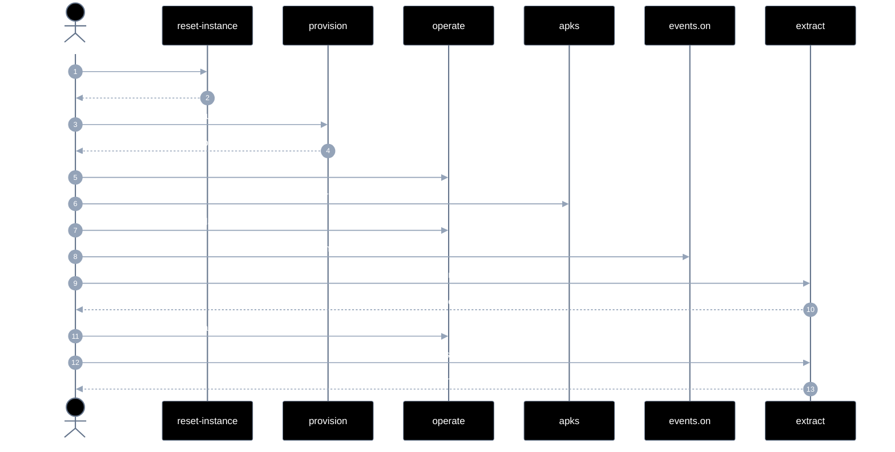

### 4.2 Provisionar — `provisionEmulator`

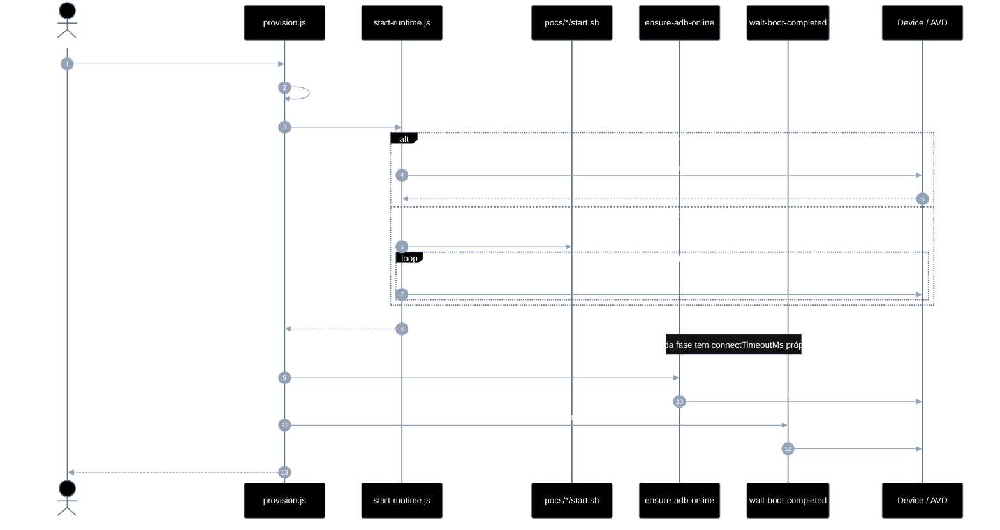

**Erros:** `PROVISION_NO_SERIAL` · `PROVISION_START_FAILED` · `PROVISION_ADB_TIMEOUT` · `PROVISION_BOOT_TIMEOUT`.

### 4.3 Reset — `resetInstance`

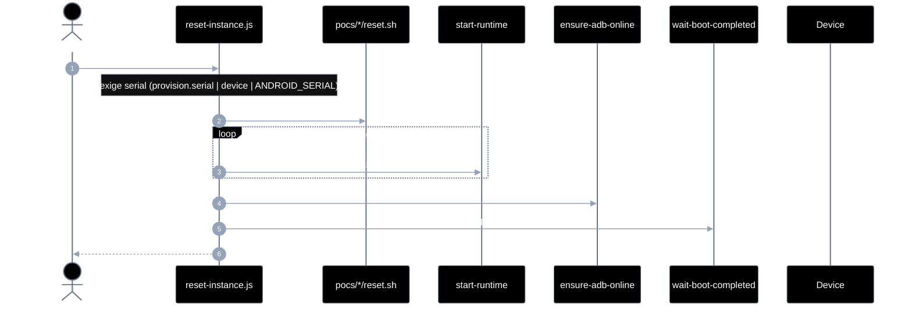

**Erros:** `RESET_NO_SERIAL` · `RESET_FAILED` · `RESET_UNSUPPORTED`.

### 4.4 Eventos de UI — `on`

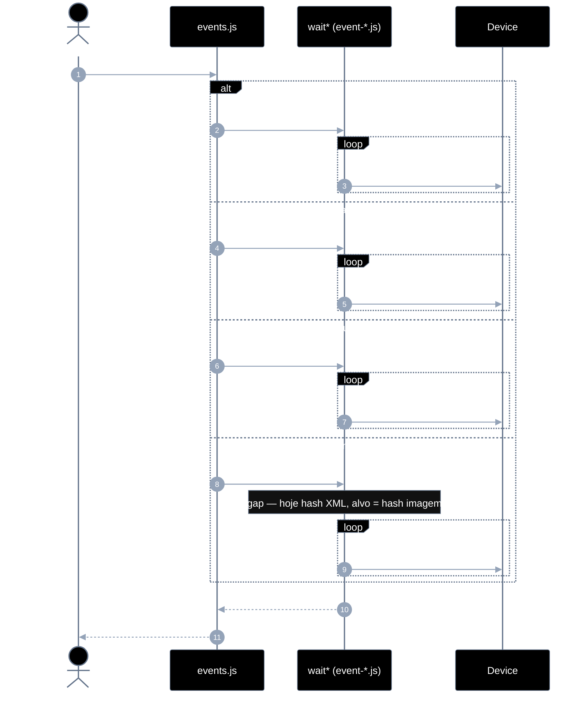

**Classes EP-02:**

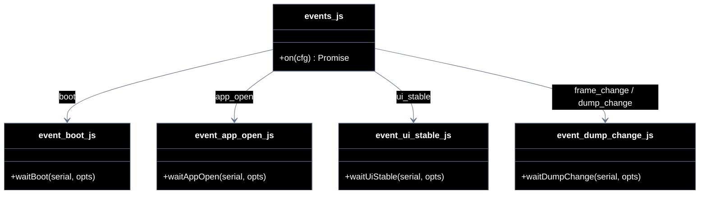

### 4.5 Instalar APK — `installApk`

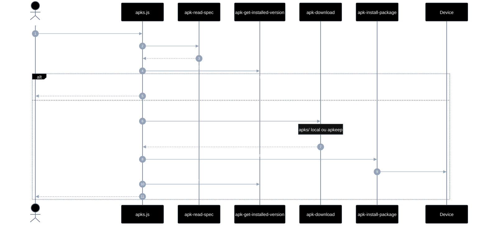

### 4.6 Operar tela

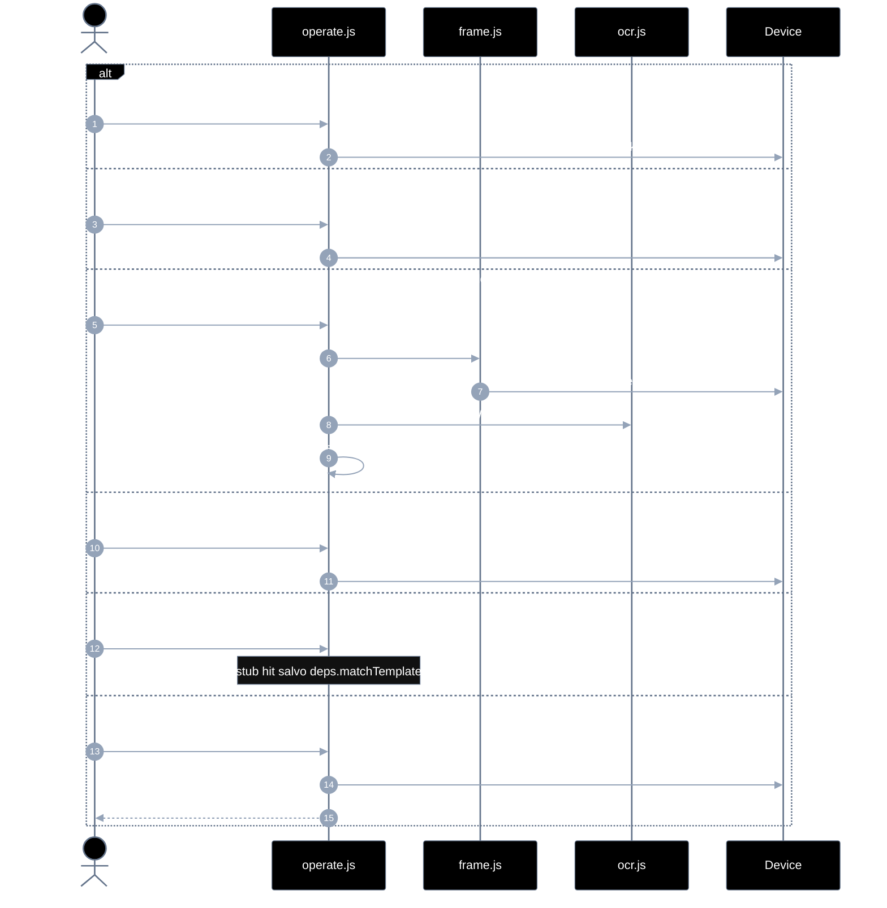

### 4.7 Extrair / findByText

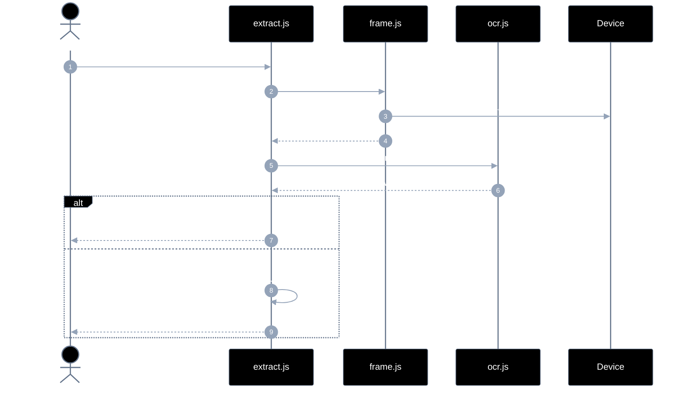

### 4.8 Sessão

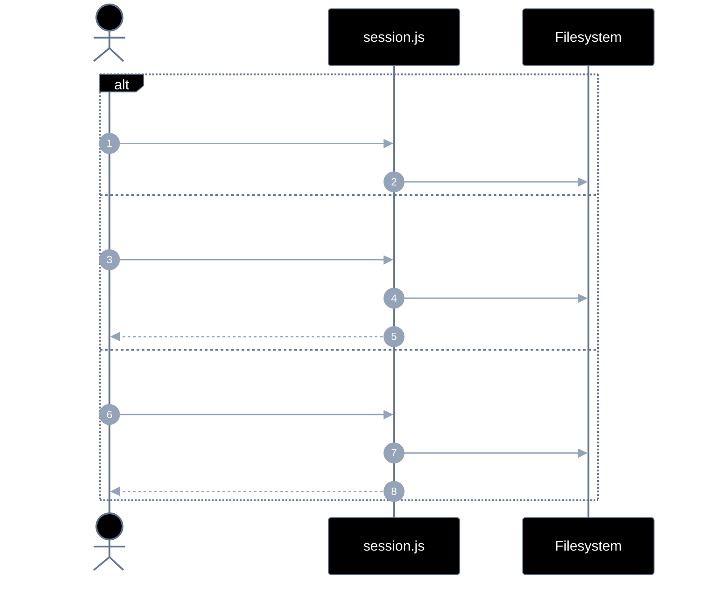

### 4.9 Ciclo de vida do runtime

```mermaid
---
config:
  theme: base
  themeVariables:
    darkMode: true
    background: '#000000'
    primaryColor: '#000000'
    primaryTextColor: '#ffffff'
    primaryBorderColor: '#64748b'
    lineColor: '#64748b'
    textColor: '#ffffff'
    mainBkg: '#000000'
    actorBkg: '#000000'
    actorBorder: '#64748b'
    actorTextColor: '#ffffff'
    signalColor: '#94a3b8'
    signalTextColor: '#ffffff'
    noteBorderColor: '#64748b'
    noteBkgColor: '#111111'
    noteTextColor: '#ffffff'
---
sequenceDiagram
  autonumber
  participant Off as offline
  participant Up as process up
  participant Adb as ADB online
  participant Ready as boot completed

  Off->>Up: start.sh / reset.sh
  Up->>Adb: adb device
  Adb->>Ready: sys.boot_completed=1
  Note over Ready: provision mesmo name → attach
  Ready->>Off: reset wipe (volta ao início)
```

---

## 5. Mapa de módulos ↔ arquivos

| Recorte | Arquivo | Plano |
|---------|---------|-------|
| `provisionEmulator` | [`src/lib/provision.js`](src/lib/provision.js) | [EP-01](implementation-plan/EP-01-provisionar-agente.md) |
| `resetInstance` | [`src/lib/reset-instance.js`](src/lib/reset-instance.js) | EP-01 |
| start / attach / AVD serial | [`src/lib/start-runtime.js`](src/lib/start-runtime.js) | EP-01 |
| redroid name→porta | [`src/lib/redroid-instance.js`](src/lib/redroid-instance.js) | EP-01 |
| `on` | [`src/lib/events.js`](src/lib/events.js) | [EP-02](implementation-plan/EP-02-eventos-de-ui.md) |
| `installApk` | [`src/lib/apks.js`](src/lib/apks.js) | [EP-03](implementation-plan/EP-03-instalar-apks.md) |
| gestos | [`src/lib/operate.js`](src/lib/operate.js) | [EP-04](implementation-plan/EP-04-operar-tela.md) |
| `extract` / `findByText` | [`src/lib/extract.js`](src/lib/extract.js) | [EP-05](implementation-plan/EP-05-extrair-elementos.md) |
| sessão | [`src/lib/session.js`](src/lib/session.js) | [EP-06](implementation-plan/EP-06-sessao.md) |
| ADB leaf | [`src/lib/adb.js`](src/lib/adb.js) | — |
| frame / OCR | [`src/lib/frame.js`](src/lib/frame.js) · [`ocr.js`](src/lib/ocr.js) | EP-05 |

---

## 6. Gaps conhecidos (código vs alvo)

| Gap | Hoje | Alvo |
|-----|------|------|
| `ui_stable` / `frame_change` | hash de dump XML | hash / diff de imagem |
| `matchImage` | stub sem `deps.matchTemplate` | template match real |
| Árvore EP-01 | `attach-runtime` / `agent-registry` no plano | lógica dentro de `start-runtime.js` |
| `dumpUiXml` | usado por eventos | deprecado para `extract` |
| Runtime sample | `sample.js` ainda demos redroid | AVD canônico |

---

## 7. Caminho inverso

| Precisa de | Ir para |
|------------|---------|
| Contratos / uso | [`src/README.md`](src/README.md) |
| Sequência detalhada por EP | [`implementation-plan/`](implementation-plan/README.md) |
| Por que AVD | [`postmortem.md`](postmortem.md) |
| Sobe/wipe shell | [`pocs/android-studio/`](pocs/android-studio/README.md) · [`pocs/redroid/`](pocs/redroid/README.md) |
| Aceite | [`5.bdds.md`](5.bdds.md) |
