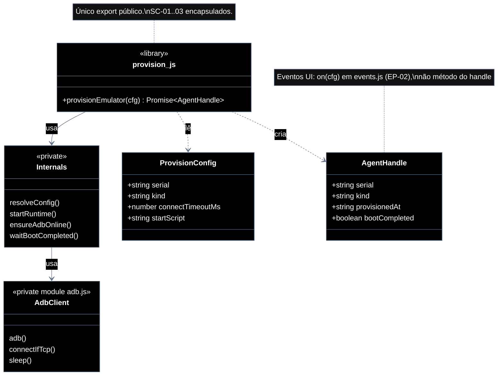

# Implementation plan — EP-01 Provisionar agente

**Por quê:** plano técnico do épico (sequências · agentes · passo a passo · contratos · classes · modelos · BDDs).  
**Épico:** [`2.epics.md`](../2.epics.md).  
**US:** [`1.stories.md`](../1.stories.md) · [`4.scenarios.md#ep-01--provisionar-agente`](../4.scenarios.md#ep-01--provisionar-agente) · [`5.bdds.md#ep-01--provisionar-agente`](../5.bdds.md#ep-01--provisionar-agente).  
**Biblioteca:** [`../src/lib/provision.js`](../src/lib/provision.js) — handle: `provisionEmulator` (create-or-attach por `name`). Ops: [`../src/lib/reset-instance.js`](../src/lib/reset-instance.js) — `resetInstance` (fora do handle).  
**Runtime:** Android Emulator / AVD via [`../pocs/android-studio/`](../pocs/android-studio/README.md).  
**Postmortem:** [`../postmortem.md`](../postmortem.md) (problemas do redroid → escolha do AVD).

**Stack:** Node ≥ 18 · JavaScript · `adb` · Android SDK / Emulator (AVD).

**Mascaramento (US-22 · SC-28):** o AVD **deve** expor identidade de aparelho Android comum, sem o fingerprint do vendor de automação — ver [`../pocs/README.md`](../pocs/README.md#mascarar-identidade-do-aparelho).

---

## Decisões de runtime (AVD)

1. **Por que AVD, não container:** apps de loja (LinkedIn, Instagram, Tinder) precisam de **GMS** + GPU decente. Sem isso a UI fica branca/preta. Não recomendar Android em container para store apps.
2. **AVD obrigatório:** API 30+ (padrão do projeto), imagem **Google APIs** ou **Google Play**, **arm64** no Apple Silicon.
3. **Tela branca:** Activity sobe mas a UI não pinta — tipicamente falta GMS ou GPU só software.
4. **Screenshot/scrcpy preto no login:** frequentemente `FLAG_SECURE` (captura bloqueada) — não é necessariamente crash.
5. **Multi-agent:** vários AVDs / instâncias do emulator — bem mais pesado que containers; documentar como limitação.
6. **Scripts** ([`pocs/android-studio/scripts/`](../pocs/android-studio/README.md)): `setup-avd.sh`, `start.sh`, `wait-boot.sh`, `stop.sh`, `reset.sh` (`-wipe-data` + boot).
7. **Visão interativa:** janela nativa do emulator; scrcpy opcional no serial ADB.

| Caso | Comportamento |
|------|----------------|
| Create | Sobe AVD nomeado por `provision.name` (ou `AVD_NAME`) |
| Attach | Reconecta ao serial existente (`emulator-5554`, …) |
| `provision.kind` | `"avd"` (default documentado) |
| `resetInstance` | Default: `pocs/android-studio/scripts/reset.sh` |

---

## Escopo

| ID | Item |
|----|------|
| US-01 | Provisionar um agente (AVD/emulador **novo** + **nome**) |
| SC-01 | Criar AVD/emulador nomeado |
| SC-02 | Garantir serial ADB online |
| SC-03 | Aguardar boot completo |
| US-20 | Resgatar agente existente |
| SC-25 | Localizar agent pelo nome |
| SC-26 | Reconectar e confirmar boot |
| US-22 | Mascarar identidade do aparelho |
| SC-28 | Identidade de aparelho de mercado |

**Resultado:** handle com `name` + serial ADB `device` + `sys.boot_completed=1` → pronto para EP-02..06. Vários nomes ⇒ vários AVDs em paralelo (mais pesado — ver limitação acima). Identidade aparente = aparelho de mercado ([`pocs/README.md`](../pocs/README.md#mascarar-identidade-do-aparelho)).

---

## Como utilizar

```js
import { provisionEmulator } from "../src/lib/provision.js";
import { resetInstance } from "../src/lib/reset-instance.js";

// Create — nome novo sobe AVD (ou redroid se kind=redroid)
const handle = await provisionEmulator({
  provision: { name: "agent-a", kind: "avd" },
});
// → { serial, kind, bootCompleted: true, provisionedAt, on, installApk, … }

// Attach — mesmo name anexa (não sobe outro)
const again = await provisionEmulator({
  provision: { name: "agent-a", kind: "avd" },
});
// again.serial === handle.serial

// redroid nomeado (porta/container isolados)
const r = await provisionEmulator({
  provision: { name: "agent-b", kind: "redroid" },
});

// Ops (fora do handle): wipe + boot
await resetInstance({
  provision: { serial: handle.serial, kind: "avd" },
});
```

Não passar `serial` nas operações do handle — vem do handle. API canônica: [`../src/README.md`](../src/README.md).

---

## Árvore de arquivos

```text
src/
├── lib/
│   ├── provision.js                 # provisionEmulator (create-or-attach)
│   ├── provision.test.js
│   ├── reset-instance.js            # resetInstance (ops — wipe + boot)
│   ├── reset-instance.test.js
│   ├── start-runtime.js             # sobe AVD novo (nome → serial)
│   ├── start-runtime.test.js
│   ├── attach-runtime.js            # resolve nome → emulador existente
│   ├── attach-runtime.test.js
│   ├── ensure-adb-online.js
│   ├── ensure-adb-online.test.js
│   ├── wait-boot-completed.js
│   ├── wait-boot-completed.test.js
│   ├── adb.js
│   └── events.js
├── device.config.json               # provision.name (obrigatório no create)
└── test/
    └── bdd/
        ├── ep-01-provisionar-agente.test.js
        ├── us-01-agent-fica-pronto-para-adb.test.js
        └── us-20-resgatar-agente-existente.test.js
pocs/android-studio/
├── README.md
└── scripts/                         # setup-avd / start / wait-boot / stop / reset (TODO)
```

Unitários ao lado do módulo (deps mock/stub). BDD e2e só US/EP.

---

## Biblioteca JavaScript

Arquivo: `src/lib/provision.js`.

**API pública:**

```js
import { provisionEmulator } from "./lib/provision.js";

// nome novo → sobe AVD
const a = await provisionEmulator({
  provision: { name: "agent-a", kind: "avd" },
});
// → { name, serial, kind, provisionedAt, bootCompleted: true, … }

// mesmo nome → anexa (US-20)
const again = await provisionEmulator({
  provision: { name: "agent-a", kind: "avd" },
});
```

Helpers internos (`resolveConfig`, `startRuntime`, `attachRuntime`, `ensureAdbOnline`, `waitBootCompleted`) **não** são exportados.

| Superfície | O quê |
|------------|--------|
| **Público (handle)** | `provisionEmulator(cfg)` |
| **Público (ops)** | `resetInstance(cfg)` — wipe + boot; **não** anexado ao handle |
| **Privado** | alocar serial · criar/anexar AVD · ADB · boot |

`cfg.provision.name` (ou `cfg.name`) é **obrigatório**. Serial é **alocado/resolvido** pela lib no create (ex. `emulator-5554`).

`resetInstance` usa `cfg.provision.resetScript` (default: `pocs/android-studio/scripts/reset.sh`) e espera ADB + boot. Erros: `RESET_NO_SERIAL` · `RESET_FAILED` · `RESET_UNSUPPORTED`.

---

## Diagramas de sequência

### US-01 — Provisionar um agente

#### Agentes

| Agente | Responsabilidade |
|--------|------------------|
| Caller / CLI | Chama **só** `provisionEmulator(cfg)` e consome o `AgentHandle` |
| provision.js | Biblioteca: encapsula SC-01→SC-03 (start, ADB, boot) |
| Runtime (interno) | Sobe AVD novo por `name` (ou resolve existente no attach) |
| AdbClient (interno) | `adb` connect, wait-for-device, getprop — **não** exportado |
| Device / emulador | Android alvo (AVD) |

```mermaid
---
config:
  theme: base
  themeVariables:
    darkMode: true
    background: '#000000'
    primaryColor: '#000000'
    primaryTextColor: '#ffffff'
    primaryBorderColor: '#64748b'
    secondaryColor: '#000000'
    secondaryTextColor: '#ffffff'
    secondaryBorderColor: '#64748b'
    tertiaryColor: '#000000'
    tertiaryTextColor: '#ffffff'
    tertiaryBorderColor: '#64748b'
    lineColor: '#64748b'
    textColor: '#ffffff'
    mainBkg: '#000000'
    nodeBorder: '#64748b'
    clusterBkg: '#000000'
    clusterBorder: '#333333'
    titleColor: '#ffffff'
    edgeLabelBackground: '#000000'
    actorBkg: '#000000'
    actorBorder: '#64748b'
    actorTextColor: '#ffffff'
    actorLineColor: '#333333'
    signalColor: '#94a3b8'
    signalTextColor: '#ffffff'
    labelBoxBkgColor: '#000000'
    labelBoxBorderColor: '#64748b'
    labelTextColor: '#ffffff'
    loopTextColor: '#ffffff'
    noteBorderColor: '#64748b'
    noteBkgColor: '#111111'
    noteTextColor: '#ffffff'
    activationBorderColor: '#64748b'
    activationBkgColor: '#1a1a1a'
    sequenceNumberColor: '#ffffff'
    classText: '#ffffff'
---
sequenceDiagram
  autonumber
  actor Dev as Caller / CLI
  participant Lib as provision.js
  participant R as Runtime (interno)
  participant A as AdbClient (interno)
  participant D as Emulador / AVD

  Dev->>Lib: provisionEmulator(cfg)
  note over Lib: único método público
  Lib->>Lib: resolveConfig(cfg)

  rect rgb(17,17,17)
    note over Lib,D: SC-01 Subir / conectar
    Lib->>R: startRuntime(cfg) se ainda não reachable
    R->>D: scripts/start.sh (AVD)
    D-->>R: up
    R-->>Lib: reachable
  end

  rect rgb(26,26,26)
    note over Lib,D: SC-02 Serial ADB online
    loop até device ou timeout
      Lib->>A: connectIfTcp(serial)
      A->>D: adb connect
      D-->>A: connected
      Lib->>A: wait-for-device
      A->>D: adb -s serial wait-for-device
      D-->>A: device
      A-->>Lib: online
    end
  end

  rect rgb(34,34,34)
    note over Lib,D: SC-03 Boot completo
    loop até boot=1 ou timeout
      Lib->>A: getprop sys.boot_completed
      A->>D: adb shell getprop
      D-->>A: "1"
      A-->>Lib: boot=1
    end
  end

  Lib-->>Dev: AgentHandle { serial, kind, provisionedAt, bootCompleted }
```



#### Passo a passo

| # | De | Para | Chamada | Descrição | Entradas | Execução | Saídas |
|---|----|------|---------|-----------|----------|----------|--------|
| 1 | Dev | provision.js | `provisionEmulator(cfg)` | **Única** chamada pública | `cfg` | Orquestra SC-01→SC-03 por dentro | Promise `AgentHandle` |
| 2 | Lib | Lib | `resolveConfig` *(privado)* | Normalizar config | `cfg` + env | Defaults e precedência | config resolvida |
| 3 | Lib | Runtime | `startRuntime` *(privado)* | Garantir AVD up (SC-01) | `kind`, `startScript?` | Start se não reachable | `reachable` |
| 4 | Runtime | Device | `scripts/start.sh` | Materializar Android | script | Spawn emulator/AVD | `up` |
| 5–6 | Device → Lib | — | reachable | Fechar SC-01 | `up` | Confirma | `true` |
| 7–14 | Lib ↔ Adb | *(privado)* | connect + wait-for-device | SC-02 | `serial` | Loop até `device` | `online` |
| 15–18 | Lib ↔ Adb | *(privado)* | getprop boot | SC-03 | `serial` | Poll até `1` | `boot=1` |
| 19 | Lib | Dev | `AgentHandle` | Entregar handle | estado interno | Monta saída + anexa `on` | `{ serial, kind, provisionedAt, bootCompleted, on }` |

#### Contratos

**API pública** (só isto é importável pelo caller):

```ts
// Pré: host com adb; AVD disponível ou startável (Google APIs/Play)
// Erros: PROVISION_NO_SERIAL | PROVISION_START_FAILED | PROVISION_ADB_TIMEOUT | PROVISION_BOOT_TIMEOUT

type ProvisionConfig = {
  device?: string;
  provision?: {
    name?: string;
    serial?: string;
    kind?: "adb" | "avd";
    connectTimeoutMs?: number;
    startScript?: string;
    /** Path do wipe (resetInstance; default pocs/android-studio/scripts/reset.sh). */
    resetScript?: string;
  };
};

type AgentHandle = {
  serial: string;
  kind: string;
  provisionedAt: string; // ISO-8601
  bootCompleted: true;
  /** EP-02: eventos de UI (serial já no handle). */
  on(
    event: "boot" | "app_open" | "ui_stable" | "frame_change",
    opts?: Record<string, unknown>,
    onEvent?: (payload: { type: string; [k: string]: unknown }) => void,
  ): Promise<unknown>;
};

/** Único método exportado pela biblioteca. */
declare function provisionEmulator(cfg: ProvisionConfig): Promise<AgentHandle>;

const handle = await provisionEmulator({
  provision: {
    name: "agent-a",
    kind: "avd",
    connectTimeoutMs: 120_000,
  },
});
// → { serial, kind, provisionedAt, bootCompleted: true, on }
// EP-02: await on({ serial: handle.serial, event: "ui_stable", stableMs: 1_200 });
```

**Interno (não exportar):** `resolveConfig`, `startRuntime`, `ensureAdbOnline`, `waitBootCompleted` — encapsulam as linhas #2–#18 do passo a passo. Eventos UI: [`EP-02`](EP-02-eventos-de-ui.md) `on(cfg)` — **não** anexado ao handle.

---

## Modelos

### ProvisionConfig

| Campo | Tipo | Origem | Descrição |
|-------|------|--------|-----------|
| `name` | `string` | `cfg.provision.name` \| `AVD_NAME` | Nome do agent / AVD |
| `serial` | `string` | `cfg.provision.serial` \| `cfg.device` \| `ANDROID_SERIAL` | Ex.: `emulator-5554` |
| `kind` | `"adb" \| "avd"` | `cfg.provision.kind` | Default documentado: `"avd"` |
| `connectTimeoutMs` | `number` | `cfg.provision.connectTimeoutMs` | Default `120000` |
| `startScript` | `string?` | futuro | Path do script de start (SC-01) |
| `resetScript` | `string?` | `cfg.provision.resetScript` | Wipe (`resetInstance`); default `pocs/android-studio/scripts/reset.sh` |

### AgentHandle (saída)

| Campo | Tipo | Descrição |
|-------|------|-----------|
| `serial` | `string` | Serial ADB online |
| `kind` | `string` | Kind efetivo |
| `provisionedAt` | `ISO-8601` | Momento do aceite |
| `bootCompleted` | `boolean` | Sempre `true` no sucesso |
| `on` | `(event, opts?, onEvent?) => Promise` | EP-02: eventos de UI |
| `installApk` | `(app) => Promise` | EP-03 |
| `launch` / `tap` / `type` / `scroll` / `screenshot` / `matchImage` | métodos | EP-04 |
| `extract` | `() => Promise<UiElement[]>` | EP-05 — lista plana só de textos OCR |
| `saveSession` / `removeSession` / `restoreSession` | métodos | EP-06 |

Métodos EP-02..06 são anexados ao handle em `provisionEmulator` (libs internas).

### DeviceState (máquina de estados)

```text
Absent → Starting → Reachable → AdbOnline → Booted
                ↘──────── timeout / error ────────↗
```

| Estado | Significado | SC |
|--------|-------------|-----|
| `Absent` | Sem processo/AVD | — |
| `Starting` | Script de start em curso | SC-01 |
| `Reachable` | Emulador alcançável (processo/serial) | SC-01 |
| `AdbOnline` | `adb` lista serial como `device` | SC-02 |
| `Booted` | `sys.boot_completed=1` | SC-03 |

### Erros

| Código | Quando |
|--------|--------|
| `PROVISION_NO_SERIAL` | Config sem serial |
| `PROVISION_START_FAILED` | Script/runtime não sobe (SC-01) |
| `PROVISION_ADB_TIMEOUT` | Serial não fica `device` (SC-02) |
| `PROVISION_BOOT_TIMEOUT` | Boot não completa (SC-03) |

---

## Diagrama de classes



**Hoje:** `provisionEmulator` exportado; ADB + boot encapsulados; `resetInstance` ops + `pocs/android-studio/scripts/reset.sh`.  
**EP-02:** eventos via `on(cfg)` solto — **não** anexar `on` ao handle.  
**Gap:** completar `startRuntime` (AVD) **dentro** da lib, sem expandir a API do handle além do create-or-attach.

---

## Cenários BDD

Fonte canônica: [`5.bdds.md#ep-01--provisionar-agente`](../5.bdds.md#ep-01--provisionar-agente).

### US-01 — Agent nomeado fica pronto para ADB

```gherkin
Cenário: US-01 Agent nomeado fica pronto para ADB
  Dado o config com nome único e o runtime Android disponíveis
  Quando o provisionamento cria um AVD/emulador novo para esse nome, garante serial online e aguarda boot completo
  Então o agent está pronto para ADB (nome, serial online e boot ok)
```

### SC-01 — Criar AVD/emulador nomeado

```gherkin
Cenário: SC-01 AVD/emulador novo sobe e fica alcançável
  Dado nome único do agent, host e AVD/runtime
  Quando a lib aloca serial e sobe um AVD/emulador novo ligado ao nome
  Então o agent nomeado está em execução e alcançável
```

### SC-02 — Garantir serial ADB online

```gherkin
Cenário: SC-02 Serial ADB fica online
  Dado o agent alcançável e o serial alocado ao nome
  Quando adb connect / listagem de devices é repetida até o serial aparecer como device
  Então o serial ADB está online
```

### SC-03 — Aguardar boot completo

```gherkin
Cenário: SC-03 Boot completo no device
  Dado o serial ADB online
  Quando o sistema faz poll de boot (ex. sys.boot_completed)
  Então o device reporta boot completo
```

### US-20 — Agent existente é resgatado pelo nome

```gherkin
Cenário: US-20 Agent existente é resgatado pelo nome
  Dado um agent já provisionado com determinado nome
  Quando provisionEmulator é chamado de novo com o mesmo nome
  Então o handle fica pronto sem criar outro emulador
```

### SC-25 — Localizar agent pelo nome

```gherkin
Cenário: SC-25 Runtime é resolvido pelo nome
  Dado o nome de um agent já criado
  Quando a lib resolve AVD/emulador e serial associados ao nome
  Então a referência ao runtime existente está disponível
```

### SC-26 — Reconectar e confirmar boot

```gherkin
Cenário: SC-26 Handle anexado fica pronto
  Dado o runtime localizado pelo nome
  Quando adb connect / wait-for-device e poll de boot concluem
  Então o handle está pronto (serial online, boot ok) sem novo AVD/emulador
```

### US-22 — Mascarar identidade do aparelho

```gherkin
Cenário: US-22 Apps veem aparelho de mercado, não o vendor de automação
  Dado um agent com boot completo em AVD
  Quando as props de produto do Android são lidas (ex. ro.product.model)
  Então os valores são de aparelho de mercado e não expõem o fingerprint do vendor
```

### SC-28 — Identidade de aparelho de mercado

```gherkin
Cenário: SC-28 Identidade de aparelho de mercado
  Dado agent boot ok e perfil de produto configurado no AVD
  Quando getprop (ou equivalente) de ro.product.* é consultado
  Então brand/model/device são de aparelho comum e sem nome do runtime de automação
```

---

## Plano de implementação (gaps → entregas)

| # | Entrega | SC | Arquivos | Critério |
|---|---------|-----|----------|----------|
| I1 | `provisionEmulator` exige `name`; cria se novo | US-01 / SC-01 | `provision.js` · `start-runtime.js` | AVD/emulador novo |
| I2 | Resolução de serial por agent (AVD) | SC-01 | `start-runtime.js` · `pocs/android-studio` | N agents (limitação RAM) |
| I3 | `ensureAdbOnline` + `waitBootCompleted` no serial alocado | SC-02/03 | existentes | Encapsulados |
| I4 | Mesmo `provisionEmulator` anexa se nome existe | US-20 / SC-25..26 | `attach-runtime.js` · `provision.js` | Sem novo AVD |
| I5 | Handle inclui `name` | US-01/20 | `provision.js` | `handle.name` estável |
| I6 | BDD e2e US-01 / US-20 / EP-01 | — | `test/bdd/` | Aceite multi-agent |
| I7 | Piloto: limpa screenshots → `resetInstance` → provision | — | `linkedin-login.js` · `reset-instance.js` · `reset.sh` | Instância do zero |
| I8 | Mascaramento de identidade (AVD) | US-22 / SC-28 | `pocs/android-studio` | Sem fingerprint do vendor |
| I9 | `reset.sh` (`-wipe-data`) | — | `pocs/android-studio/scripts/reset.sh` | Feito |

### Ordem

```text
I1 → I2 → I3 → I5 → I4 → I6 → I7 → I8 → I9
```

---

## Mapeamento código atual

| Peça | Status |
|------|--------|
| `provisionEmulator` (create-or-attach por `name`) | Existe — evoluir / consolidar |
| `resetInstance` + `reset.sh` | Feito (ops + `pocs/android-studio/scripts/reset.sh`) |
| `attachRuntime` interno | Interno do provision |
| Multi-AVD paralelo | Gap / limitação de recursos |
| Internos ADB / boot | `ensure-adb-online` · `wait-boot-completed` |
| Mascaramento identidade (US-22) | Parcial — contrato em [`pocs/README.md`](../pocs/README.md); AVD aplica |
| BDD e2e US-01 / US-20 / EP-01 | Estender multi-nome · US-22 |

---

## Critério de pronto (épico)

1. `provisionEmulator({ name })` cria se novo; anexa se o nome já existir  
2. SC-01..03 e SC-25..26 encapsulados no mesmo método  
3. Handle com `name`, `serial`, `bootCompleted`  
4. ≥2 agents simultâneos no e2e (aceitar custo de RAM)  
5. Piloto LinkedIn: `resetInstance` + provision (screenshots limpos)  
6. SC-28: identidade de aparelho de mercado no AVD (sem fingerprint do runtime)  
7. AVD com Google APIs/Play — UI pintada (sem tela branca por falta de GMS)  

## Próximos passos

→ Implementar I1–I9 em [`src`](../src/README.md)  
→ Aceite: [`5.bdds.md#ep-01--provisionar-agente`](../5.bdds.md#ep-01--provisionar-agente)
