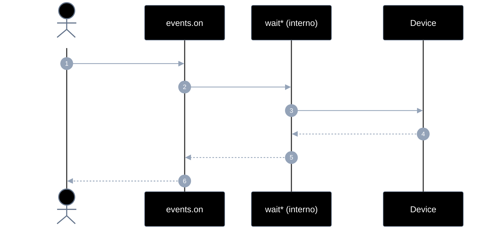
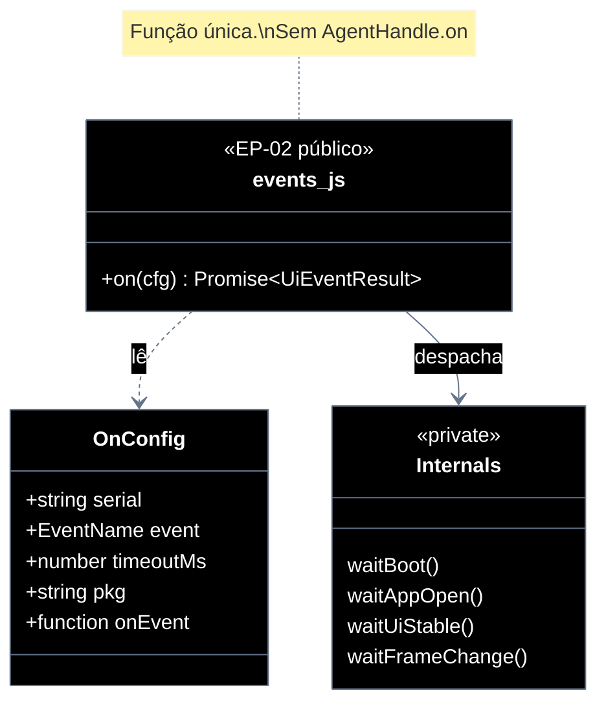

# Implementation plan — EP-02 Eventos de UI

**Por quê:** plano técnico do épico (sequências · agentes · passo a passo · contratos · classes · modelos · BDDs).  
**Épico:** [`2.epics.md`](../2.epics.md).  
**US:** [`1.stories.md`](../1.stories.md) · [`4.scenarios.md#ep-02--eventos-de-ui`](../4.scenarios.md#ep-02--eventos-de-ui) · [`5.bdds.md#ep-02--eventos-de-ui`](../5.bdds.md#ep-02--eventos-de-ui).  
**API:** função **`on(cfg)`** exportada de [`../src/lib/events.js`](../src/lib/events.js) — **único** método público do épico; **não** OO / **não** `handle.on`.  
**Pré-requisito:** `serial` ADB online (tipicamente após [`EP-01`](EP-01-provisionar-agente.md)).

**Stack:** Node ≥ 18 · JavaScript · `adb` · runtime provisionado (EP-01).  
**Percepção:** estabilidade e mudança de UI por **hash/diff de frame/imagem** — **não** dump uiautomator / XML de acessibilidade.

**Antes → depois:** `handle.on(event, opts?, onEvent?)` → **`on({ serial, event, … })`** (tudo na config).

---

## Escopo

| ID | Item |
|----|------|
| US-02 | Evento de boot |
| US-03 | Evento de app aberta |
| US-04 | Evento de tela estável |
| US-05 | Evento de mudança de frame |
| SC-04 | Sinal de boot é recebido |
| SC-05 | App em foreground é confirmada |
| SC-06 | Tela fica estável |
| SC-07 | Frame da tela muda |

**Resultado:** sinais de UI confiáveis via **`on(cfg)`** antes de instalar/operar/extrair.

---

## Como utilizar

```js
import { provisionEmulator } from "../src/lib/provision.js";
import { on } from "../src/lib/events.js";

const { serial } = await provisionEmulator(cfg); // EP-01 — serial

await on({ serial, event: "boot", timeoutMs: 60_000 });
await on({ serial, event: "app_open", pkg: "com.linkedin.android" });
await on({
  serial,
  event: "ui_stable",
  stableMs: 1_200,
  onEvent: (p) => console.log(p.type),
});
await on({ serial, event: "frame_change", previousFrame });
```

`event`: `"boot"` \| `"app_open"` \| `"ui_stable"` \| `"frame_change"`.  
Obrigatório na config: `serial`, `event`. Progresso: `onEvent` **na config** (não 3º parâmetro).

---

## Árvore de arquivos

```text
src/
├── lib/
│   ├── events.js                 # export on(cfg) — único público EP-02
│   ├── events.test.js
│   ├── event-boot.js             # waitBoot (US-02 / SC-04)
│   ├── event-boot.test.js
│   ├── event-app-open.js         # waitAppOpen (US-03 / SC-05)
│   ├── event-app-open.test.js
│   ├── event-ui-stable.js        # waitUiStable — hash de frame (US-04 / SC-06)
│   ├── event-ui-stable.test.js
│   ├── event-frame-change.js     # waitFrameChange (US-05 / SC-07)
│   ├── event-frame-change.test.js
│   └── frame.js                  # captura de frame
└── test/
    └── bdd/
        ├── ep-02-eventos-de-ui.test.js
        ├── us-02-boot-do-device-e-sinalizado.test.js
        ├── us-03-app-aberta-e-confirmada.test.js
        ├── us-04-tela-estavel-e-confirmada.test.js
        └── us-05-frame-atualizado-fica-disponivel.test.js
```

Unitários ao lado do módulo. BDD e2e só US/EP.

**Gap código atual:** `createOn` + `handle.on` no provision — migrar para `export async function on(cfg)`. Remover `on` do AgentHandle. Migrar `dump_change` → `frame_change`.

---

## Fluxo (obrigatório)

1. Obter `serial` (EP-01 ou device já online).  
2. Chamar **`on({ serial, event, … })`**.

| Superfície | O quê |
|------------|--------|
| **Público** | `on(cfg)` |
| **Privado** | `waitBoot` · `waitAppOpen` · `waitUiStable` · `waitFrameChange` |

---

## Diagramas de sequência

### Visão geral — `on(cfg)`

#### Agentes

| Agente | Responsabilidade |
|--------|------------------|
| Caller / CLI | Chama **`on(cfg)`** com `serial` + `event` + opts |
| events.js | Despacha SC-04→SC-07 |
| wait* (interno) | Polls boot / foreground / frame |
| Device | Props, foreground, frames |



#### Passo a passo

| # | De | Para | Chamada | Descrição | Entradas | Saídas |
|---|----|------|---------|-----------|----------|--------|
| 1 | Dev | events | `on(cfg)` | Esperar evento UI | `serial`, `event`, opts | Promise resultado |
| 2–n | events ↔ Device | *(privado)* | polls | Ver US abaixo | cfg | resultado tipado |

#### Contratos

**API pública:**

```ts
// Erros: EVENT_BOOT_TIMEOUT | EVENT_APP_TIMEOUT | EVENT_STABLE_TIMEOUT
//        | EVENT_FRAME_TIMEOUT | EVENT_UNKNOWN | EVENT_NO_SERIAL

type EventName = "boot" | "app_open" | "ui_stable" | "frame_change";

type OnConfig = {
  serial: string;          // obrigatório
  event: EventName;        // obrigatório
  timeoutMs?: number;
  intervalMs?: number;
  stableMs?: number;       // ui_stable
  pkg?: string;            // app_open
  activity?: string;       // app_open
  previousFrame?: Buffer | string; // frame_change
  contains?: string;       // ui_stable opcional (legado)
  onEvent?: (payload: { type: string; [k: string]: unknown }) => void;
};

type UiEventResult =
  | { boot: true }
  | { foreground: true; package: string; activity?: string }
  | { stable: true }
  | { frame: Buffer | string; changed: true };

declare function on(cfg: OnConfig): Promise<UiEventResult>;
```

**Interno (não exportar):** `waitBoot`, `waitAppOpen`, `waitUiStable`, `waitFrameChange`.

---

### US-02 — Evento de boot (SC-04)

```js
await on({
  serial,
  event: "boot",
  timeoutMs: 60_000,
  intervalMs: 1_500,
  onEvent: (p) => console.log(p.type),
});
// → { boot: true }
```

| # | De | Para | Chamada | Descrição |
|---|----|------|---------|-----------|
| 1 | Dev | events | `on({ event: "boot", … })` | Entrada |
| 2 | waitBoot | Device | getprop *(privado)* | Poll `sys.boot_completed` |
| 3 | events | Dev | `{ boot: true }` | Resolve |

---

### US-03 — Evento de app aberta (SC-05)

```js
await on({
  serial,
  event: "app_open",
  pkg: "com.linkedin.android",
  activity: ".authenticator.LaunchActivity",
  timeoutMs: 30_000,
});
```

| # | De | Para | Chamada | Descrição |
|---|----|------|---------|-----------|
| 1 | Dev | events | `on({ event: "app_open", pkg, … })` | Entrada |
| 2 | waitAppOpen | Device | dumpsys/pidof *(privado)* | Poll foreground |
| 3 | events | Dev | `{ foreground: true, package }` | Resolve |

---

### US-04 — Evento de tela estável (SC-06)

```js
await on({
  serial,
  event: "ui_stable",
  timeoutMs: 30_000,
  stableMs: 1_200,
  intervalMs: 400,
});
```

| # | De | Para | Chamada | Descrição |
|---|----|------|---------|-----------|
| 1 | Dev | events | `on({ event: "ui_stable", … })` | Entrada |
| 2 | waitUiStable | Device | frame + hash *(privado)* | Estabilidade visual |
| 3 | events | Dev | `{ stable: true }` | Resolve |

**Proibido:** `dumpUiXml` / uiautomator.

---

### US-05 — Evento de mudança de frame (SC-07)

```js
const changed = await on({
  serial,
  event: "frame_change",
  previousFrame,
  timeoutMs: 20_000,
});
```

| # | De | Para | Chamada | Descrição |
|---|----|------|---------|-----------|
| 1 | Dev | events | `on({ event: "frame_change", … })` | Entrada |
| 2 | waitFrameChange | Device | frame até hash ≠ base *(privado)* | Mudança visual |
| 3 | events | Dev | `{ frame, changed: true }` | Resolve |

**Proibido:** dump XML / `dump_change` / `waitDumpChange`.

---

## Modelos

### OnConfig

| Campo | Tipo | Descrição |
|-------|------|-----------|
| `serial` | `string` | **Obrigatório** — device ADB |
| `event` | `EventName` | **Obrigatório** |
| `timeoutMs` | `number?` | Default por evento |
| `intervalMs` | `number?` | Poll interval |
| `stableMs` | `number?` | `"ui_stable"` |
| `pkg` | `string?` | `"app_open"` |
| `activity` | `string?` | `"app_open"` |
| `previousFrame` | `Buffer \| string?` | `"frame_change"` |
| `contains` | `string?` | `"ui_stable"` opcional |
| `onEvent` | `fn?` | Progresso (`*_poll`) |

### UiEventResult

| `event` | Resultado |
|---------|-----------|
| `boot` | `{ boot: true }` |
| `app_open` | `{ foreground: true, package, activity? }` |
| `ui_stable` | `{ stable: true }` |
| `frame_change` | `{ frame, changed: true }` |

### Erros

| Código | Quando |
|--------|--------|
| `EVENT_NO_SERIAL` | falta `cfg.serial` |
| `EVENT_UNKNOWN` | `event` inválido |
| `EVENT_BOOT_TIMEOUT` | US-02 |
| `EVENT_APP_TIMEOUT` | US-03 |
| `EVENT_STABLE_TIMEOUT` | US-04 |
| `EVENT_FRAME_TIMEOUT` | US-05 |

---

## Diagrama de classes



---

## Cenários BDD

Fonte canônica: [`5.bdds.md#ep-02--eventos-de-ui`](../5.bdds.md#ep-02--eventos-de-ui).

Caller nos BDDs: device com `serial` online; “Quando o sistema espera…” = **`on({ serial, event, … })`**.

---

## Plano de implementação (gaps → entregas)

| # | Entrega | SC | Arquivos | Critério |
|---|---------|-----|----------|----------|
| I1 | Exportar `on(cfg)`; remover `createOn` / `handle.on` do provision | — | `events.js` · `provision.js` | Caller usa só `on(cfg)` |
| I2 | Interno: `waitBoot` | SC-04 | `event-boot.js` | `on({ event: "boot" })` |
| I3 | Interno: `waitAppOpen` | SC-05 | `event-app-open.js` | `on({ event: "app_open", pkg })` |
| I4 | Interno: `waitUiStable` por hash de frame | SC-06 | `event-ui-stable.js` | Sem dump XML |
| I5 | Interno: `waitFrameChange` | SC-07 | `event-frame-change.js` | Sem `dump_change` |
| I6 | Atualizar scripts/BDDs/docs (`handle.on` → `on(cfg)`) | — | piloto · `src/README` · tasks | Zero `handle.on` |
| I7 | Piloto LinkedIn: `on({ serial, event: "ui_stable", … })` | — | `linkedin-login.js` | Compila no novo contrato |

### Ordem

```text
I1 → I2 → I3 → I4 → I5 → I6 → I7
```

---

## Mapeamento código atual

| Peça | Status |
|------|--------|
| `handle.on` / `createOn(serial)` | **Legado** — substituir por `on(cfg)` |
| `waitBoot` / `waitAppOpen` | Existem |
| `waitUiStable` / `waitDumpChange` | Migrar dump → frame / `waitFrameChange` |
| Evento `dump_change` | Renomear → `frame_change` |
| `on` como export solto | **Alvo** (único público) |

---

## Critério de pronto (épico)

1. Caller usa **só** `on(cfg)` — sem `handle.on`  
2. `serial` e `event` na config; SC-04..07 encapsulados  
3. `ui_stable` e `frame_change` por **imagem**, sem uiautomator  
4. Quatro eventos cobertos por BDD  
5. Piloto LinkedIn no mesmo padrão  

## Próximos passos

→ Implementar I1–I7 em [`src`](../src/README.md)  
→ Aceite: [`5.bdds.md#ep-02--eventos-de-ui`](../5.bdds.md#ep-02--eventos-de-ui)
