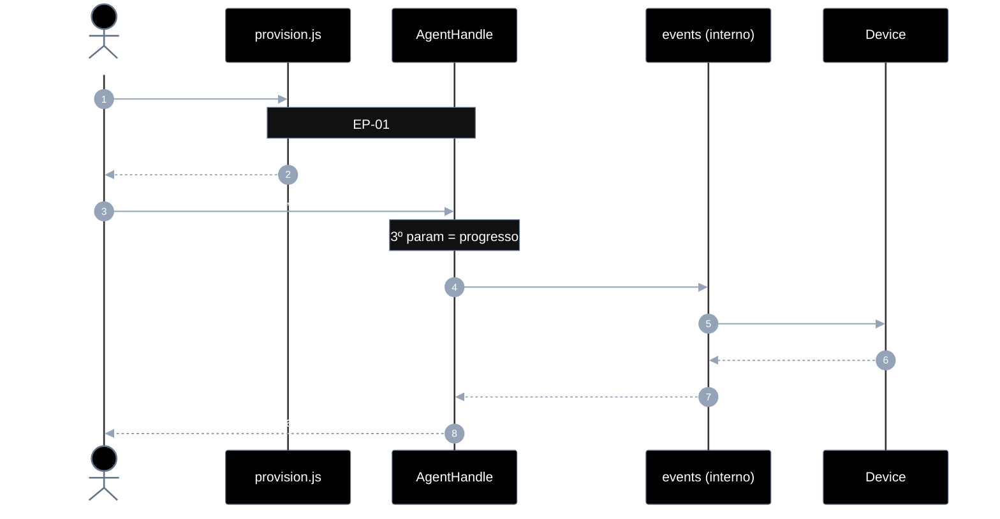
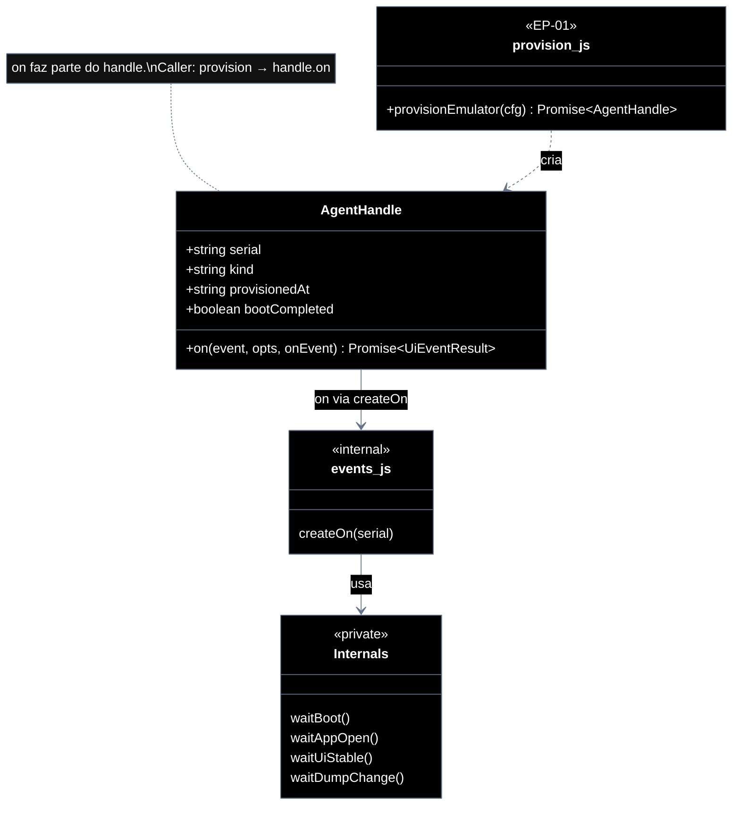

# Implementation plan — EP-02 Eventos de UI

**Por quê:** plano técnico do épico (sequências · agentes · passo a passo · contratos · classes · modelos · BDDs).  
**Épico:** [`2.epics.md`](../2.epics.md).  
**US:** [`1.stories.md`](../1.stories.md) · [`4.scenarios.md#ep-02--eventos-de-ui`](../4.scenarios.md#ep-02--eventos-de-ui) · [`5.bdds.md#ep-02--eventos-de-ui`](../5.bdds.md#ep-02--eventos-de-ui).  
**Handle:** `on` é método do [`AgentHandle`](EP-01-provisionar-agente.md) — **não** é função solta.  
**Pré-requisito:** [`EP-01`](EP-01-provisionar-agente.md) · `provisionEmulator` → handle.  
**Implementação interna:** [`../sources/lib/events.js`](../sources/lib/events.js) (anexado ao handle em `provision.js`).

**Stack:** Node ≥ 18 · JavaScript · `adb` · runtime provisionado (EP-01).

---

## Escopo

| ID | Item |
|----|------|
| US-02 | Evento de boot |
| US-03 | Evento de app aberta |
| US-04 | Evento de tela estável |
| US-05 | Evento de mudança de dump |
| SC-04 | Sinal de boot é recebido |
| SC-05 | App em foreground é confirmada |
| SC-06 | Tela fica estável |
| SC-07 | Dump de UI muda |

**Resultado:** sinais de UI confiáveis via `handle.on(...)` antes de instalar/operar/extrair.

---

## Fluxo (obrigatório)

1. **Provisionar** o emulador (EP-01) → recebe `AgentHandle`.  
2. **Usar o handle** → `handle.on(event, opts?, onEvent?)` (serial já no handle).

```js
import { provisionEmulator } from "./lib/provision.js";

const handle = await provisionEmulator(cfg);

await handle.on("boot", { timeoutMs: 60_000 });
await handle.on("app_open", { pkg: "com.linkedin.android" });
await handle.on("ui_stable", { stableMs: 1_200 }, (p) => console.log(p.type));
await handle.on("dump_change", { previousXml });
```

Não chamar `on` sem handle. Não passar `serial` em `opts` (vem do handle). Callback de progresso = **3º parâmetro** (não `opts.onEvent`).

| Superfície | O quê |
|------------|--------|
| **Público (caller)** | `provisionEmulator` → `handle.on(event, opts?, onEvent?)` |
| **Privado** | waits em `events.js` · adb · dump · polls `*_poll` |

`event`: `"boot"` \| `"app_open"` \| `"ui_stable"` \| `"dump_change"`.

---

## Diagramas de sequência

### Visão geral — provisionar, depois `handle.on`

#### Agentes

| Agente | Responsabilidade |
|--------|------------------|
| Caller / CLI | `provisionEmulator` → depois **só** `handle.on(...)` |
| provision.js | Entrega `AgentHandle` com `on` ligado (EP-01) |
| AgentHandle | Expõe `on`; carrega `serial` |
| events.js (interno) | Encapsula SC-04→SC-07; ligado ao handle |
| AdbClient / Extractor (interno) | getprop, dumpsys, dump XML |
| Device | Fonte de props, foreground e dump |



#### Passo a passo (visão geral)

| # | De | Para | Chamada | Descrição | Entradas | Execução | Saídas |
|---|----|------|---------|-----------|----------|----------|--------|
| 1 | Dev | provision.js | `provisionEmulator(cfg)` | Obter handle (EP-01) | `cfg` | SC-01→SC-03 | `AgentHandle` |
| 2 | Dev | handle | `on(event, opts?, onEvent?)` | Esperar evento UI | event, opts, callback? | Despacha SC-04..07 | Promise resultado |
| 3 | handle | events | bind serial *(privado)* | Completar opts | `handle.serial` | Injeta serial | opts completos |
| 4–n | events ↔ Device | *(privado)* | polls por evento | Ver US abaixo | opts | Loop + `onEvent` | resultado tipado |

#### Contratos

**API pública (caller):**

```ts
// Pré: EP-01 concluído
// Erros: EVENT_BOOT_TIMEOUT | EVENT_APP_TIMEOUT | EVENT_STABLE_TIMEOUT | EVENT_DUMP_TIMEOUT | EVENT_UNKNOWN

type EventName = "boot" | "app_open" | "ui_stable" | "dump_change";

type EventOpts = {
  timeoutMs?: number;
  intervalMs?: number;
  stableMs?: number;       // ui_stable
  pkg?: string;            // app_open
  activity?: string;       // app_open
  previousXml?: string;    // dump_change
  contains?: string;       // ui_stable opcional
};

type UiEventResult =
  | { boot: true }
  | { foreground: true; package: string; activity?: string }
  | { stable: true }
  | { xml: string; changed: true };

type OnEvent = (payload: { type: string; [k: string]: unknown }) => void;

type AgentHandle = {
  serial: string;
  kind: string;
  provisionedAt: string;
  bootCompleted: true;
  on(event: EventName, opts?: EventOpts, onEvent?: OnEvent): Promise<UiEventResult>;
};

const handle = await provisionEmulator(cfg);
await handle.on("boot", { timeoutMs: 60_000 });
await handle.on("app_open", { pkg: "com.linkedin.android" });
await handle.on("ui_stable", { stableMs: 1_200 }, (p) => console.log(p.type));
await handle.on("dump_change", { previousXml: "<hierarchy/>" });
```

**Interno (não exportar ao caller):** `createOn(serial)`, `waitBoot`, `waitAppOpen`, `waitUiStable`, `waitDumpChange` em `events.js` — anexados ao handle em `provisionEmulator`.

---

### US-02 — Evento de boot (SC-04)

```ts
await handle.on(
  "boot",
  { timeoutMs: 60_000, intervalMs: 1_500 },
  (p) => console.log(p.type), // boot_poll
);
// → { boot: true }
```

| # | De | Para | Chamada | Descrição |
|---|----|------|---------|-----------|
| 1 | Dev | handle | `on("boot", opts)` | Entrada |
| 2 | events | Device | getprop *(privado)* | Poll `sys.boot_completed` |
| 3 | handle | Dev | `{ boot: true }` | Resolve |

---

### US-03 — Evento de app aberta (SC-05)

```ts
await handle.on("app_open", {
  pkg: "com.linkedin.android",
  activity: ".authenticator.LaunchActivity",
  timeoutMs: 30_000,
});
```

| # | De | Para | Chamada | Descrição |
|---|----|------|---------|-----------|
| 1 | Dev | handle | `on("app_open", { pkg, ... })` | Entrada |
| 2 | events | Device | dumpsys/pidof *(privado)* | Poll foreground |
| 3 | handle | Dev | `{ foreground: true, package }` | Resolve |

---

### US-04 — Evento de tela estável (SC-06)

```ts
await handle.on("ui_stable", {
  timeoutMs: 30_000,
  stableMs: 1_200,
  intervalMs: 400,
});
```

| # | De | Para | Chamada | Descrição |
|---|----|------|---------|-----------|
| 1 | Dev | handle | `on("ui_stable", opts)` | Entrada |
| 2 | events | Device | dump + hash *(privado)* | Estabilidade |
| 3 | handle | Dev | `{ stable: true }` | Resolve |

---

### US-05 — Evento de mudança de dump (SC-07)

```ts
const changed = await handle.on("dump_change", {
  previousXml: "<hierarchy/>",
  timeoutMs: 20_000,
});
```

| # | De | Para | Chamada | Descrição |
|---|----|------|---------|-----------|
| 1 | Dev | handle | `on("dump_change", opts)` | Entrada |
| 2 | events | Device | dump até hash ≠ base *(privado)* | Mudança |
| 3 | handle | Dev | `{ xml, changed: true }` | Resolve |

---

## Modelos

### EventOpts

| Campo | Tipo | Descrição |
|-------|------|-----------|
| `timeoutMs` | `number` | Default por evento |
| `intervalMs` | `number` | Poll interval |
| `stableMs` | `number` | `"ui_stable"` |
| `pkg` | `string?` | `"app_open"` |
| `activity` | `string?` | `"app_open"` |
| `previousXml` | `string?` | `"dump_change"` |
| `contains` | `string?` | `"ui_stable"` opcional |

**3º parâmetro** `onEvent?: (e) => void` — progresso (`*_poll`), não vai em `EventOpts`.

`serial` **não** entra em `EventOpts` — vem do handle.

### UiEventResult

| `event` | Resultado |
|---------|-----------|
| `boot` | `{ boot: true }` |
| `app_open` | `{ foreground: true, package, activity? }` |
| `ui_stable` | `{ stable: true }` |
| `dump_change` | `{ xml, changed: true }` |

### Erros

| Código | US |
|--------|-----|
| `EVENT_BOOT_TIMEOUT` | US-02 |
| `EVENT_APP_TIMEOUT` | US-03 |
| `EVENT_STABLE_TIMEOUT` | US-04 |
| `EVENT_DUMP_TIMEOUT` | US-05 |
| `EVENT_UNKNOWN` | evento inválido |

---

## Diagrama de classes



---

## Cenários BDD

Fonte canônica: [`5.bdds.md#ep-02--eventos-de-ui`](../5.bdds.md#ep-02--eventos-de-ui).

Caller nos BDDs: device já provisionado (handle); “Quando o sistema espera…” = `handle.on(...)`.

---

## Plano de implementação (gaps → entregas)

| # | Entrega | SC | Arquivos | Critério |
|---|---------|-----|----------|----------|
| I1 | `createOn(serial)` + anexar `handle.on` em `provisionEmulator` | — | `events.js` + `provision.js` | `on` só no handle |
| I2 | Interno: `waitBoot` | SC-04 | `events.js` | `handle.on("boot")` |
| I3 | Interno: `waitAppOpen` (dumpsys) | SC-05 | `events.js` | `handle.on("app_open")` |
| I4 | Interno: `waitUiStable` | SC-06 | `events.js` | `handle.on("ui_stable")` |
| I5 | Interno: `waitDumpChange` | SC-07 | `events.js` | `handle.on("dump_change")` |
| I6 | Piloto: `provisionEmulator` → `handle.on(...)` | — | `linkedin-login.js` | Sem `on`/`waitForUiReady` soltos |

### Ordem

```text
I1 → I2 → I3 → I4 → I5 → I6
```

---

## Mapeamento código atual

| Peça | Status |
|------|--------|
| `handle.on` após `provisionEmulator` | **Alvo** |
| `createOn(serial)` interno | **Gap** / em curso |
| `waitForUiReady` exportado | Substituir por `handle.on("ui_stable")` |
| `on` como export solto | **Proibido** |

---

## Critério de pronto (épico)

1. Caller **sempre** provisiona antes e usa `handle.on`  
2. Sequências SC-04..07 encapsuladas; serial só no handle  
3. Quatro eventos cobertos por BDD  
4. Piloto LinkedIn no mesmo padrão  

## Próximos passos

→ Implementar I1–I6 em [`sources`](../sources/README.md)  
→ Aceite: [`5.bdds.md#ep-02--eventos-de-ui`](../5.bdds.md#ep-02--eventos-de-ui)
