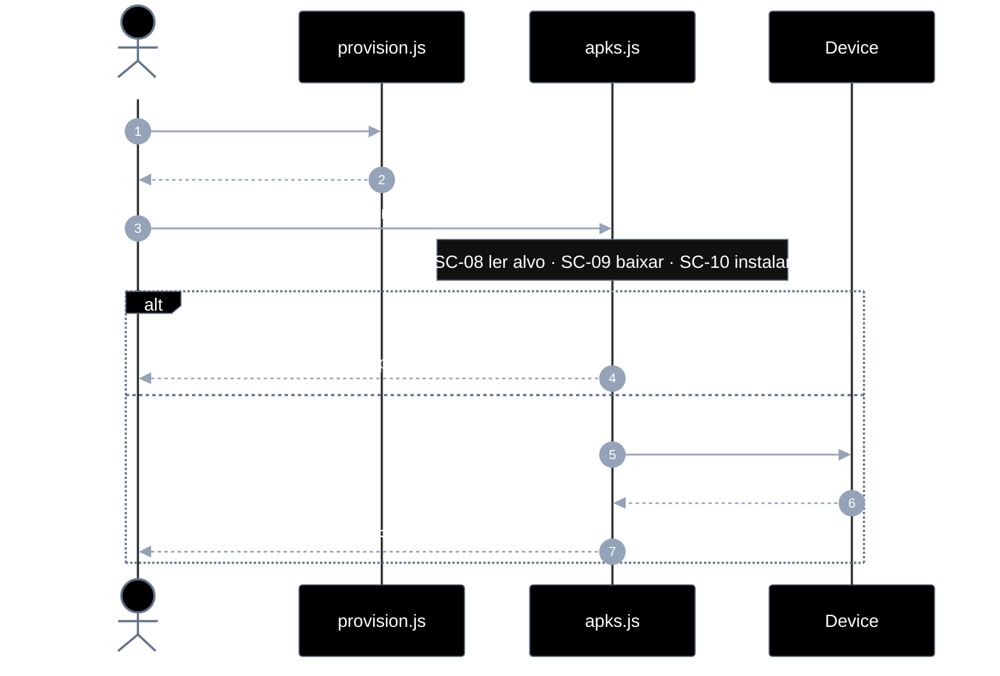
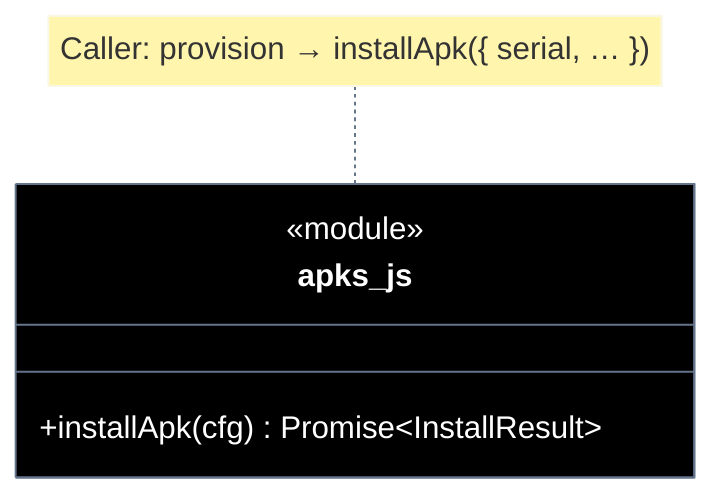

# Implementation plan — EP-03 Instalar APKs

**Por quê:** plano técnico do épico (sequências · agentes · passo a passo · contratos · classes · modelos · BDDs).  
**Épico:** [`2.epics.md`](../2.epics.md).  
**US:** [`1.stories.md`](../1.stories.md) · [`4.scenarios.md#ep-03--instalar-apks`](../4.scenarios.md#ep-03--instalar-apks) · [`5.bdds.md#ep-03--instalar-apks`](../5.bdds.md#ep-03--instalar-apks).  
**API:** `installApk({ serial, … })` em [`../src/lib/apks.js`](../src/lib/apks.js) — função pura com config; **não** método de handle.  
**Pré-requisito:** [`EP-01`](EP-01-provisionar-agente.md) · `provisionEmulator(cfg)` → `{ serial, … }`.  
**Implementação:** [`../src/lib/apks.js`](../src/lib/apks.js).

**Stack:** Node ≥ 18 · JavaScript · `adb` · runtime AVD provisionado (EP-01).

**Runtime (UI útil):** instalar/abrir apps de loja exige AVD com **Google APIs / Play** (GMS) — ver [Decisões de runtime (AVD)](EP-01-provisionar-agente.md#decisões-de-runtime-avd). Sem GMS a app pode instalar mas a UI fica branca/preta.

---

## Escopo

| ID | Item |
|----|------|
| US-06 | Instalar APKs |
| SC-08 | Ler versão na config |
| SC-09 | Baixar APK na versão definida |
| SC-10 | Instalar pacote no agent |

**Resultado:** apps da config instalados na versão pedida via `installApk({ serial, … })`.

---

## Como utilizar

```js
import { provisionEmulator } from "../src/lib/provision.js";
import { installApk } from "../src/lib/apks.js";

const { serial } = await provisionEmulator(cfg); // EP-01

const result = await installApk({ serial, ...cfg.apps.linkedin });
// → { package, version, skipped, artifactPath? }

await installApk({
  serial,
  package: "com.instagram.android",
  version: "…",
});
// ou: installApk({ serial, app: cfg.apps.instagram })
```

**Antes → depois:** `handle.installApk(app)` → `installApk({ serial, …app })`. Sequência SC-08→SC-10 encapsulada por dentro.

---

## Árvore de arquivos

```text
src/
├── lib/
│   ├── apks.js                      # installApk(cfg)
│   ├── apks.test.js
│   ├── apk-read-spec.js             # SC-08
│   ├── apk-read-spec.test.js
│   ├── apk-get-installed-version.js
│   ├── apk-get-installed-version.test.js
│   ├── apk-download.js              # SC-09
│   ├── apk-download.test.js
│   ├── apk-install-package.js       # SC-10
│   ├── apk-install-package.test.js
│   └── provision.js                 # só dados (serial/kind)
├── apks/
│   └── ADBKeyboard.apk              # artefato local (e2e)
└── test/
    └── bdd/
        ├── ep-03-instalar-apks.test.js
        └── us-06-apps-da-config-ficam-instalados.test.js
```

---

## Fluxo (obrigatório)

1. **Provisionar** (EP-01) → `{ serial, … }`.  
2. **Instalar** → `installApk({ serial, … })`.

```js
const { serial } = await provisionEmulator(cfg);
await installApk({ serial, ...cfg.apps.linkedin });
```

| Superfície | O quê |
|------------|--------|
| **Público (caller)** | `installApk({ serial, package, version?, source?, artifact? })` |
| **Privado** | ler spec · versionName · download · adb install |

---

## Diagramas de sequência

### Visão geral — provisionar, depois `installApk`

#### Agentes

| Agente | Responsabilidade |
|--------|------------------|
| Caller | `provisionEmulator` → `installApk({ serial, … })` |
| apks.js | Encapsula SC-08→SC-10 |
| Device | Recebe o package |



#### Contratos

```ts
// Pré: serial de EP-01; apkeep ou artefato local
// Erros: APK_CONFIG_INVALID | APK_NO_SERIAL | APK_DOWNLOAD_FAILED | APK_INSTALL_FAILED

type AppSpec = {
  package: string;
  version?: string;
  source?: string;
  artifact?: string;
};

type InstallResult = {
  package: string;
  version: string;
  skipped: boolean;
  artifactPath?: string;
};

function installApk(cfg: { serial: string } & AppSpec): Promise<InstallResult>;

const { serial } = await provisionEmulator(cfg);
const r = await installApk({
  serial,
  package: "com.linkedin.android",
  version: "4.1.986",
  source: "apk-pure",
});
```

**Interno (não exportar como API separada obrigatória):** `downloadApk`, `getInstalledVersion`, `adbInstall` — usados por `installApk`.

---

## Modelos

### AppSpec / InstallResult

| Campo | Tipo | Descrição |
|-------|------|-----------|
| `package` | `string` | Package Android |
| `version` | `string?` | Versão alvo |
| `source` | `string?` | Ex. apk-pure |
| `artifact` | `string?` | Path local |
| `skipped` | `boolean` | Já na versão (resultado) |

### Erros

| Código | Quando |
|--------|--------|
| `APK_CONFIG_INVALID` | Sem package |
| `APK_NO_SERIAL` | Sem serial |
| `APK_DOWNLOAD_FAILED` | apkeep/artefato |
| `APK_INSTALL_FAILED` | adb install |

---

## Diagrama de classes



---

## Cenários BDD

Fonte: [`5.bdds.md#ep-03--instalar-apks`](../5.bdds.md#ep-03--instalar-apks). Caller: `serial` de EP-01; “Quando…” = `installApk({ serial, … })`.

---

## Plano de implementação (gaps → entregas)

| # | Entrega | SC | Critério |
|---|---------|-----|----------|
| I1 | `installApk({ serial, … })` exportado | — | Função pura com config |
| I2 | Skip se versionName == alvo | SC-08/10 | Idempotente |
| I3 | Validar versão pós-install | SC-10 | Assert |
| I4 | Erros tipados | SC-09/10 | Códigos estáveis |
| I5 | Piloto usa `installApk({ serial, …apps.linkedin })` apenas | — | linkedin-login | Sem Instagram no script |

### Ordem

```text
I1 → I2 → I3 → I4 → I5
```

---

## Mapeamento código atual

| Peça | Status |
|------|--------|
| `installApk({ serial, … })` | Existe |
| SC-08 / 09 / 10 | `apk-read-spec` · `apk-download` · `apk-install-package` |
| Skip se versão ok | Sim |
| Erros tipados | `APK_CONFIG_INVALID` · `APK_NO_SERIAL` · `APK_DOWNLOAD_FAILED` · `APK_INSTALL_FAILED` |
| Piloto LinkedIn | `installApk({ serial, … })` |

---

## Critério de pronto (épico)

1. Caller: `provisionEmulator` → `installApk({ serial, … })`  
2. SC-08..10 encapsulados  
3. BDDs US-06 + SC  

## Próximos passos

→ Implementar I1–I5 em [`src`](../src/README.md)  
→ Aceite: [`5.bdds.md#ep-03--instalar-apks`](../5.bdds.md#ep-03--instalar-apks)
