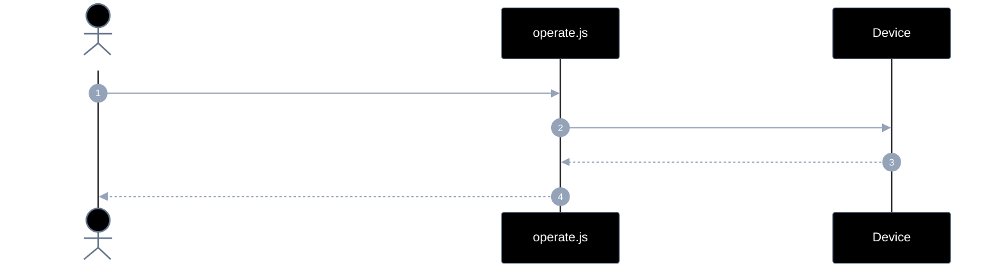
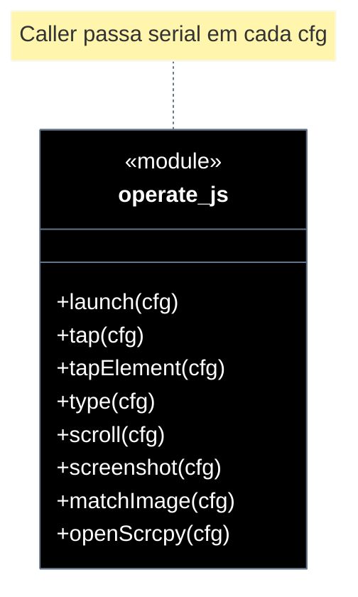

# Implementation plan — EP-04 Operar tela

**Por quê:** plano técnico do épico (sequências · agentes · passo a passo · contratos · classes · modelos · BDDs).  
**Épico:** [`2.epics.md`](../2.epics.md).  
**US:** [`1.stories.md`](../1.stories.md) · [`4.scenarios.md#ep-04--operar-tela`](../4.scenarios.md#ep-04--operar-tela) · [`5.bdds.md#ep-04--operar-tela`](../5.bdds.md#ep-04--operar-tela).  
**API:** funções puras com `{ serial, … }` em [`../src/lib/operate.js`](../src/lib/operate.js) — **não** métodos de handle.  
**Pré-requisito:** [`EP-01`](EP-01-provisionar-agente.md) · [`EP-02`](EP-02-eventos-de-ui.md) (`on(cfg)` para confirmar app/UI).  
**Implementação:** [`../src/lib/operate.js`](../src/lib/operate.js).

**Stack:** Node ≥ 18 · JavaScript · `adb` · visão/OCR (coords) · runtime AVD provisionado.

**Runtime (UI útil):** operar/capturar exige tela pintada — AVD com **Google APIs / Play** (GMS). Tela branca = falta GMS/GPU; screenshot preto no login muitas vezes = `FLAG_SECURE`. Detalhe: [Decisões de runtime (AVD)](EP-01-provisionar-agente.md#decisões-de-runtime-avd).

**Princípio:** gestos (`tap`/`type`) usam **coords vindas de visão/OCR** sobre o frame.  
**Type:** digita **só tocando teclas** localizadas por OCR na **imagem do teclado** (região opcional); **proibido** `adb input text` / ADBKeyboard / inject.
`screenshot` = **capturar frame** (screencap ADB hoje; futuro: câmera no device real — mesmo path de imagem).

---

## Escopo

| ID | Item |
|----|------|
| US-07 | Abrir aplicativo |
| US-08 | tap |
| US-09 | type |
| US-10 | scroll |
| US-11 | Capturar frame (screenshot / câmera) |
| US-12 | Resgatar coordenadas x,y a partir de uma imagem |
| US-21 | Abrir scrcpy (espelhar tela) |
| SC-11..16 · SC-27 | Cenários correspondentes |

**Resultado:** gestos e captura via `launch` / `tap` / `type` / `scroll` / `screenshot` / `matchImage` / `openScrcpy`.

---

## Como utilizar

```js
import { provisionEmulator } from "../src/lib/provision.js";
import { on } from "../src/lib/events.js";
import {
  launch, tap, tapElement, type, scroll, screenshot, matchImage, openScrcpy,
} from "../src/lib/operate.js";

const { serial } = await provisionEmulator(cfg); // EP-01

await launch({ serial, package: "com.linkedin.android" });
await on({ serial, event: "app_open", pkg: "com.linkedin.android" }); // EP-02
await on({ serial, event: "ui_stable", stableMs: 800 });

tap({ serial, x: 360, y: 640 }); // ou tapElement({ serial, center, bounds })
await type({
  serial,
  text: "11999999999",
  region: { x: 0, y: 700, width: 720, height: 500 },
});
scroll({ serial, direction: "down", distance: 800 });
screenshot({ serial, path: "./screenshots/tela.png" });
const { x, y, confidence } = await matchImage({ serial, templatePath: "./templates/btn.png" });
tap({ serial, x, y });
const view = openScrcpy({ serial, title: `agent ${serial}` });
// → { pid, serial }
```

**Antes → depois:** `handle.launch(pkg)` → `launch({ serial, package })` (idem demais). `type` = OCR das teclas + tap. Eventos: **`on(cfg)`** (EP-02).

---

## Árvore de arquivos

```text
src/
├── lib/
│   ├── operate.js                 # launch/tap/type/…/openScrcpy (cfg.serial)
│   ├── operate.test.js
│   └── provision.js               # só dados
├── scripts/
│   └── view.sh                    # CLI/legado; openScrcpy reutiliza a mesma lógica
└── test/
    └── bdd/
        ├── ep-04-operar-tela.test.js
        ├── us-07-abrir-aplicativo.test.js
        └── us-21-abrir-scrcpy.test.js
```

---

## Fluxo (obrigatório)

1. **Provisionar** → `{ serial }`.  
2. **Operar** via funções com `{ serial, … }`.  
3. Opcional: confirmar com `on({ serial, event: "app_open" | "ui_stable", … })` (EP-02).

```js
const { serial } = await provisionEmulator(cfg);

await launch({ serial, package: "com.linkedin.android" });
await on({ serial, event: "app_open", pkg: "com.linkedin.android" });
await on({ serial, event: "ui_stable", stableMs: 800 });

tap({ serial, x: 360, y: 640 });
await type({ serial, text: "11999999999", region: { x: 0, y: 700, width: 720, height: 500 } });
scroll({ serial, direction: "down", distance: 800 });
screenshot({ serial, path: "./screenshots/tela.png" });
const { x, y } = await matchImage({ serial, templatePath: "./templates/btn.png" });
openScrcpy({ serial });
```

| Superfície | O quê |
|------------|--------|
| **Público** | `launch` · `tap` · `type` · `scroll` · `screenshot` · `matchImage` · `openScrcpy` |
| **Privado** | am start · input tap/swipe · capturar frame · OCR teclas → tap · template match · spawn scrcpy |

---

## Diagramas de sequência

### Visão geral



### Por US (caller → funções)

| US | SC | Chamada pública | Interno |
|----|-----|-----------------|---------|
| US-07 | SC-11 | `launch({ serial, package, activity? })` | am start; opcional `on({ event: "app_open" })` |
| US-08 | SC-12 | `tap({ serial, x, y })` / `tapElement({ serial, … })` | input tap; **x,y de visão/OCR** |
| US-09 | SC-13 | `type({ serial, text, region?, … })` | frame → OCR teclas (região opcional) → tap por caractere |
| US-10 | SC-14 | `scroll({ serial, … })` | swipe |
| US-11 | SC-15 | `screenshot({ serial, path })` | **capturar frame** (screencap; futuro câmera) + gravar |
| US-12 | SC-16 | `matchImage({ serial, templatePath })` | template match / visão → x,y |
| US-21 | SC-27 | `openScrcpy({ serial, … })` | spawn scrcpy |

#### Contratos

```ts
type ScrollOpts = {
  serial: string;
  direction: "up" | "down" | "left" | "right";
  distance?: number;
  x?: number;
  y?: number;
};

/** Região opcional do teclado na imagem (coords de tela / frame). */
type KeyboardRegion = {
  x: number;
  y: number;
  width: number;
  height: number;
};

function launch(cfg: { serial: string; package: string; activity?: string }): Promise<void>;
function tap(cfg: { serial: string; x: number; y: number }): void;
function tapElement(cfg: { serial: string; center?: [number, number]; bounds?: object }): void;
/** Digita só com tap nas teclas OCR do frame (sem input text / IME). */
function type(cfg: { serial: string; text: string; region?: KeyboardRegion; delayMs?: number }): Promise<void>;
function scroll(cfg: ScrollOpts): void;
function screenshot(cfg: { serial: string; path: string }): string;
function matchImage(cfg: { serial: string; templatePath: string }): Promise<{ x: number; y: number; confidence: number }>;
function openScrcpy(cfg: { serial: string; title?: string }): { pid: number; serial: string };
```

---

## Modelos / Erros

| Código | US |
|--------|-----|
| `OPERATE_LAUNCH_FAILED` | US-07 |
| `OPERATE_TYPE_FAILED` | US-09 |
| `OPERATE_SCREENSHOT_FAILED` | US-11 |
| `OPERATE_MATCH_NOT_FOUND` | US-12 |

---

## Diagrama de classes



---

## Cenários BDD

Fonte: [`5.bdds.md#ep-04--operar-tela`](../5.bdds.md#ep-04--operar-tela). “Quando…” = função com `{ serial, … }`.

---

## Plano de implementação (gaps → entregas)

| # | Entrega | SC | Critério |
|---|---------|-----|----------|
| I1 | Exportar funções `operate.js` com `{ serial, … }` | — | Sem handle |
| I2 | `launch` + integração `on({ event: "app_open" })` | SC-11 | US-07 |
| I3 | `tap` / `tapElement` | SC-12 | US-08 |
| I4 | `type` via OCR do teclado + tap por tecla (região opcional) | SC-13 | US-09 |
| I5 | `scroll` | SC-14 | US-10 |
| I6 | `screenshot` = capturar frame | SC-15 | US-11 |
| I7 | `matchImage` (visão/template → coords) | SC-16 | US-12 |
| I8 | `openScrcpy({ serial })` | SC-27 | US-21 |
| I9 | Piloto: `launch` · `screenshot` tela inicial · `extract` | — | linkedin-login |

### Ordem

```text
I1 → I2 → I3 → I4 → I5 → I6 → I7 → I8 → I9
```

---

## Mapeamento código atual

| Peça | Status |
|------|--------|
| `launch` / `tap` / `type` / `scroll` / `screenshot` / `matchImage` / `openScrcpy` | Existe (`type` = OCR teclado + tap; região opcional) |
| Legado `handle.*` / `createOperate` | Removido |

---

## Critério de pronto (épico)

1. Caller usa só funções com `{ serial, … }`  
2. SC-11..16 e SC-27 encapsulados  
3. BDDs US-07 · US-21 · EP-04  

## Próximos passos

→ Aceite: [`5.bdds.md#ep-04--operar-tela`](../5.bdds.md#ep-04--operar-tela)
