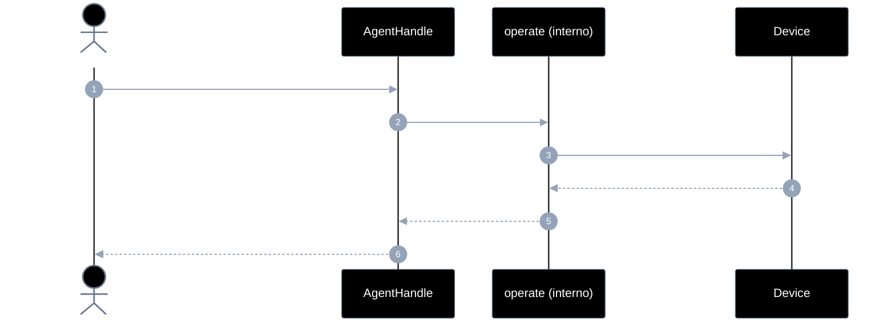
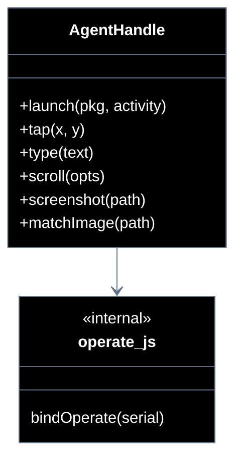

# Implementation plan — EP-04 Operar tela

**Por quê:** plano técnico do épico (sequências · agentes · passo a passo · contratos · classes · modelos · BDDs).  
**Épico:** [`2.epics.md`](../2.epics.md).  
**US:** [`1.stories.md`](../1.stories.md) · [`4.scenarios.md#ep-04--operar-tela`](../4.scenarios.md#ep-04--operar-tela) · [`5.bdds.md#ep-04--operar-tela`](../5.bdds.md#ep-04--operar-tela).  
**Handle:** gestos são métodos do [`AgentHandle`](EP-01-provisionar-agente.md) — **não** funções soltas com `serial`.  
**Pré-requisito:** [`EP-01`](EP-01-provisionar-agente.md) · [`EP-02`](EP-02-eventos-de-ui.md) (`handle.on` para confirmar app/UI).  
**Implementação interna:** [`../src/lib/operate.js`](../src/lib/operate.js) (anexado ao handle em `provision.js`).

**Stack:** Node ≥ 18 · JavaScript · `adb` · visão/OCR (coords) · runtime provisionado.

**Princípio:** gestos (`tap`/`type`) usam **coords vindas de visão/OCR** sobre o frame.  
`screenshot` = **capturar frame** (screencap ADB hoje; futuro: câmera no device real — mesmo path de imagem).

---

## Escopo

| ID | Item |
|----|------|
| US-07 | Abrir aplicativo |
| US-08 | tap |
| US-09 | type |
| US-10 | scroll |
| US-11 | Capturar frame (screenshot / câmera) |
| US-12 | Resgatar coordenadas x,y a partir de uma imagem |
| US-21 | Abrir scrcpy (espelhar tela) |
| SC-11..16 · SC-27 | Cenários correspondentes |

**Resultado:** gestos e captura via `handle.launch` / `tap` / `type` / `scroll` / `screenshot` / `matchImage` / `openScrcpy`.

---

## Árvore de arquivos

```text
src/
├── lib/
│   ├── operate.js                 # createOperate → handle.launch/tap/…/openScrcpy
│   ├── operate.test.js
│   └── provision.js               # anexa operate ao handle
├── scripts/
│   └── view.sh                    # CLI/legado; openScrcpy reutiliza a mesma lógica
└── test/
    └── bdd/
        ├── ep-04-operar-tela.test.js
        ├── us-07-abrir-aplicativo.test.js
        └── us-21-abrir-scrcpy.test.js
```

---

## Fluxo (obrigatório)

1. **Provisionar** → handle.  
2. **Operar** via métodos do handle (serial implícito).  
3. Opcional: confirmar com `handle.on("app_open" | "ui_stable", …)` (EP-02).

```js
const handle = await provisionEmulator(cfg);

await handle.launch("com.linkedin.android");
await handle.on("app_open", { pkg: "com.linkedin.android" });
await handle.on("ui_stable", { stableMs: 800 });

await handle.tap(360, 640); // coords de visão/OCR (ou matchImage)
await handle.type("olá");
await handle.scroll({ direction: "down", distance: 800 });
await handle.screenshot("./screenshots/tela.png"); // capturar frame
const { x, y } = await handle.matchImage("./templates/btn.png");
await handle.openScrcpy(); // janela scrcpy no serial do handle
```

| Superfície | O quê |
|------------|--------|
| **Público** | `handle.launch` · `tap` · `type` · `scroll` · `screenshot` · `matchImage` · `openScrcpy` |
| **Privado** | am start · input tap/text/swipe · capturar frame · template match / OCR coords · spawn scrcpy |

---

## Diagramas de sequência

### Visão geral



### Por US (caller → handle)

| US | SC | Chamada pública | Interno |
|----|-----|-----------------|---------|
| US-07 | SC-11 | `handle.launch(pkg, activity?)` | am start; opcional `on("app_open")` |
| US-08 | SC-12 | `handle.tap(x, y)` / `tapElement(el)` | input tap; **x,y de visão/OCR** |
| US-09 | SC-13 | `handle.type(text)` | input text / IME; foco via coords visão/OCR |
| US-10 | SC-14 | `handle.scroll(opts)` | swipe |
| US-11 | SC-15 | `handle.screenshot(path)` | **capturar frame** (screencap; futuro câmera) + gravar |
| US-12 | SC-16 | `handle.matchImage(templatePath)` | template match / visão → x,y |

#### Contratos

```ts
type ScrollOpts = {
  direction: "up" | "down" | "left" | "right";
  distance?: number;
  x?: number;
  y?: number;
};

type AgentHandle = {
  // … EP-01..03 …
  launch(pkg: string, activity?: string): Promise<void>;
  tap(x: number, y: number): void;
  tapElement(el: { bounds?: { centerX: number; centerY: number } }): void;
  type(text: string): void;
  scroll(opts: ScrollOpts): void;
  screenshot(path: string): string;
  matchImage(templatePath: string): Promise<{ x: number; y: number; confidence: number }>;
};
```

---

## Modelos / Erros

| Código | US |
|--------|-----|
| `OPERATE_LAUNCH_FAILED` | US-07 |
| `OPERATE_TYPE_FAILED` | US-09 |
| `OPERATE_SCREENSHOT_FAILED` | US-11 |
| `OPERATE_MATCH_NOT_FOUND` | US-12 |

---

## Diagrama de classes



---

## Cenários BDD

Fonte: [`5.bdds.md#ep-04--operar-tela`](../5.bdds.md#ep-04--operar-tela). “Quando…” = método do handle.

---

## Plano de implementação (gaps → entregas)

| # | Entrega | SC | Critério |
|---|---------|-----|----------|
| I1 | `bindOperate(serial)` + anexar ao handle | — | Sem serial no caller |
| I2 | `launch` + integração `on("app_open")` | SC-11 | US-07 |
| I3 | `tap` / `tapElement` | SC-12 | US-08 |
| I4 | `type` (IME se necessário) | SC-13 | US-09 |
| I5 | `scroll` | SC-14 | US-10 |
| I6 | `screenshot` = capturar frame | SC-15 | US-11 |
| I7 | `matchImage` (visão/template → coords) | SC-16 | US-12 |
| I8 | `openScrcpy` no handle (serial implícito) | SC-27 | US-21 |
| I9 | Piloto: `launch` · `screenshot` tela inicial · `extract` | — | linkedin-login |

### Ordem

```text
I1 → I2 → I3 → I4 → I5 → I6 → I7 → I8 → I9
```

---

## Mapeamento código atual

| Peça | Status |
|------|--------|
| `createOperate` → handle | Existe |
| `launch` / `tap` / `type` / `scroll` / `screenshot` / `matchImage` | Existe |
| `openScrcpy` | Existe |
| Legado `operate.*(serial, …)` | Deprecado |

---

## Critério de pronto (épico)

1. Caller só usa métodos do handle  
2. SC-11..16 e SC-27 encapsulados  
3. BDDs US-07 · US-21 · EP-04  

## Próximos passos

→ Aceite: [`5.bdds.md#ep-04--operar-tela`](../5.bdds.md#ep-04--operar-tela)
