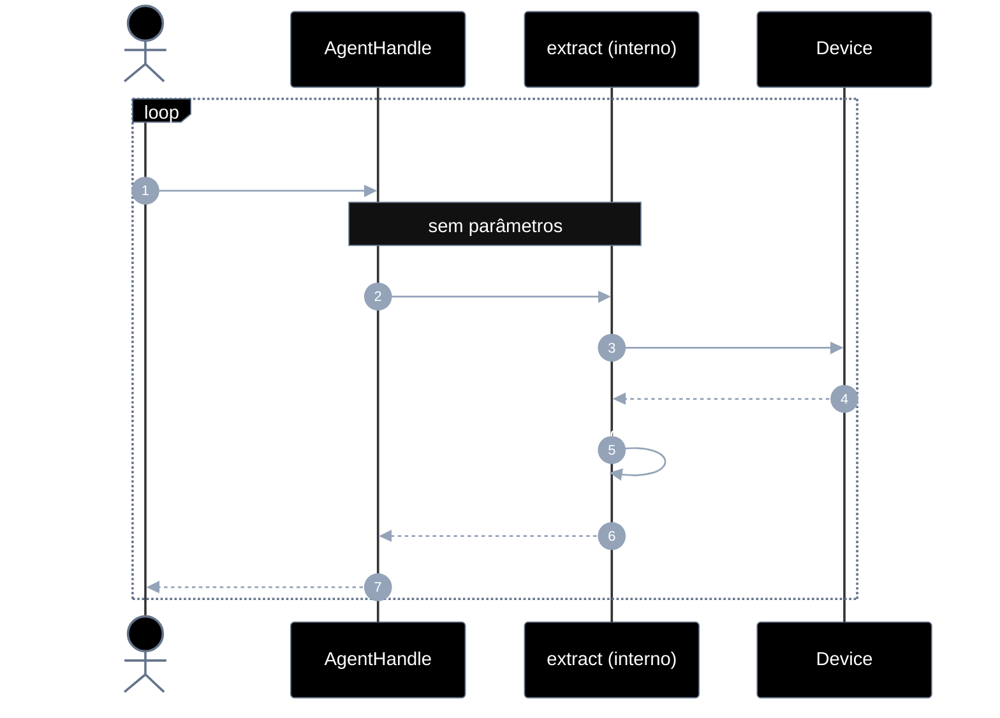
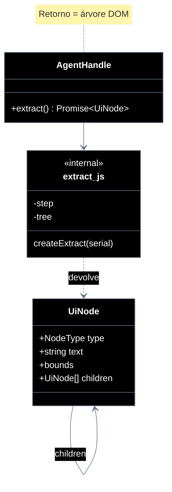

# Implementation plan — EP-05 Extrair elementos

**Por quê:** plano técnico do épico (sequências · agentes · passo a passo · contratos · classes · modelos · BDDs).  
**Épico:** [`2.epics.md`](../2.epics.md).  
**US:** [`1.stories.md`](../1.stories.md) · [`4.scenarios.md#ep-05--extrair-elementos`](../4.scenarios.md#ep-05--extrair-elementos) · [`5.bdds.md#ep-05--extrair-elementos`](../5.bdds.md#ep-05--extrair-elementos).  
**Handle:** `extract` é método do [`AgentHandle`](EP-01-provisionar-agente.md) — **não** é função solta com `serial`.  
**Pré-requisito:** [`EP-01`](EP-01-provisionar-agente.md) · handle.  
**Implementação interna:** [`../src/lib/extract.js`](../src/lib/extract.js) (anexado ao handle em `provision.js`).

**Stack:** Node ≥ 18 · JavaScript · `adb` · runtime provisionado.

---

## Escopo

| ID | Item |
|----|------|
| US-13 | Extrair árvore DOM com textos |
| US-14 | Extrair ícones |
| US-15 | Extrair listas |
| US-16 | Extrair imagens |
| SC-17..21 | Cenários correspondentes |

**Resultado:** **árvore estilo DOM** — raiz com `children`; cada elemento é um **node**.  
`handle.extract()` — **um método, sem parâmetros**; cada chamada (por estória/SC) **incrementa nodes** na mesma árvore.

---

## Árvore de arquivos

```text
src/
├── lib/
│   ├── extract.js                 # createExtract → handle.extract() (progressivo)
│   ├── extract.test.js
│   └── provision.js               # anexa extract ao handle
└── test/
    └── bdd/
        ├── ep-05-extrair-elementos.test.js
        └── us-13-extrair-arvore-dom.test.js
```

---

## Fluxo (obrigatório)

1. **Provisionar** → handle.  
2. **Extrair** → `handle.extract()`; retorno = árvore DOM; cada chamada enriquece nodes.

```js
const handle = await provisionEmulator(cfg);

const t1 = await handle.extract();
// árvore só com nodes de texto (SC-17)

const t2 = await handle.extract();
// mesma árvore + hierarquia completa (SC-18)

const t3 = await handle.extract();
// + nodes type "icon" (SC-19 / US-14)

const t4 = await handle.extract();
// + nodes type "list" (SC-20 / US-15)

const t5 = await handle.extract();
// + nodes type "image" (SC-21 / US-16)
```

**Regra:** sempre `extract()` → `Promise<UiNode>` (raiz). Sem `kind`/opts. O que muda é a árvore: novos tipos de node aparecem / hierarquia completa.

| Superfície | O quê |
|------------|--------|
| **Público** | `handle.extract() → Promise<UiNode>` (árvore DOM) |
| **Privado** | passo · dump · parse · inserir/tipar nodes na árvore |

---

## Exemplo de JSON (árvore DOM)

### Após 1ª chamada — SC-17 (textos)

```json
{
  "type": "root",
  "bounds": { "x": 0, "y": 0, "w": 1080, "h": 2400 },
  "children": [
    {
      "type": "text",
      "text": "Entrar",
      "bounds": { "x": 120, "y": 1800, "w": 840, "h": 96 },
      "children": []
    },
    {
      "type": "text",
      "text": "E-mail ou telefone",
      "bounds": { "x": 120, "y": 900, "w": 840, "h": 72 },
      "children": []
    }
  ]
}
```

### Após 2ª chamada — SC-18 (hierarquia + textos)

```json
{
  "type": "root",
  "bounds": { "x": 0, "y": 0, "w": 1080, "h": 2400 },
  "children": [
    {
      "type": "other",
      "bounds": { "x": 0, "y": 0, "w": 1080, "h": 2400 },
      "children": [
        {
          "type": "other",
          "bounds": { "x": 48, "y": 800, "w": 984, "h": 400 },
          "children": [
            {
              "type": "text",
              "text": "E-mail ou telefone",
              "bounds": { "x": 120, "y": 900, "w": 840, "h": 72 },
              "children": []
            }
          ]
        },
        {
          "type": "text",
          "text": "Entrar",
          "bounds": { "x": 120, "y": 1800, "w": 840, "h": 96 },
          "children": []
        }
      ]
    }
  ]
}
```

### Após 3ª–5ª chamadas — ícones / listas / imagens como nodes

Mesma raiz; nodes novos com `"type": "icon" | "list" | "image"` entram na hierarquia (filhos nos lugares certos):

```json
{
  "type": "root",
  "bounds": { "x": 0, "y": 0, "w": 1080, "h": 2400 },
  "children": [
    {
      "type": "other",
      "children": [
        {
          "type": "icon",
          "bounds": { "x": 48, "y": 64, "w": 72, "h": 72 },
          "children": []
        },
        {
          "type": "list",
          "bounds": { "x": 0, "y": 400, "w": 1080, "h": 1200 },
          "children": [
            {
              "type": "other",
              "children": [
                { "type": "text", "text": "Item 1", "children": [] },
                { "type": "image", "bounds": { "x": 24, "y": 420, "w": 128, "h": 128 }, "children": [] }
              ]
            }
          ]
        }
      ]
    }
  ]
}
```

---

## Diagramas de sequência

### Visão geral



### Por US — mesma chamada, árvore que ganha nodes

| Ordem | US | SC | Chamada | O que a árvore ganha |
|-------|----|-----|---------|----------------------|
| 1 | US-13 | SC-17 | `extract()` | nodes `type: "text"` |
| 2 | US-13 | SC-18 | `extract()` | hierarquia (`other` + filhos); textos no lugar |
| 3 | US-14 | SC-19 | `extract()` | nodes `type: "icon"` |
| 4 | US-15 | SC-20 | `extract()` | nodes `type: "list"` (+ itens filhos) |
| 5 | US-16 | SC-21 | `extract()` | nodes `type: "image"` |

Caller inspeciona a árvore (walk em `children`) — não há arrays paralelos `texts` / `icons` fora do DOM.

#### Contratos

```ts
type NodeType = "root" | "text" | "icon" | "list" | "image" | "other";

/** Node da árvore DOM. */
type UiNode = {
  type: NodeType;
  text?: string;
  bounds?: { x: number; y: number; w: number; h: number };
  children: UiNode[];
};

type AgentHandle = {
  // … EP-01..04 …
  /** Sem parâmetros. Retorna a árvore DOM; cada chamada incrementa nodes. */
  extract(): Promise<UiNode>;
};

const tree = await handle.extract();
// tree.type === "root"
// tree.children[0].type === "text" | "icon" | …
```

**Interno:** cursor de passo no handle; árvore mutável/acumulada; após o passo 5, nova chamada pode devolver a árvore completa (idempotente).

---

## Modelos / Erros

| Código | Quando |
|--------|--------|
| `EXTRACT_DUMP_FAILED` | dump indisponível |
| `EXTRACT_STEP_FAILED` | falha ao tipar/inserir nodes no passo |

---

## Diagrama de classes



---

## Cenários BDD

Fonte: [`5.bdds.md#ep-05--extrair-elementos`](../5.bdds.md#ep-05--extrair-elementos).  
“Quando…” = `handle.extract()`; “Então…” = árvore contém nodes do tipo da estória.

---

## Plano de implementação (gaps → entregas)

| # | Entrega | SC | Critério |
|---|---------|-----|----------|
| I1 | `createExtract` + `handle.extract()` → `UiNode` raiz | — | Árvore DOM |
| I2 | Passo 1 → nodes `text` | SC-17 | Filhos texto |
| I3 | Passo 2 → hierarquia completa | SC-18 | `children` aninhados |
| I4 | Passos 3–5 → nodes `icon` / `list` / `image` | SC-19..21 | Tipos na árvore |
| I5 | Piloto usa `extract()` | — | linkedin-login |

### Ordem

```text
I1 → I2 → I3 → I4 → I5
```

---

## Mapeamento código atual

| Peça | Status |
|------|--------|
| `createExtract` → `handle.extract()` | Existe (progressivo) |
| `extractElements` lista plana | Legado (piloto LinkedIn) |

---

## Critério de pronto (épico)

1. `handle.extract()` sem parâmetros  
2. Retorno = árvore DOM (`type` + `children`); elementos = nodes  
3. Cada chamada incrementa tipos de node na árvore  
4. BDDs US-13 + EP-05  

## Próximos passos

→ Aceite: [`5.bdds.md#ep-05--extrair-elementos`](../5.bdds.md#ep-05--extrair-elementos)
