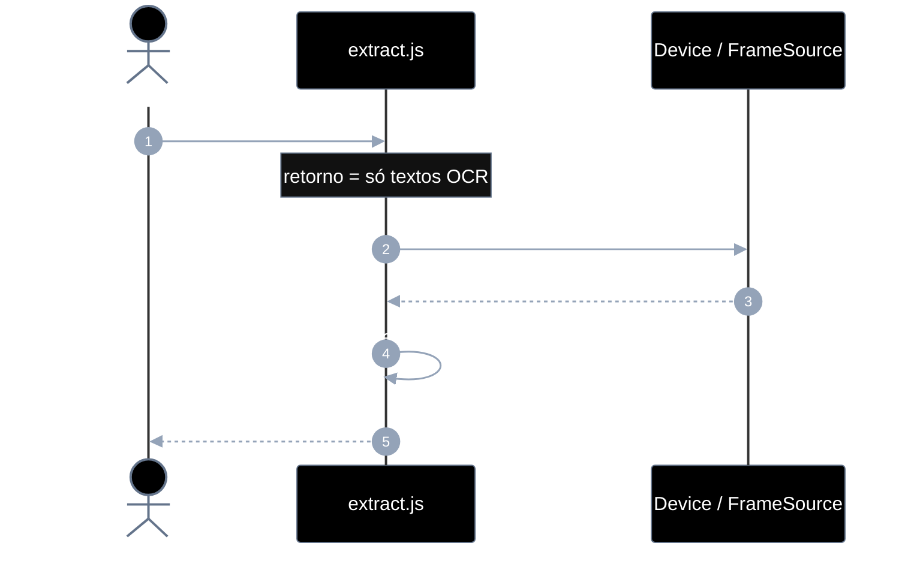
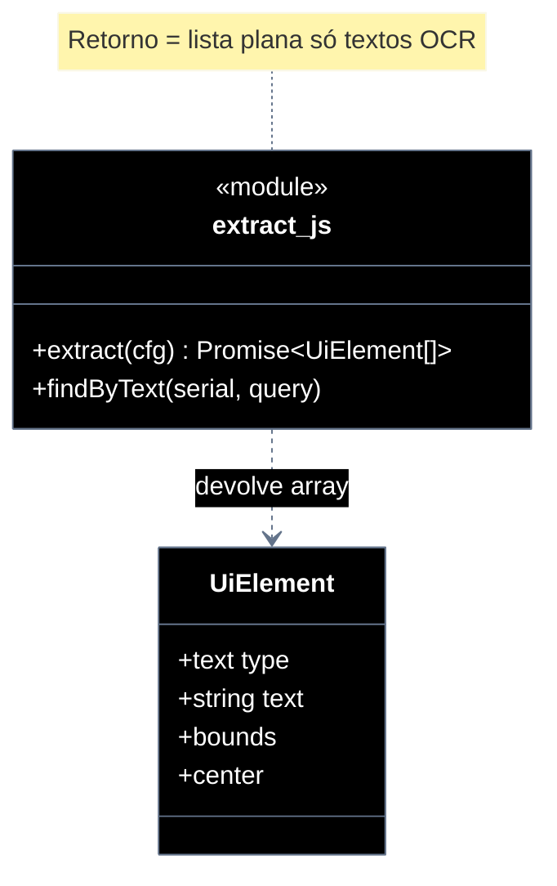

# Implementation plan — EP-05 Extrair textos

**Por quê:** plano técnico do épico (sequências · agentes · passo a passo · contratos · classes · modelos · BDDs).  
**Épico:** [`2.epics.md`](../2.epics.md).  
**US:** [`1.stories.md`](../1.stories.md) · [`4.scenarios.md#ep-05--extrair-textos`](../4.scenarios.md#ep-05--extrair-textos) · [`5.bdds.md#ep-05--extrair-textos`](../5.bdds.md#ep-05--extrair-textos).  
**API:** `extract({ serial })` · `findByText(serial, query)` em [`../src/lib/extract.js`](../src/lib/extract.js) — funções puras; **não** método de handle.  
**Pré-requisito:** [`EP-01`](EP-01-provisionar-agente.md) · `serial`.  
**Implementação:** [`../src/lib/extract.js`](../src/lib/extract.js).

**Stack:** Node ≥ 18 · JavaScript · `adb` · **OCR** · runtime provisionado.  
**Visão (`vision.js`):** legado / usado só em template match (US-12 `matchImage`) — **não** entra no contrato de `extract()`.

**Princípio:** percepção = **frame/imagem** → **OCR** → **lista plana de textos**.  
**Proibido** como fonte: dump uiautomator / árvore de acessibilidade ADB.  
**Fonte de frame:** screenshot ADB, stream ou **câmera** (device real) — mesmo pipeline.  
**Não** devolver árvore DOM (`root` / `children`); contrato = **array de elementos `type: "text"`**.

**Antes → depois:** US-13/14/15 (e US-16 imagens) eram stories separadas (textos / ícones / listas / imagens). Agora **só US-13 Extrair textos**; `extract()` devolve somente textos OCR.

---

## Escopo

| ID | Item | Status |
|----|------|--------|
| US-13 | Extrair textos (OCR) | Ativo |
| US-23 | Buscar elemento(s) por texto (similaridade) | Ativo |
| SC-17 | Extrair textos | Ativo |
| SC-29..30 | `findByText` (SC-30 = LinkedIn Sign in with Email) | Ativo |
| US-14 · US-15 · US-16 | Extrair ícones / listas / imagens | **Absorvido em US-13 / removido** |
| SC-18 · SC-19 · SC-20 · SC-21 | Enriquecer / ícones / listas / imagens | **Removido** |
| TSK-024..027 | Tasks de ícones/listas/imagens/enriquecer | **Cancelado** |

**Resultado:** **lista plana** `UiElement[]` — cada item `{ type: "text", text, bounds, center }`.  
`extract({ serial })` — cada chamada faz OCR de novo; devolve só textos.

---

## Como utilizar

```js
import { provisionEmulator } from "../src/lib/provision.js";
import { extract, findByText } from "../src/lib/extract.js";
import { tapElement } from "../src/lib/operate.js";

const { serial } = await provisionEmulator(cfg); // EP-01

const elements = await extract({ serial });
// → [ { type: "text", text, bounds, center }, … ]

const again = await extract({ serial }); // OCR novo

const hit = await findByText(serial, "Sign in with Email", { minScore: 0.8 });
if (hit) tapElement({ serial, center: hit.center, bounds: hit.bounds });
```

**Antes → depois:** `handle.extract()` (cache) → `extract({ serial })` (OCR a cada call). Só `type: "text"`.

---

## Árvore de arquivos

```text
src/
├── lib/
│   ├── extract.js                      # extract · extractElements · findByText
│   ├── frame.js                        # captura de frame
│   ├── ocr.js                          # tesseract → palavras + bounds
│   ├── vision.js                       # legado; template match (US-12) — não tipa extract
│   ├── extract.test.js
│   ├── find-by-text.test.js
│   ├── find-by-text.fixture.test.js    # SC-30 unitário (fixture LinkedIn)
│   └── provision.js
└── test/
    ├── fixtures/
    │   └── linkedin-tela-inicial.png   # print inicial LinkedIn (SC-30)
    └── bdd/
        ├── ep-05-extrair-elementos.test.js
        └── sc-30-linkedin-sign-in-with-email.test.js
```

---

## Fluxo (obrigatório)

1. **Provisionar** → `{ serial }`.  
2. **Capturar frame** (interno).  
3. **Extrair** → `extract({ serial })`; OCR sobre o frame; retorno = **lista de textos**.

```js
const { serial } = await provisionEmulator(cfg);
const elements = await extract({ serial });
const hit = await findByText(serial, "Sign in with Email", { minScore: 0.8 });
```

**Público:** `extract({ serial }) → Promise<UiElement[]>` · `findByText(serial, query)`  
**Privado:** capturar frame · OCR · tipar `text` · match lado a lado na query

### US-23 — Buscar por texto (similaridade)

OCR costuma devolver a frase partida (piloto LinkedIn: `"Sign"` + `"in"` + `"with"` + `"Email"`, não a string inteira).  
`findByText(serial, query, { minScore })` **encapsula** `extractElements` — o caller **não** passa a lista de elementos.

**Regras de retorno:**
- elementos **lado a lado** (mesma linha / bounds vizinhos)
- o texto de cada um (e o texto **unido**) está **contido na string maior** (`query`)
- score de similaridade ≥ `minScore`

```js
const hit = await findByText(serial, "Sign in with Email", { minScore: 0.8 });
// hit.elements → [Sign, in, with, Email] — lado a lado, dentro da query
// hit.score elevado; hit.center para tap
```

---

## Exemplo de JSON (lista de textos)

```json
[
  {
    "type": "text",
    "text": "Entrar",
    "bounds": { "x": 120, "y": 1800, "w": 840, "h": 96 },
    "center": [540, 1848]
  },
  {
    "type": "text",
    "text": "E-mail ou telefone",
    "bounds": { "x": 120, "y": 900, "w": 840, "h": 72 },
    "center": [540, 936]
  }
]
```

Não há elementos `icon` / `list` / `image` / `other` no retorno de `extract()`.

---

## Diagramas de sequência

### Visão geral



### Por US — ativo

| Ordem | US | SC | Chamada | O que devolve |
|-------|----|-----|---------|----------------|
| 1 | US-13 | SC-17 | `extract({ serial })` | elementos `type: "text"` via **OCR** |
| — | US-23 | SC-29..30 | `findByText(serial, query)` | hit com textos lado a lado na query |

Caller filtra/itera o array (`el.text`, `el.center`) — **não** há walk em `children` nem tipos de visão.

#### Contratos

```ts
type ElementType = "text";

/** Elemento plano encontrado por OCR. */
type UiElement = {
  type: "text";
  text: string;
  bounds: { x: number; y: number; w: number; h: number };
  center?: [number, number];
};

function extract(cfg: { serial: string }): Promise<UiElement[]>;

/** Hit de findByText: elementos lado a lado contidos na string maior. */
type FindByTextHit = {
  elements: UiElement[];
  score: number;
  text: string;
  bounds: { x: number; y: number; w: number; h: number };
  center: [number, number];
};

function findByText(
  serial: string,
  query: string,
  opts?: { minScore?: number },
): Promise<FindByTextHit | null>;

const elements = await extract({ serial });
// [ { type: "text", text, bounds, center }, … ]
```

---

## Modelos / Erros

| Código | Quando |
|--------|--------|
| `EXTRACT_FRAME_FAILED` | frame/imagem indisponível (screenshot/câmera) |
| `EXTRACT_OCR_FAILED` | falha no OCR |

---

## Diagrama de classes



---

## Cenários BDD

Fonte: [`5.bdds.md#ep-05--extrair-elementos`](../5.bdds.md#ep-05--extrair-elementos).  
“Quando…” = `extract({ serial })`; “Então…” = lista só com `type: "text"`.

---

## Plano de implementação (gaps → entregas)

| # | Entrega | SC | Critério |
|---|---------|-----|----------|
| I1 | `extract({ serial })` → `UiElement[]` | — | Lista plana só `text`; sem árvore DOM |
| I2 | Fonte de frame (screenshot ADB; abstrair câmera) | — | Imagem disponível sem dump XML |
| I3 | OCR textos + bounds → elementos `text` | SC-17 | Itens texto na lista |
| I4 | Sem uiautomator dump como fonte | — | Só frame → OCR |
| I5 | Piloto: `extract({ serial })` + JSON da lista de textos | — | linkedin-login |
| I6 | `findByText(serial, query)` encapsula `extractElements` + match por similaridade | SC-29 | Score ≥ limiar; caller não passa lista |
| I7 | BDD SC-30 LinkedIn fixture `"Sign in with Email"` → 4 partes | SC-30 | `Sign`+`in`+`with`+`Email` |

### Ordem

```text
I1 → I2 → I3 → I4 → I5 → I6 → I7
```

---

## Mapeamento código atual

| Peça | Status |
|------|--------|
| `extract({ serial })` | Feito — só `type: "text"` (lista plana, sem `children`) |
| Fonte = frame → OCR | Feito (`frame.js` / `ocr.js`) |
| `vision.js` tipando extract | **Removido do produto** — legado; US-12 `matchImage` permanece |
| `dumpUiXml` | Só legado eventos EP-02 |
| `extractElements` lista plana de textos | Feito |
| `findByText` (US-23) | Feito — encapsula `extractElements`; lado a lado + contidos na query |
| Fixture + BDD SC-30 | Feito — `linkedin-tela-inicial.png` · `sc-30-*.test.js` |

---

## Como rodar (SC-30 / LinkedIn)

```bash
cd screen-robot/src

# BDD oficial SC-30 (fixture, sem device)
node --test --test-timeout=120000 test/bdd/sc-30-linkedin-sign-in-with-email.test.js

# Unitário da mesma fixture
node --test --test-timeout=120000 lib/find-by-text.fixture.test.js

# Piloto ao vivo (device)
npm run linkedin-login
```

---

## Critério de pronto (épico)

1. `extract({ serial })`  
2. Retorno = **lista** `UiElement[]` só com `type: "text"` (não árvore `root`/`children`)  
3. Pipeline = **frame → OCR → lista de textos** (sem dump uiautomator; sem enriquecimento por visão)  
4. Chamadas repetidas = OCR de novo (lista plana só textos)  
5. `findByText(serial, query)`: elementos **lado a lado** contidos na **string maior**  
6. BDD **SC-30** LinkedIn verde (fixture)  
7. BDDs US-13 + EP-05  

## Próximos passos

→ Aceite: [`5.bdds.md#ep-05--extrair-elementos`](../5.bdds.md#ep-05--extrair-elementos) · SC-30
