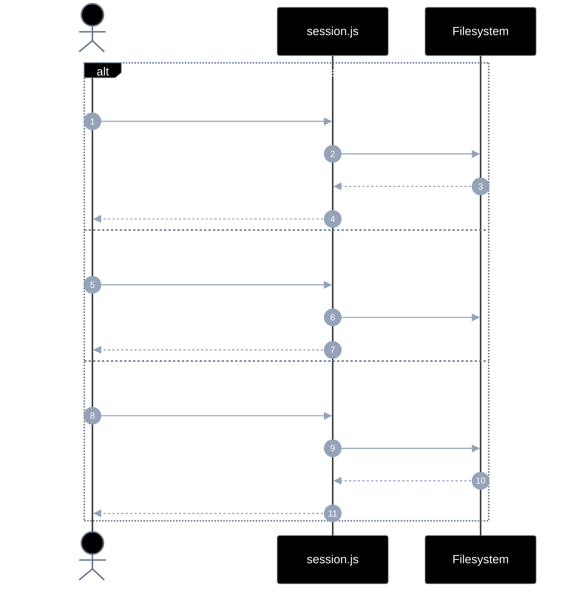
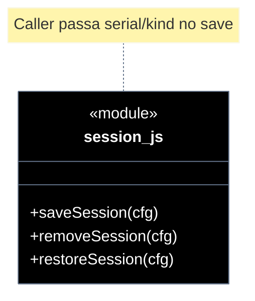

# Implementation plan — EP-06 Sessão

**Por quê:** plano técnico do épico (sequências · agentes · passo a passo · contratos · classes · modelos · BDDs).  
**Épico:** [`2.epics.md`](../2.epics.md).  
**US:** [`1.stories.md`](../1.stories.md) · [`4.scenarios.md#ep-06--sessao`](../4.scenarios.md#ep-06--sessao) · [`5.bdds.md#ep-06--sessao`](../5.bdds.md#ep-06--sessao).  
**API:** `saveSession` / `removeSession` / `restoreSession` em [`../src/lib/session.js`](../src/lib/session.js) — funções com config; **não** métodos de handle.  
**Pré-requisito:** [`EP-01`](EP-01-provisionar-agente.md) · `{ serial, kind }` no save.  
**Implementação:** [`../src/lib/session.js`](../src/lib/session.js).

**Stack:** Node ≥ 18 · JavaScript · runtime provisionado.

---

## Escopo

| ID | Item |
|----|------|
| US-17 | Salvar sessão |
| US-18 | Remover sessão |
| US-19 | Recuperar sessão |
| SC-22..24 | Cenários correspondentes |

**Resultado:** estado persistido/apagado/restaurado via `saveSession` / `removeSession` / `restoreSession`.

---

## Como utilizar

```js
import { provisionEmulator } from "../src/lib/provision.js";
import { saveSession, restoreSession, removeSession } from "../src/lib/session.js";

const { serial, kind } = await provisionEmulator(cfg); // EP-01
// … operar …

const path = await saveSession({
  serial,
  kind,
  path: "./sessions/linkedin.json",
  state: { step: "logged-in", apps: ["com.linkedin.android"] },
});

const state = await restoreSession({ path: "./sessions/linkedin.json" });
// → { serial, kind, savedAt, step, apps, … }

const removed = await removeSession({ path: "./sessions/linkedin.json" });
```

**Antes → depois:** `handle.saveSession(path, state)` → `saveSession({ serial, kind, path, state })`. Erros: `SESSION_WRITE_FAILED` · `SESSION_NOT_FOUND` · `SESSION_INVALID`.

---

## Árvore de arquivos

```text
src/
├── lib/
│   ├── session.js                 # saveSession / removeSession / restoreSession
│   ├── session.test.js
│   └── provision.js               # só dados
└── test/
    └── bdd/
        ├── ep-06-sessao.test.js
        └── us-17-salvar-sessao.test.js
```

---

## Fluxo (obrigatório)

1. **Provisionar** → `{ serial, kind }`.  
2. **Sessão** via funções com `path` (+ `serial`/`kind` no save).

```js
const { serial, kind } = await provisionEmulator(cfg);
await saveSession({ serial, kind, path: "./sessions/linkedin.json", state: { step: "logged-in" } });
await removeSession({ path: "./sessions/linkedin.json" });
const state = await restoreSession({ path: "./sessions/linkedin.json" });
```

| Superfície | O quê |
|------------|--------|
| **Público** | `saveSession` · `removeSession` · `restoreSession` |
| **Privado** | serialize JSON · unlink |

---

## Diagramas de sequência

### Visão geral



### Por US

| US | SC | Chamada |
|----|-----|---------|
| US-17 | SC-22 | `saveSession({ serial, kind, path, state? })` |
| US-18 | SC-23 | `removeSession({ path })` |
| US-19 | SC-24 | `restoreSession({ path })` |

#### Contratos

```ts
type SessionState = {
  serial?: string;
  kind?: string;
  step?: string;
  apps?: unknown[];
  savedAt?: string;
  [k: string]: unknown;
};

function saveSession(cfg: {
  serial: string;
  kind: string;
  path: string;
  state?: SessionState;
}): Promise<string>;
function removeSession(cfg: { path: string }): Promise<boolean>;
function restoreSession(cfg: { path: string }): Promise<SessionState>;

await saveSession({ serial, kind, path: "./sessions/li.json", state: { step: "logged-in" } });
await removeSession({ path: "./sessions/li.json" });
const s = await restoreSession({ path: "./sessions/li.json" });
```

`saveSession` grava `serial` / `kind` no payload a partir da config.

#### Exemplo de JSON (arquivo de sessão)

Ilustrativo da API EP-06 (o piloto LinkedIn atual **não** grava sessão):

```json
{
  "serial": "emulator-5554",
  "kind": "avd",
  "step": "ready",
  "apps": {
    "linkedin": {
      "package": "com.linkedin.android",
      "version": "4.1.1248"
    }
  },
  "screenshot": "./screenshots/01-antes-agree.png",
  "paths": {
    "session": "./sessions/linkedin.json",
    "screenshot": "./screenshots/01-antes-agree.png"
  },
  "extract": [
    {
      "type": "text",
      "text": "Sign in",
      "bounds": { "x": 120, "y": 1800, "w": 840, "h": 96 },
      "center": [540, 1848]
    }
  ],
  "events": [
    { "type": "ui_stable", "attempt": 3, "at": "2026-09-19T23:00:00.000Z" }
  ],
  "savedAt": "2026-09-19T23:00:01.000Z"
}
```

| Campo | Origem |
|-------|--------|
| `serial` / `kind` | config do caller (EP-01) |
| `step` | estado passado pelo caller |
| `apps` | instalação (EP-03) |
| `paths` | paths úteis para restore |
| `extract` | última lista de textos OCR (EP-05), opcional |
| `events` | últimos eventos (EP-02), opcional |
| `savedAt` | preenchido no save |

`restoreSession` lê esse JSON e devolve `serial`, `apps`, `step` e `paths` para o caller reaplicar.

---

## Modelos / Erros

| Código | Quando |
|--------|--------|
| `SESSION_WRITE_FAILED` | US-17 |
| `SESSION_NOT_FOUND` | US-19 |
| `SESSION_INVALID` | JSON inválido |

---

## Diagrama de classes



---

## Cenários BDD

Fonte: [`5.bdds.md#ep-06--sessao`](../5.bdds.md#ep-06--sessao).

---

## Plano de implementação (gaps → entregas)

| # | Entrega | SC | Critério |
|---|---------|-----|----------|
| I1 | Exportar `saveSession` / `removeSession` / `restoreSession` com config | — | Funções puras |
| I2 | save inclui serial/kind da config | SC-22 | US-17 |
| I3 | remove limpa arquivo | SC-23 | US-18 |
| I4 | restore devolve estado do JSON | SC-24 | US-19 |
| I5 | Piloto **não** chama `saveSession` (fluxo atual = lista OCR / AGREE|Sign In) | — | linkedin-login | API de sessão disponível; piloto não grava |

### Ordem

```text
I1 → I2 → I3 → I4 → I5
```

---

## Mapeamento código atual

| Peça | Status |
|------|--------|
| `saveSession` / `removeSession` / `restoreSession` | Existe (funções com config) |
| Legado `handle.*` / `createSessionApi` | Removido |

---

## Critério de pronto (épico)

1. Sessão só via funções com config  
2. SC-22..24 encapsulados  
3. BDDs US-17 + EP-06  

## Próximos passos

→ Aceite: [`5.bdds.md#ep-06--sessao`](../5.bdds.md#ep-06--sessao)
