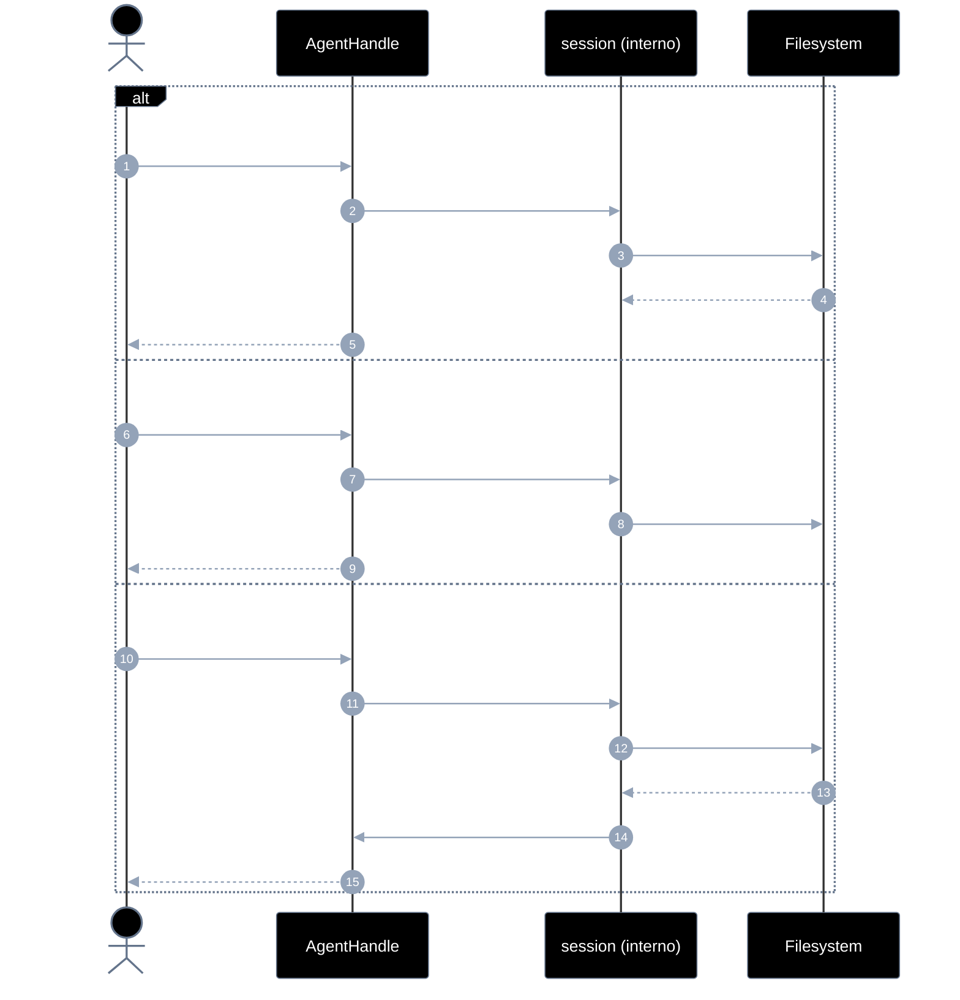
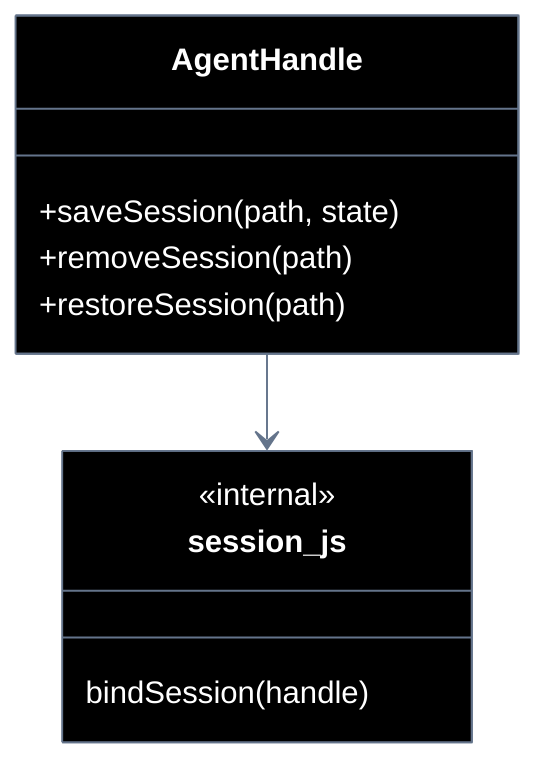

# Implementation plan — EP-06 Sessão

**Por quê:** plano técnico do épico (sequências · agentes · passo a passo · contratos · classes · modelos · BDDs).  
**Épico:** [`2.epics.md`](../2.epics.md).  
**US:** [`1.stories.md`](../1.stories.md) · [`4.scenarios.md#ep-06--sessao`](../4.scenarios.md#ep-06--sessao) · [`5.bdds.md#ep-06--sessao`](../5.bdds.md#ep-06--sessao).  
**Handle:** sessão são métodos do [`AgentHandle`](EP-01-provisionar-agente.md) — **não** funções soltas desligadas do agent.  
**Pré-requisito:** [`EP-01`](EP-01-provisionar-agente.md) · handle.  
**Implementação interna:** [`../src/lib/session.js`](../src/lib/session.js) (anexado ao handle em `provision.js`).

**Stack:** Node ≥ 18 · JavaScript · runtime provisionado.

---

## Escopo

| ID | Item |
|----|------|
| US-17 | Salvar sessão |
| US-18 | Remover sessão |
| US-19 | Recuperar sessão |
| SC-22..24 | Cenários correspondentes |

**Resultado:** estado persistido/apagado/restaurado via `handle.saveSession` / `removeSession` / `restoreSession`.

---

## Fluxo (obrigatório)

1. **Provisionar** → handle.  
2. **Sessão** via métodos do handle (path + estado; serial/contexto do handle inclusos ao salvar).

```js
const handle = await provisionEmulator(cfg);
// … operar …

await handle.saveSession("./sessions/linkedin.json", { step: "logged-in", apps: […] });
await handle.removeSession("./sessions/linkedin.json");
const state = await handle.restoreSession("./sessions/linkedin.json");
// restore reaplica contexto no runtime ligado ao handle
```

| Superfície | O quê |
|------------|--------|
| **Público** | `handle.saveSession` · `removeSession` · `restoreSession` |
| **Privado** | serialize JSON · unlink · reaplicar serial/apps/etapa |

---

## Diagramas de sequência

### Visão geral



### Por US

| US | SC | Chamada |
|----|-----|---------|
| US-17 | SC-22 | `handle.saveSession(path, state?)` |
| US-18 | SC-23 | `handle.removeSession(path)` |
| US-19 | SC-24 | `handle.restoreSession(path)` |

#### Contratos

```ts
type SessionState = {
  serial?: string;
  kind?: string;
  step?: string;
  apps?: unknown[];
  savedAt?: string;
  [k: string]: unknown;
};

type AgentHandle = {
  // … EP-01..05 …
  saveSession(path: string, state?: SessionState): Promise<string>;
  removeSession(path: string): Promise<boolean>;
  restoreSession(path: string): Promise<SessionState>;
};

await handle.saveSession("./sessions/li.json", { step: "logged-in" });
await handle.removeSession("./sessions/li.json");
const s = await handle.restoreSession("./sessions/li.json");
```

`saveSession` inclui `handle.serial` / `kind` no payload automaticamente.

#### Exemplo de JSON (arquivo de sessão)

Gravado por `handle.saveSession("./sessions/linkedin.json", { … })`:

```json
{
  "serial": "127.0.0.1:5555",
  "kind": "redroid",
  "step": "logged-in",
  "apps": {
    "instagram": {
      "package": "com.instagram.android",
      "version": "361.0.0.0.0"
    },
    "linkedin": {
      "package": "com.linkedin.android",
      "version": "4.1.986"
    }
  },
  "screenshot": "./screenshots/linkedin-before-login.png",
  "paths": {
    "session": "./sessions/linkedin.json",
    "screenshot": "./screenshots/linkedin-before-login.png"
  },
  "extract": {
    "type": "root",
    "bounds": { "x": 0, "y": 0, "w": 1080, "h": 2400 },
    "children": [
      {
        "type": "text",
        "text": "Entrar",
        "bounds": { "x": 120, "y": 1800, "w": 840, "h": 96 },
        "children": []
      }
    ]
  },
  "events": [
    { "type": "ui_stable", "attempt": 3, "at": "2026-09-19T23:00:00.000Z" }
  ],
  "savedAt": "2026-09-19T23:00:01.000Z"
}
```

| Campo | Origem |
|-------|--------|
| `serial` / `kind` | handle (EP-01) |
| `step` | estado passado pelo caller |
| `apps` | instalação (EP-03) |
| `paths` | paths úteis para restore |
| `extract` | última árvore DOM (EP-05), opcional |
| `events` | últimos eventos (EP-02), opcional |
| `savedAt` | preenchido no save |

`restoreSession` lê esse JSON e reaplica `serial`, `apps`, `step` e `paths` no runtime do handle.

---

## Modelos / Erros

| Código | Quando |
|--------|--------|
| `SESSION_WRITE_FAILED` | US-17 |
| `SESSION_NOT_FOUND` | US-19 |
| `SESSION_INVALID` | JSON inválido |

---

## Diagrama de classes



---

## Cenários BDD

Fonte: [`5.bdds.md#ep-06--sessao`](../5.bdds.md#ep-06--sessao).

---

## Plano de implementação (gaps → entregas)

| # | Entrega | SC | Critério |
|---|---------|-----|----------|
| I1 | Anexar `saveSession` / `removeSession` / `restoreSession` ao handle | — | Sem API solta no caller |
| I2 | save inclui serial/kind do handle | SC-22 | US-17 |
| I3 | remove limpa arquivo + contexto | SC-23 | US-18 |
| I4 | restore reaplica no handle/runtime | SC-24 | US-19 |
| I5 | Piloto usa `handle.saveSession` | — | linkedin-login |

### Ordem

```text
I1 → I2 → I3 → I4 → I5
```

---

## Mapeamento código atual

| Peça | Status |
|------|--------|
| `saveSession` / `loadSession` soltos | Existe — **mover** para handle |
| `removeSession` | **Gap** |
| `restoreSession` reaplicando runtime | **Gap** |

---

## Critério de pronto (épico)

1. Sessão só via handle  
2. SC-22..24 encapsulados  
3. BDDs US-17..19  

## Próximos passos

→ Implementar I1–I5 em [`sources`](../src/README.md)  
→ Aceite: [`5.bdds.md#ep-06--sessao`](../5.bdds.md#ep-06--sessao)
