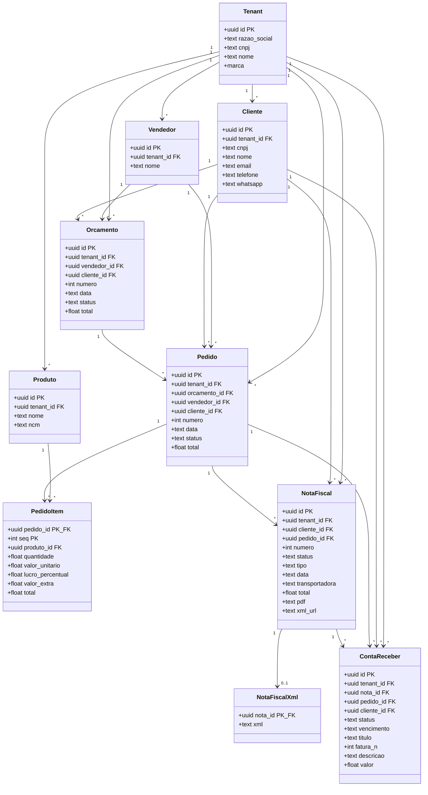

# Modelagem de dados — Super Portal

```mermaid
classDiagram
  direction TB

  class Tenant {
    +uuid id PK
    +text razao_social
    +text cnpj
    +text nome
    +marca
  }

  class Vendedor {
    +uuid id PK
    +uuid tenant_id FK
    +text nome
  }

  class Cliente {
    +uuid id PK
    +uuid tenant_id FK
    +text cnpj
    +text nome
    +text email
    +text telefone
    +text whatsapp
  }

  class Produto {
    +uuid id PK
    +uuid tenant_id FK
    +text nome
    +text ncm
  }

  class Orcamento {
    +uuid id PK
    +uuid tenant_id FK
    +uuid vendedor_id FK
    +uuid cliente_id FK
    +int numero
    +text data
    +text status
    +float total
  }

  class Pedido {
    +uuid id PK
    +uuid tenant_id FK
    +uuid orcamento_id FK
    +uuid vendedor_id FK
    +uuid cliente_id FK
    +int numero
    +text data
    +text status
    +float total
  }

  class PedidoItem {
    +uuid pedido_id PK_FK
    +int seq PK
    +uuid produto_id FK
    +float quantidade
    +float valor_unitario
    +float lucro_percentual
    +float valor_extra
    +float total
  }

  class NotaFiscal {
    +uuid id PK
    +uuid tenant_id FK
    +uuid cliente_id FK
    +uuid pedido_id FK
    +int numero
    +text status
    +text tipo
    +text data
    +text transportadora
    +float total
    +text pdf
    +text xml_url
  }

  class NotaFiscalXml {
    +uuid nota_id PK_FK
    +text xml
  }

  class ContaReceber {
    +uuid id PK
    +uuid tenant_id FK
    +uuid nota_id FK
    +uuid pedido_id FK
    +uuid cliente_id FK
    +text status
    +text vencimento
    +text titulo
    +int fatura_n
    +text descricao
    +float valor
  }

  Tenant "1" --> "*" Vendedor
  Tenant "1" --> "*" Cliente
  Tenant "1" --> "*" Produto
  Tenant "1" --> "*" Orcamento
  Tenant "1" --> "*" Pedido
  Tenant "1" --> "*" NotaFiscal
  Tenant "1" --> "*" ContaReceber

  Vendedor "1" --> "*" Orcamento
  Vendedor "1" --> "*" Pedido
  Cliente "1" --> "*" Orcamento
  Cliente "1" --> "*" Pedido
  Cliente "1" --> "*" NotaFiscal
  Cliente "1" --> "*" ContaReceber
  Produto "1" --> "*" PedidoItem

  Orcamento "1" --> "*" Pedido
  Pedido "1" --> "*" PedidoItem
  Pedido "1" --> "*" NotaFiscal
  Pedido "1" --> "*" ContaReceber
  NotaFiscal "1" --> "0..1" NotaFiscalXml
  NotaFiscal "1" --> "*" ContaReceber
```
